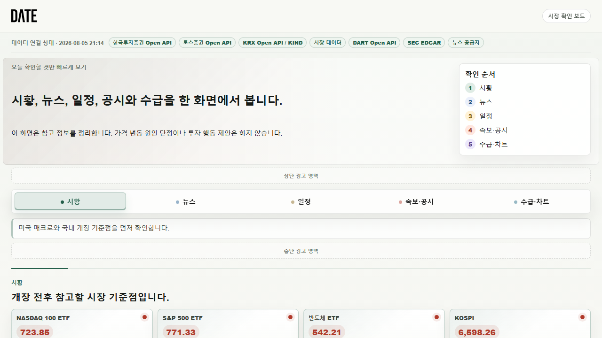
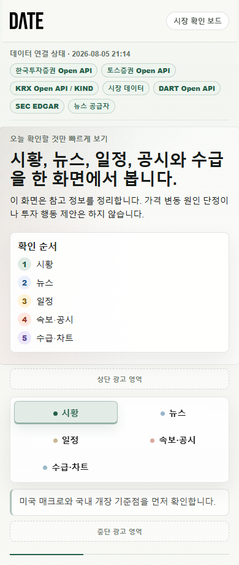

# DATE Market Board

미국 시황, 국내 시황, 뉴스, 일정, 속보 공시, 수급과 차트 확인 루틴을 한 화면에서 볼 수 있도록 만든 **Next.js 기반 금융 시장 대시보드**입니다.

이 프로젝트는 단순히 데이터를 나열하는 화면이 아니라, 장중 시장을 확인하는 사용자가 “무엇을 먼저 보고, 어떤 원문을 확인해야 하는지” 빠르게 판단할 수 있도록 정보 구조와 UI 밀도를 설계한 프론트엔드 포트폴리오 프로젝트입니다.

> 매수/매도 추천을 제공하는 서비스가 아니라, 여러 시장 데이터와 원문 링크를 정리해 투자 판단 전 확인 흐름을 돕는 정보 보드입니다.

## Live Demo

- Production: [https://date-platform.vercel.app](https://date-platform.vercel.app)
- Deployment: Vercel Production
- Latest verified status: `Ready`

## Preview

### Desktop



### Mobile



## Project Summary

| Item | Description |
| --- | --- |
| 프로젝트명 | DATE Market Board |
| 목적 | 시황, 뉴스, 일정, 공시, 수급 데이터를 한 화면에서 빠르게 확인하는 시장 모니터링 보드 |
| 주요 사용자 | 국내/미국 주식 시장을 함께 확인하는 개인 투자자, 리서치 사용자 |
| 핵심 가치 | 여러 API와 원문 데이터를 탭별로 정리하고, 외부 API 실패에도 UI가 유지되는 안정적인 대시보드 |
| 구현 형태 | Next.js App Router 기반 서버/클라이언트 혼합 대시보드 |

## Main Features

### 1. 시황 보드

- 미국 지수, 국내 지수, 반도체 ETF, 환율, 금리, 원자재 등 주요 시장 지표를 카드 UI로 표시합니다.
- 상승/하락 방향을 색상으로 구분합니다.
- `+` 등락률은 빨간색, `-` 등락률은 파란색으로 표시해 국내 투자자에게 익숙한 방향성을 따릅니다.
- 미국 시황, 국내 시황, 환율 시황, 강세 테마를 별도 브리프 카드로 요약합니다.

### 2. 뉴스 타임라인

- 국내 뉴스, 미국 뉴스, 테마 뉴스, 매크로 뉴스 필터를 제공합니다.
- 헤드라인 시간, 공급자, 분류, 원문 링크를 한 줄 타임라인 형태로 구성했습니다.
- 새로 들어온 헤드라인은 별도 상태 표시로 구분합니다.
- 뉴스 원문과 번역/정규화된 텍스트를 함께 관리할 수 있도록 DTO를 설계했습니다.

### 3. 일정 캘린더

- 실적, 공모주, 신규상장, 매크로, FOMC, 공시 일정을 월간 캘린더로 제공합니다.
- 날짜 선택 시 해당 날짜의 이벤트 상세 확인 항목을 보여줍니다.
- 다가오는 주요 일정을 별도 리스트로 분리해 사용자가 빠르게 스캔할 수 있게 구성했습니다.

### 4. 속보·공시

- SEC EDGAR, DART, KRX/KIND 기반 공시 이벤트를 탭과 필터로 분리했습니다.
- 새 공시, 소형주, 인수합병, 매각, 증자/지분 등 이벤트 유형 필터를 제공합니다.
- 각 공시는 원문 링크, 제출 시각, 확인 액션을 함께 노출합니다.

### 5. 수급·차트 보드

- 거래대금, 상승률, 거래량, ETF, 위험 필터 기반으로 주도주를 정리합니다.
- 선택한 종목에 대해 관련 뉴스, 관련 공시, 테마 뉴스, 랭킹 기준을 우측 상세 패널로 제공합니다.
- 현재가와 전일 대비를 별도 배지로 분리해 가독성을 높였습니다.
- 수급 테이블은 고밀도 정보 UI에 맞춰 컬럼 패딩과 정렬을 조정했습니다.

## APIs and Data Sources

이 프로젝트는 실제 시장 데이터 연동을 고려해 여러 외부 API 어댑터를 분리해 구성했습니다.

| Source | Usage | Environment |
| --- | --- | --- |
| 한국투자증권 Open API | 국내 지수, 거래대금/거래량 순위, 국내 종목 흐름, 분봉/차트 후보 데이터 | `KIS_APP_KEY`, `KIS_APP_SECRET`, `KIS_HTS_ID` |
| Toss Invest API | 국내/미국 거래대금, 상승률, 거래량 상위 종목, 환율/시장 지표 | `TOSS_INVEST_CLIENT_ID`, `TOSS_INVEST_CLIENT_SECRET` |
| KRX/KIND | 신규상장, 공모, 국내 시장 일정 | `KRX_CALENDAR_FEED_URL` |
| DART Open API | 국내 기업 공시 | `DART_API_KEY` |
| SEC EDGAR | 미국 기업 최신 공시, 8-K, 10-Q, 10-K 등 | public, optional `SEC_USER_AGENT` |
| NewsAPI | 글로벌 뉴스 헤드라인 | `NEWSAPI_KEY` |
| Finnhub | 미국 뉴스, 실적 일정, 시장 지표 | `FINNHUB_API_KEY` |
| Benzinga | 미국 주식 뉴스 후보 | `BENZINGA_API_KEY` |
| Naver Search API | 국내 뉴스 검색 | `NAVER_CLIENT_ID`, `NAVER_CLIENT_SECRET` |
| Naver Papago API | 미국 뉴스 번역 보조 | `NAVER_PAPAGO_CLIENT_ID`, `NAVER_PAPAGO_CLIENT_SECRET` |
| Google News RSS | 키워드 기반 국내/미국 뉴스 fallback | public RSS |
| Frankfurter API | USD/KRW 환율 fallback | public |
| CoinGecko API | BTC 가격 fallback | public |
| U.S. Treasury XML | 미국 10년물 금리 fallback | public |

API 키가 없는 환경에서도 프로젝트를 실행할 수 있도록 mock fallback 데이터를 유지합니다. 이 덕분에 GitHub 검토자나 면접관도 별도 키 없이 UI와 데이터 흐름을 확인할 수 있습니다.

## Production Data Health

Vercel Production 기준으로 `/api/market-board`의 provider 상태를 점검했습니다.

| Provider | Production Status | Note |
| --- | --- | --- |
| 한국투자증권 Open API | `ready` | 국내 지수/수급 후보 데이터 adapter 활성화 |
| KRX Open API / KIND | `ready` | 일정 데이터 adapter 활성화 |
| 시장 데이터 | `ready` | 환율, 금리, ETF, BTC 등 public/fallback market adapter 활성화 |
| DART Open API | `ready` | 국내 공시 adapter 활성화 |
| SEC EDGAR | `ready` | 미국 공시 public adapter 활성화 |
| 뉴스 공급자 | `ready` | 뉴스 정규화 adapter 활성화 |
| Toss Invest API | `error` | Production 요청이 `403`을 반환해 mock fallback 유지 |

Toss adapter가 실패해도 보드는 전체 렌더링을 유지합니다. 이는 외부 금융 API가 실패하거나 권한 문제가 발생해도 사용자가 시장 보드의 나머지 정보를 계속 확인할 수 있게 하기 위한 의도적인 fallback 설계입니다.

## Frontend Tech Stack

| Area | Stack |
| --- | --- |
| Framework | Next.js 16 App Router |
| UI Library | React 19 |
| Language | TypeScript |
| Styling | SCSS Modules, CSS custom properties |
| Rendering | Server Component container + Client Component dashboard |
| Data Fetching | Next.js Route Handlers, server-side provider orchestration |
| State | React `useState`, `useMemo`, `useEffect` |
| Validation | TypeScript DTO, ESLint |
| Build | Next.js Turbopack build |

## Architecture

```text
app/
  page.tsx
    - 서버에서 MarketBoard 데이터를 로드하는 엔트리

  page.module.scss
    - 대시보드 전체 UI 시스템
    - 탭별 컬러 토큰, 카드, 테이블, 캘린더, 반응형 스타일 관리

  api/market-board/route.ts
    - 클라이언트 갱신용 시장 보드 API

  api/market-board/news-events/route.ts
    - 새 뉴스 이벤트 조회

  api/market-board/sec-events/route.ts
    - 새 SEC 공시 이벤트 조회

  kr/market-board/
    MarketBoard.tsx
      - 탭 UI, 필터, 캘린더 선택, 주도주 선택, 상세 패널 렌더링

    providers.ts
      - 여러 API adapter 실행
      - timeout 처리
      - provider status 생성
      - mock fallback merge
      - 테마 브리프 파생 데이터 생성

    types.ts
      - 화면과 API adapter가 공유하는 DTO 계약

    adapters/
      kis.ts
      toss.ts
      krx.ts
      dart.ts
      sec.ts
      news.ts
      market.ts
      news-normalizer.ts
      cache.ts
      http.ts
```

## Data Flow

```text
External APIs
  -> adapter layer
  -> provider orchestration
  -> normalized MarketBoardData DTO
  -> Next.js page / API route
  -> MarketBoard client component
  -> tabbed dashboard UI
```

### Adapter Pattern

각 데이터 공급자는 독립적인 adapter로 분리되어 있습니다.

- API별 인증 방식과 응답 구조를 adapter 안에 격리
- adapter 실패 시 전체 화면이 깨지지 않도록 mock fallback 유지
- provider 상태를 상단 상태 스트립에 표시
- 동일한 DTO로 정규화해 UI 컴포넌트가 공급자 차이를 몰라도 되게 설계

### Timeout and Fallback

금융 데이터 API는 지연, 인증 실패, 레이트 리밋 가능성이 높기 때문에 `providers.ts`에서 각 adapter를 timeout으로 감쌉니다.

- timeout 발생 시 해당 provider만 error 상태 처리
- 나머지 provider 데이터는 정상 반영
- 부족한 데이터는 mock baseline으로 보완
- UI는 항상 렌더링 가능한 상태 유지

## UI/UX Implementation

### 고밀도 금융 정보 UI

금융 대시보드는 일반 랜딩 페이지보다 정보 밀도가 높아야 합니다. 그래서 이 프로젝트는 큰 히어로나 장식적 그래픽보다, 실제 사용자가 장중에 빠르게 스캔할 수 있는 UI에 집중했습니다.

- 탭 기반 정보 분리
- 카드형 시황 요약
- 표 기반 수급 데이터
- 캘린더 기반 일정 확인
- 원문 링크 중심의 공시/뉴스 리스트
- 데이터 공급자 상태 표시

### Color System

색상은 많지 않게 유지하면서 탭별 성격을 구분했습니다.

| Tab | Tone |
| --- | --- |
| 시황 | Green |
| 뉴스 | Blue |
| 일정 | Yellow |
| 속보·공시 | Red |
| 수급·차트 | Cyan |

등락률 표기는 국내 시장 사용자 경험을 기준으로 적용했습니다.

- 상승: red
- 하락: blue
- 중립: gray

### Responsive Layout

- 데스크톱에서는 요약 카드, 표, 상세 패널을 동시에 노출합니다.
- 모바일에서는 카드와 테이블을 세로 흐름으로 재배치합니다.
- 긴 텍스트가 버튼, 카드, 배지 밖으로 넘치지 않도록 `overflow-wrap`, `minmax`, `grid` 제약을 적용했습니다.

## What I Focused On as a Frontend Developer

이 프로젝트에서 프론트엔드 개발자로서 특히 신경 쓴 부분입니다.

### 1. 데이터가 불안정해도 깨지지 않는 UI

외부 API 연동 프로젝트는 키 누락, 네트워크 지연, 응답 구조 변화가 자주 발생합니다. 그래서 UI가 특정 API 성공에 의존하지 않게 설계했습니다.

- provider status 표시
- adapter timeout
- mock fallback
- DTO merge
- 원문 링크 대기 상태 처리

### 2. 정보 우선순위 설계

단순히 많은 정보를 보여주는 것이 아니라, 사용자의 확인 순서를 기준으로 화면을 나눴습니다.

1. 시장 기준점 확인
2. 뉴스 흐름 확인
3. 일정 이벤트 확인
4. 속보/공시 원문 확인
5. 수급과 주도주 확인

### 3. 재사용 가능한 데이터 계약

`types.ts`의 `MarketBoardData`를 중심으로 UI와 adapter가 같은 계약을 사용합니다. 덕분에 공급자가 늘어나도 UI 컴포넌트는 큰 변경 없이 확장할 수 있습니다.

### 4. 실제 서비스에 가까운 운영 상태 표현

상단 provider strip을 통해 어떤 데이터 공급자가 ready/mock/error 상태인지 보여줍니다. 포트폴리오 프로젝트지만 실제 운영 환경에서 필요한 관측 가능성을 UI에 반영했습니다.

## Running Locally

```bash
npm install
npm run dev
```

Open:

```text
http://localhost:3000
```

## Environment Variables

모든 값이 필수는 아닙니다. 값이 없으면 해당 adapter는 mock fallback으로 동작합니다.

```bash
KIS_APP_KEY=
KIS_APP_SECRET=
KIS_HTS_ID=
KIS_ENABLE_MINUTE_CHARTS=

TOSS_INVEST_CLIENT_ID=
TOSS_INVEST_CLIENT_SECRET=

DART_API_KEY=
SEC_USER_AGENT=

KRX_CALENDAR_FEED_URL=

NEWSAPI_KEY=
FINNHUB_API_KEY=
BENZINGA_API_KEY=
MARKET_BOARD_NEWS_FEED_URL=

NAVER_CLIENT_ID=
NAVER_CLIENT_SECRET=
NAVER_SEARCH_CLIENT_ID=
NAVER_SEARCH_CLIENT_SECRET=
NAVER_API_HUB_KEY_ID=
NAVER_API_HUB_KEY=
NAVER_PAPAGO_CLIENT_ID=
NAVER_PAPAGO_CLIENT_SECRET=
```

## Scripts

```bash
npm run dev        # local development
npm run build      # production build
npm run start      # production server
npm run lint       # ESLint
npm run test:news  # news normalization test
```

## Verification

작업 검증에 사용한 명령입니다.

```bash
npm run lint
npx tsc --noEmit
npm run build
```

Production deployment was verified with Vercel CLI:

```bash
vercel inspect https://date-platform.vercel.app
```

## Portfolio Review Points

면접관이나 리뷰어가 확인하면 좋은 포인트입니다.

- Next.js App Router에서 서버 데이터 로딩과 클라이언트 인터랙션을 분리한 방식
- 여러 외부 API를 adapter pattern으로 관리한 구조
- TypeScript DTO를 중심으로 화면과 데이터 계층을 연결한 방식
- 금융 정보 UI에 맞춘 고밀도 반응형 레이아웃
- API 실패를 고려한 timeout, fallback, provider status 설계
- 뉴스 정규화, 원문 링크, 공시 이벤트 등 실제 서비스에 가까운 데이터 흐름

## Limitations and Next Steps

추가로 확장할 수 있는 부분입니다.

- 투자자별 수급 데이터 세분화
- 차트 캔들 시각화 고도화
- 사용자별 관심 종목 저장
- 뉴스/공시 중요도 점수 모델 개선
- 실시간 WebSocket 기반 가격 업데이트
- 대시보드 개인화 설정
