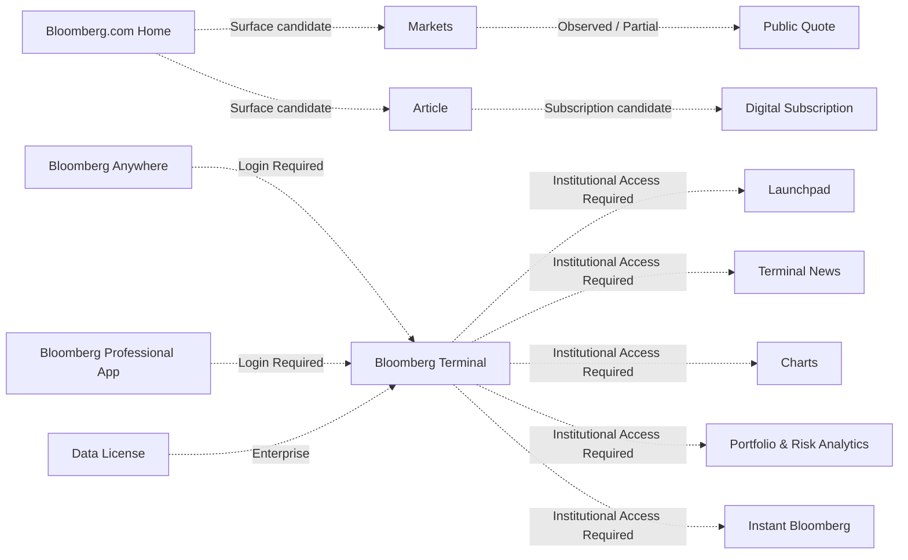

# Bloomberg Product Surface Map

## Surface Map 기준

이번 문서는 Surface Mapping만 수행한다. Navigation Flow, User Journey, Entity Relationship, Information Density, Trust / Evidence 평가는 작성하지 않는다.

## Product Surface Inventory

| Surface ID | Product | Surface Name | Product Layer | Primary Responsibility | Primary User | Primary Entity | Information Form | Primary Entry | Secondary Entry | Access Level | Observation Status | Evidence Type | Confidence | Open Question |
| --- | --- | --- | --- | --- | --- | --- | --- | --- | --- | --- | --- | --- | --- | --- |
| BBG-SUR-001 | Bloomberg.com | Home | Public Web | global business news, video, Latest, In Focus, Market Data footer entry | public reader | News / Market | News List, Video, Dense Summary | bloomberg.com | category nav, search | Public / Subscription CTA | Partially Observed | Official Product Observation | High | logged-in personalization structure |
| BBG-SUR-002 | Bloomberg.com | Markets | Public Web | Market news and Top Securities summary | public reader, investor | Market | Quote Strip, News List, Table candidate | /markets | Market Data footer | Public | Observed | Official Product Observation | High | current dynamic block order |
| BBG-SUR-003 | Bloomberg.com | Stocks | Public Web | regional index and stock market tables | public investor | Equity Index / Stock | Table | /markets/stocks | Markets | Public | Observed | Official Product Observation | High | Stock row drill-down depth |
| BBG-SUR-004 | Bloomberg.com | Futures | Public Web | equity index futures tables | public investor | Futures Contract / Index | Table | /markets/stocks/futures | Stocks | Public | Observed | Official Product Observation | High | contract detail page existence |
| BBG-SUR-005 | Bloomberg.com | Commodities | Public Web | commodity index and contract tables | public investor | Commodity / Futures Contract | Table, Chart candidate | /markets/commodities | Market Data footer | Public | Observed | Official Product Observation | High | chart interaction depth |
| BBG-SUR-006 | Bloomberg.com | Currencies | Public Web | FX market summary | public investor | Currency Pair | Table | /markets/currencies | Market Data footer | Public | Partially Observed | Official Product Observation | Medium | current full table extraction |
| BBG-SUR-007 | Bloomberg.com | Rates & Bonds | Public Web | rates and bond market summary | public investor | Bond / Yield / Interest Rate | Table | /markets/rates-bonds | Market Data footer | Public | Partially Observed | Official Product Observation | Medium | government bond detail depth |
| BBG-SUR-008 | Bloomberg.com | Quote | Public Web | Security quote summary and key statistics | public investor | Security / Stock / Equity Index | Detail Page, Chart, Dense Summary | /quote/{ticker} | market table row, search | Public / bot challenge candidate | Partially Observed | Official Product Observation | Medium | AAPL direct access blocked by bot challenge |
| BBG-SUR-009 | Bloomberg.com | Company Profile | Public Web | company description and news profile | public investor | Company | Detail Page, Article List candidate | /profile/company/{ticker} | Quote | Public | Partially Observed | Official Product Observation | Medium | full module inventory |
| BBG-SUR-010 | Bloomberg.com | Article | Public Web / Digital Subscription | Bloomberg Original News article | public reader, subscriber | Article / News | Article | headline link | Search, category page | Public / Subscription Required candidate | Partially Observed | Official Product Observation | High | paywall and related entity links |
| BBG-SUR-011 | Bloomberg.com | Search | Public Web | keyword search across articles and topics candidate | public reader | Keyword / Article / Topic | Search Result | header search | Home, Markets | Public | Partially Observed | Official Product Observation | Medium | company / security search behavior |
| BBG-SUR-012 | Bloomberg.com | Subscription Landing | Digital Subscription | Digital / All Access / Corporate / Student subscription conversion | reader, subscriber | Subscription | Form, Pricing, CTA | Subscribe CTA | article paywall | Public / Subscription Required | Observed | Official Pricing / Sales | High | actual subscriber entitlement UI |
| BBG-SUR-013 | Bloomberg Television | Live TV / Video | Supporting Media | live and recorded business video | public reader, subscriber | Video | Video | BTV+ / Video nav | Home modules | Public / Subscription Candidate | Partially Observed | Official Product Observation | Medium | free minutes / subscriber gate current behavior |
| BBG-SUR-014 | Bloomberg Radio | Audio / Radio | Supporting Media | audio and radio business news | public reader, subscriber | Audio | Audio | Audio footer nav | Subscription | Public / Subscription Candidate | Partially Observed | Official Product Observation | Low | audio entitlement detail |
| BBG-SUR-015 | Bloomberg Terminal | Terminal Workspace | Terminal | integrated professional workspace for data, news, analytics, execution, collaboration | financial professional | Security / Market / Function | Multi-panel Workspace, Command Line | Terminal login | Bloomberg Anywhere | Institutional Access Required | Official Product Description | Official Product Description | High | direct UI structure |
| BBG-SUR-016 | Bloomberg Terminal | Launchpad | Terminal | customized multi-asset monitors, alerts, charts, news | financial professional | Security / Market | Monitor, Chart, News Feed, Workspace | Terminal | saved workspace candidate | Institutional Access Required | Official Product Description | Official Product Description | High | layout save and context linking |
| BBG-SUR-017 | Bloomberg Terminal | News | Terminal | Terminal-integrated Bloomberg and external provider news | financial professional | News / Security / Topic | News Feed, Alert, Digest | Terminal news functions | security context candidate | Institutional Access Required | Official Product Description | Official Product Description | High | specific function code and interaction |
| BBG-SUR-018 | Bloomberg Terminal | Charts | Terminal | multi-asset charting, comparison, annotation, export, collaboration | financial professional | Security / Market | Chart | Terminal chart functions | Launchpad | Institutional Access Required | Official Product Description | Official Product Description | High | exact chart function scope |
| BBG-SUR-019 | Bloomberg Terminal | Research | Terminal | company, industry, country, strategy research in connected environment | analyst, PM | Company / Industry / Country | Report, Dashboard candidate | Terminal research tools | Bloomberg Intelligence | Institutional Access Required | Official Product Description | Official Product Description | High | provider-level module UI |
| BBG-SUR-020 | Bloomberg Terminal | Portfolio & Risk Analytics | Terminal | position, risk, performance, attribution, scenario analysis | PM, risk professional | Portfolio / Position | Dashboard, Table, Chart, Report | PORT product | Terminal | Institutional Access Required | Official Product Description | Official Product Description | High | actual portfolio import and analytics UI |
| BBG-SUR-021 | Bloomberg Terminal | Collaboration Tools | Terminal | IB, messaging, chat, research sharing | financial professional | Message / User / Security | Message Thread, Panel | IB / MSG candidate | Terminal workspace | Institutional Access Required | Official Product Description | Official Product Description | High | message metadata and capture UI |
| BBG-SUR-022 | Bloomberg Anywhere | Bloomberg Anywhere | Bloomberg Anywhere | remote Terminal access | Terminal subscriber | User / Workspace | Login Surface | bba.bloomberg.com | Terminal access page | Login Required / Institutional Access Required | Observed | Official Product Observation | High | post-login environment |
| BBG-SUR-023 | Bloomberg Professional App | Mobile Terminal companion | Bloomberg Anywhere | mobile monitoring, securities, worksheets, alerts, IB / MSG | Terminal subscriber | Security / Worksheet / Message | Mobile App Surface | app download | Bloomberg Anywhere | Login Required / Institutional Access Required | Official Documentation Only | Official Product Description | High | actual mobile UI |
| BBG-SUR-024 | Data License | DATA <GO> / Data.Bloomberg.com | Enterprise Data | dataset discovery, acquisition, delivery | enterprise data user | Dataset / Security / Legal Entity | Data Catalog, API Result, File Delivery | DATA <GO>, data.bloomberg.com | Data License page | Enterprise / Additional Product Required | Official Product Description | Official Product Description | High | client portal interaction |
| BBG-SUR-025 | B-PIPE / Cloud Access | Market Data Feed | Enterprise Data | real-time market data delivery | enterprise application / data team | Security / Exchange | API Result, Feed | data connectivity sales | enterprise contract | Enterprise / Entitlement Required | Official Product Description | Official Product Description | Medium | end-user visibility |
| BBG-SUR-026 | Server API | Server API | Enterprise Data | Terminal-aligned data into client applications | developer / quant | Security / Data Field | API Result | SAPI product page | API library | Enterprise / Terminal entitlement | Official Product Description | Official Product Description | High | exact entitlement model |
| BBG-SUR-027 | Bloomberg Law | Legal Research and Software | Separate Domain | legal research and workflow tools | legal professional | Legal Source / Case / Company | Search Result, Research Workspace | pro.bloomberglaw.com | request demo | Separate subscription | Official Product Description | Official Product Description | High | excluded from DATE Core |
| BBG-SUR-028 | Bloomberg Tax | Daily Tax Report / Tax Product | Separate Domain | tax news and expert analysis | tax professional | Tax Article / Regulation | Article, News List | news.bloombergtax.com | tax product | Separate subscription candidate | Partially Observed | Official Product Observation | Medium | product app boundary |
| BBG-SUR-029 | Bloomberg Government | BGOV News / Analysis | Separate Domain | government policy and procurement analysis | government affairs professional | Policy / Bill / Government Entity | News List, Analysis | news.bgov.com | BGOV product | Separate subscription candidate | Partially Observed | Official Product Observation | Medium | product app boundary |

## Capability 분리

| Capability | Surface가 아님 | 확인 수준 |
| --- | --- | --- |
| Search | Search Surface의 action이며 Terminal에서는 Command / Function lookup candidate | Partially Observed / Not Verified |
| Command Execution | Terminal Command Line의 Capability | Official Product Description |
| Compare | Charts / tables의 Capability candidate | Official Product Description |
| Link Panels | Launchpad / Workspace Capability candidate | Not Verified |
| Save Workspace | Launchpad / Workspace state Capability candidate | Official Product Description / Not Verified |
| Alert | News, Launchpad, Professional App Capability | Official Product Description |
| Message | Collaboration Tools / IB Capability | Official Product Description |
| Export | Charts / Data / Excel integration Capability | Official Product Description |
| Excel Sync | support and software / API component candidate | Official Documentation |
| API Query | Server API / Data Connectivity Capability | Official Product Description |
| Subscribe | Subscription Landing Capability | Observed |
| Follow / Watch | Bloomberg.com Quote account state candidate | Partially Observed / Not Verified |

## Surface 관계 후보

Diagram은 Product Architecture 확정안이 아니다. Phase 6.1에서는 Surface 관계 후보만 표시한다.

## Terminal과 Public Web 책임 차이

Observation:
Public Web은 Bloomberg.com Home, Markets, Article, Subscription CTA 중심으로 작동한다. Terminal은 official Product Description에서 data, news, research, analytics, execution, collaboration, Launchpad, Portfolio Analytics를 professional workflow로 묶는다.

Interpretation:
Public Web은 Market awareness와 media consumption entry에 가깝고, Terminal은 multi-asset professional decision workflow에 가깝다.

Evidence:
https://www.bloomberg.com/
https://www.bloomberg.com/markets
https://professional.bloomberg.com/products/bloomberg-terminal/
https://professional.bloomberg.com/products/bloomberg-terminal/news/
https://professional.bloomberg.com/products/bloomberg-terminal/charts/
https://professional.bloomberg.com/products/bloomberg-terminal/portfolio-analytics/

Confidence:
High
