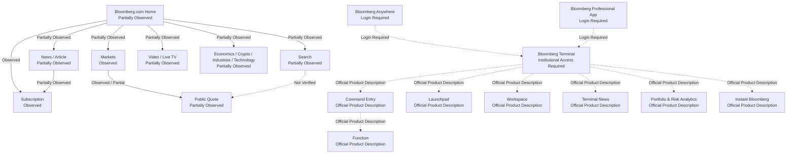

# Bloomberg Navigation Map

## 문서 목적

이 문서는 Phase 6.2 범위에서 Bloomberg Public Web과 Bloomberg Terminal / Professional Workflow의 Navigation 후보를 분리해 기록한다.

Bloomberg Terminal은 직접 사용하지 않았다. 따라서 Terminal 내부 Command Entry, Function, Workspace, Launchpad, Panel, Linked Window, Security Context는 실제 Interaction Observation이 아니라 Official Product Description 또는 Official Documentation 기준으로만 기록한다.

## 조사 기준

| 항목 | 내용 |
| --- | --- |
| 조사 날짜 | 2026-07-28 KST |
| Timezone | Asia/Seoul |
| Environment | Desktop web extraction / official URL review |
| Bloomberg.com Public Access | Partially Observed |
| Bloomberg Account Login | Not Logged In |
| Digital Subscription | No Digital Subscription |
| Bloomberg Terminal Access | No Direct Terminal Session |
| Bloomberg Anywhere Access | No Bloomberg Anywhere session |
| Secondary Source | Not Used |

## Navigation Status

| Status | 기준 |
| --- | --- |
| Observed | Bloomberg Public Product에서 entry와 destination을 확인했다. |
| Partially Observed | entry 또는 target은 확인했지만 dynamic body, login state, return state는 확인하지 못했다. |
| Official Documentation Only | 공식 Help / Support / Documentation에서만 확인했다. |
| Official Product Description | Bloomberg Professional Services Product Page 설명에서만 확인했다. |
| Institutional Access Required | Terminal 또는 Professional Services 계약이 필요하다. |
| Login Required | Bloomberg account, Bloomberg Anywhere, B-Unit login이 필요하다. |
| Inference | 공식 자료에서 가능한 관계 후보로만 기록한다. |
| Not Verified | 이번 단계에서 확인하지 못했다. |

## Navigation 관계 요약

Diagram은 Navigation Architecture 확정안이 아니다. Solid edge는 Public Product에서 확인한 관계이며, dashed edge는 Official Product Description, Login Required, Not Verified 관계다.

## Public Navigation Inventory

| Navigation ID | Entry | Product Layer | Destination | Access Level | Observation Status | Navigation Responsibility | Evidence Type | Evidence | Confidence | Open Question |
| --- | --- | --- | --- | --- | --- | --- | --- | --- | --- | --- |
| BBG-NAV-001 | Bloomberg.com Home | Public Web | Top News, Latest, In Focus, Video, Market Data footer | Public / Subscription CTA | Partially Observed | Public News와 Market Data entry를 결합한다. | Official Product Observation | https://www.bloomberg.com/ | High | logged-in Home과 regional personalization은 Not Verified |
| BBG-NAV-002 | Markets | Public Web | Markets page, Top Securities, Market news | Public | Observed | Public Market awareness와 market category entry를 제공한다. | Official Product Observation | https://www.bloomberg.com/markets | High | current dynamic block order |
| BBG-NAV-003 | Market Data footer | Public Web | Stocks, Commodities, Rates & Bonds, Currencies, Futures, Sectors, Economic Calendar | Public | Observed / Partially Observed | asset class 및 Market data page entry를 제공한다. | Official Product Observation | Bloomberg.com footer Market Data | High | Sectors와 Economic Calendar body는 Not Verified |
| BBG-NAV-004 | Stocks | Public Web | regional index tables and Futures tab | Public | Observed | Equity Index와 Stock market table을 제공한다. | Official Product Observation | https://www.bloomberg.com/markets/stocks/ | High | row-to-Quote transition은 Not Verified |
| BBG-NAV-005 | Futures | Public Web | equity index futures table | Public | Observed | Futures Contract table을 제공한다. | Official Product Observation | https://www.bloomberg.com/markets/stocks/futures | High | contract detail Surface는 Not Verified |
| BBG-NAV-006 | Commodities | Public Web | Energy, Metals, Agriculture sections | Public | Observed | Commodity와 Futures Contract table entry를 제공한다. | Official Product Observation | https://www.bloomberg.com/markets/commodities/ | High | chart compare interaction은 Not Verified |
| BBG-NAV-007 | Currencies | Public Web | currency market table candidate | Public | Partially Observed | Currency Pair Market entry를 제공한다. | Official Product Observation | https://www.bloomberg.com/markets/currencies | Medium | full table and pair detail은 Not Verified |
| BBG-NAV-008 | Rates & Bonds | Public Web | rates and bonds table candidate | Public | Partially Observed | Bond, Yield, Interest Rate Market entry를 제공한다. | Official Product Observation | https://www.bloomberg.com/markets/rates-bonds | Medium | security detail depth는 Not Verified |
| BBG-NAV-009 | Quote | Public Web | Security Quote detail | Public / bot challenge candidate | Partially Observed | Security / Stock / Index detail entry다. | Official Product Observation | https://www.bloomberg.com/quote/AAPL%3AUS, search snippet | Medium | direct AAPL body는 bot challenge |
| BBG-NAV-010 | News / Article | Public Web / Digital Subscription | Bloomberg Article | Public / Subscription Required candidate | Partially Observed | News headline에서 Article로 전환한다. | Official Product Observation | Bloomberg.com article pages | High | article paywall와 related entity links는 article별 차이 |
| BBG-NAV-011 | Search | Public Web | Search result candidate | Public | Partially Observed | Keyword, Article, Topic, Company / Security candidate entry다. | Official Product Observation | Bloomberg.com header Search | Medium | result grouping과 suggestion은 Not Verified |
| BBG-NAV-012 | Subscription | Digital Subscription | Subscribe, plan selection, Subscription Finder | Public / Subscription Required | Observed | Digital content entitlement와 account access entry를 제공한다. | Official Pricing / Sales | https://www.bloomberg.com/subscriptions/oddlots, https://www.bloomberg.com/subscription-finder | High | post-subscription UI는 Not Verified |
| BBG-NAV-013 | Video / Live TV | Supporting Media | Live TV / Video | Public / Subscription Candidate | Partially Observed | Bloomberg media video entry다. | Official Product Observation | Bloomberg.com Video / BTV+ links | Medium | free minutes와 subscriber gate는 Not Verified |
| BBG-NAV-014 | Economics / Crypto / Industries / Technology | Public Web | category pages | Public / Subscription Candidate | Partially Observed | News category Navigation을 제공한다. | Official Product Observation | Bloomberg.com top navigation | Medium | category internal filters는 Not Verified |

## Terminal Navigation Inventory

| Navigation ID | Entry | Product Layer | Destination | Access Level | Observation Status | Navigation Responsibility | Evidence Type | Evidence | Confidence | Open Question |
| --- | --- | --- | --- | --- | --- | --- | --- | --- | --- | --- |
| BBG-NAV-015 | Bloomberg Terminal Login | Terminal | Terminal Workspace | Institutional Access Required | Official Product Description | Professional workflow 시작점이다. | Official Product Description | https://professional.bloomberg.com/products/bloomberg-terminal/ | High | actual login landing은 Not Verified |
| BBG-NAV-016 | Command Entry | Terminal | Function / Security candidate | Institutional Access Required | Official Product Description | Function과 Security 전환의 핵심 entry 후보로 기록한다. | Official Product Description | Terminal product and education pages | Medium | command parsing, autocomplete, history는 Not Verified |
| BBG-NAV-017 | Function | Terminal | Security, Chart, News, Portfolio, Research tools candidate | Institutional Access Required | Official Product Description | Terminal capability를 실행하는 단위다. | Official Product Description | Terminal product page | Medium | Function Code는 추측하지 않음 |
| BBG-NAV-018 | Launchpad | Terminal | monitors, alerts, charts, news | Institutional Access Required | Official Product Description | customized Workspace / Monitor entry다. | Official Product Description | Terminal product page | High | layout save, panel link는 Not Verified |
| BBG-NAV-019 | Terminal News | Terminal | Top News, First Word, Daybreak, Morning Report, News Trends, News Alerts | Institutional Access Required | Official Product Description | Terminal-integrated News Monitoring entry다. | Official Product Description | https://professional.bloomberg.com/products/bloomberg-terminal/news/ | High | exact screen transition은 Not Verified |
| BBG-NAV-020 | Charts | Terminal | multi-asset charts, compare, annotations, export | Institutional Access Required | Official Product Description | visual analysis entry다. | Official Product Description | https://professional.bloomberg.com/products/bloomberg-terminal/charts/ | High | chart function details are Not Verified |
| BBG-NAV-021 | Portfolio & Risk Analytics | Terminal | PORT, PORT Enterprise | Institutional Access Required | Official Product Description | Portfolio, Position, Risk, Performance, Scenario entry다. | Official Product Description | https://professional.bloomberg.com/products/bloomberg-terminal/portfolio-analytics/ | High | import and holdings UI are Not Verified |
| BBG-NAV-022 | Collaboration Tools | Terminal | Instant Bloomberg, NOTE, research sharing | Institutional Access Required | Official Product Description | messaging and collaboration entry다. | Official Product Description | https://professional.bloomberg.com/products/bloomberg-terminal/collaboration-tools/ | High | in-Terminal panel placement is Not Verified |
| BBG-NAV-023 | Instant Bloomberg | Terminal | chat rooms, tabs, folders, search, structured data links | Institutional Access Required | Official Product Description | professional Message Thread Navigation을 제공한다. | Official Product Description | https://professional.bloomberg.com/products/bloomberg-terminal/collaboration-tools/instant-bloomberg/ | High | actual chat state is Not Verified |
| BBG-NAV-024 | Bloomberg Anywhere | Bloomberg Anywhere | remote Terminal session | Login Required / Institutional Access Required | Observed | Terminal access를 PC와 mobile로 확장한다. | Official Product Observation | https://bba.bloomberg.com/ | High | post-login session is Not Verified |
| BBG-NAV-025 | Bloomberg Professional App | Bloomberg Anywhere | Today, Data, Worksheets, IB, Alerts | Login Required / Institutional Access Required | Official Product Description | mobile Terminal companion entry다. | Official Product Description | https://professional.bloomberg.com/products/bloomberg-terminal/access/bloomberg-professional-app/ | High | actual mobile UI is Not Verified |

## Workspace Navigation

| Navigation ID | Workspace Element | Status | Access Level | Responsibility | Context Preservation Candidate | Confidence | Open Question |
| --- | --- | --- | --- | --- | --- | --- | --- |
| BBG-NAV-026 | Workspace | Official Product Description | Institutional Access Required | Terminal data, analytics, News, collaboration을 같은 working environment에 둔다. | Security, Function, News, Portfolio context candidate | Medium | actual multi-window behavior |
| BBG-NAV-027 | Launchpad Monitor | Official Product Description | Institutional Access Required | customized multi-asset class security monitors를 제공한다. | Monitor 구성과 Security list candidate | Medium | layout persistence Not Verified |
| BBG-NAV-028 | Panel / Window | Not Verified | Institutional Access Required | multi-panel 작업 단위 후보 | Panel link candidate | Low | panel creation and linking not verified |
| BBG-NAV-029 | Linked Window | Not Verified | Institutional Access Required | Security Context sharing 후보 | Security Context sharing candidate | Low | linked window behavior not verified |
| BBG-NAV-030 | Worksheet | Official Product Description | Login Required / Institutional Access Required | Professional App에서 Terminal-created worksheets access | worksheet and watch list context candidate | Medium | actual worksheet restore not verified |

## Search와 Security Entry

Observation:
Public Web Search entry는 Bloomberg.com header에서 확인된다. Terminal Command Entry와 Security Lookup은 6.1 문서에서 Function Category 후보로 기록했지만 직접 사용하지 않았다.

Interpretation:
Bloomberg Public Web Search는 Article / topic discovery에 가까운 entry일 수 있고, Terminal Command Entry는 Security와 Function을 빠르게 호출하는 professional workflow entry일 수 있다. 그러나 Terminal autocomplete, Function Code, recent history는 Not Verified다.

Confidence:
Public Search는 Medium, Terminal Command Entry는 Medium.

Evidence:
Bloomberg.com header Search, Bloomberg Terminal product and education official pages.

## News Navigation

Observation:
Public Web News는 Bloomberg.com Home, category pages, Article Surface로 연결된다. Terminal News는 Top News, First Word, Daybreak, Morning Report, News Trends, News Alerts를 공식 Product Description에서 설명한다.

Interpretation:
Public News는 Article consumption 중심이고, Terminal News는 alert, security list, trend monitoring과 professional workflow integration에 가깝게 설명된다.

Confidence:
High for responsibility separation, Low to Medium for exact Terminal screen transition.

Evidence:
https://www.bloomberg.com/
https://professional.bloomberg.com/products/bloomberg-terminal/news/

## Subscription Navigation

Observation:
Bloomberg.com exposes Subscribe CTA, Digital Subscription plan pages, Subscription Finder, and Bloomberg Professional Services Request a Demo. Bloomberg Anywhere requires B-Unit login.

Interpretation:
Digital Subscription과 Terminal / Professional Services는 별도 access route다. Bloomberg.com subscription은 media / article / app entitlement에 가깝고, Terminal demo request는 institutional workflow access route다.

Confidence:
High

Evidence:
https://www.bloomberg.com/subscriptions/oddlots
https://www.bloomberg.com/subscription-finder
https://professional.bloomberg.com/request-demo/
https://bba.bloomberg.com/

## 남아 있는 Open Question

- Terminal Command Entry가 Security와 Function을 실제로 어떻게 구분하는가.
- Terminal autocomplete, recent, favorites가 존재하는지 확인 필요.
- Launchpad panel link와 Security Context sharing이 실제로 어떻게 작동하는가.
- Bloomberg.com Search result가 Article, Company, Security, Topic을 어떻게 분류하는가.
- Public Quote에서 Company Profile, Key Statistics, related News 전환이 어느 수준까지 가능한가.
- Digital Subscription 이후 article, app, personalization Navigation이 어떻게 달라지는가.
- Bloomberg Anywhere post-login Navigation은 Terminal desktop과 동일한가.
