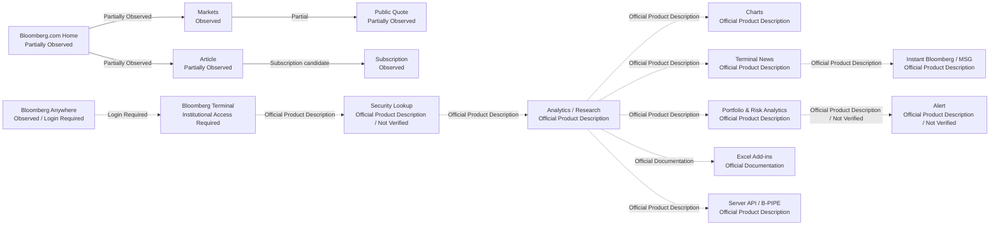
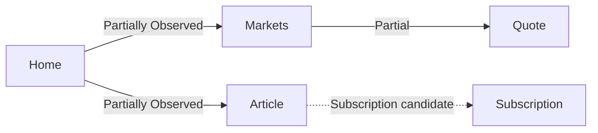
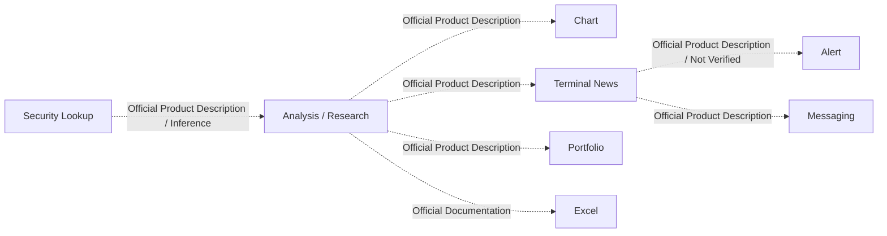
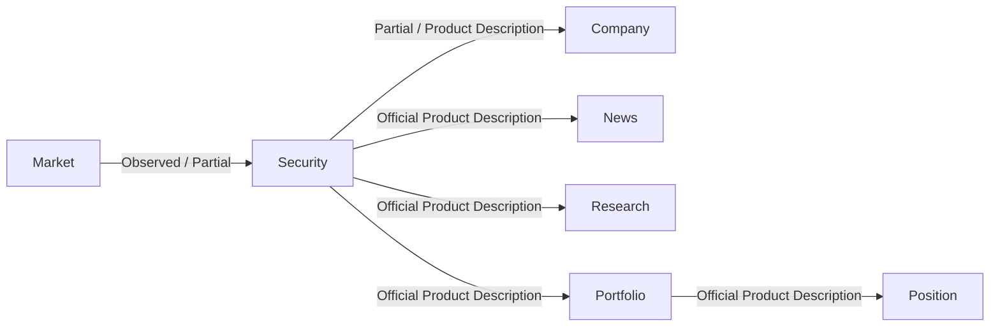
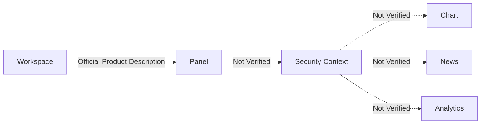
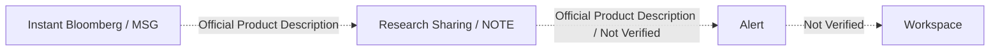
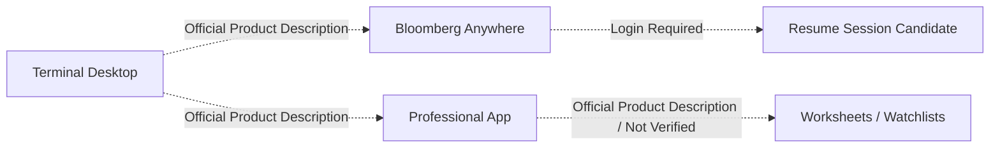
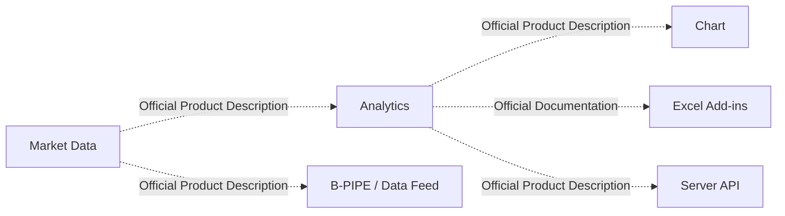

# Bloomberg Product Flow Architecture

## 문서 목적

이 문서는 Phase 6.1~6.3 Bloomberg Observation을 바탕으로 Public Web, Terminal / Professional Workflow, Workspace, Collaboration, Anywhere, Data / Integration Flow 후보를 분리해 기록한다.

이 문서는 Bloomberg Product Flow Architecture Observation이며 DATE Architecture를 확정하지 않는다. Candidate Principle과 Registry 업데이트를 수행하지 않는다.

## 조사 기준

| 항목 | 내용 |
| --- | --- |
| 조사 날짜 | 2026-07-28 KST |
| Timezone | Asia/Seoul |
| Bloomberg.com Public Access | Partially Observed |
| Bloomberg Account Login | Not Logged In |
| Digital Subscription | No Digital Subscription |
| Bloomberg Terminal Access | No Direct Terminal Session |
| Bloomberg Anywhere Access | No Bloomberg Anywhere session |
| Secondary Source | Not Used |

## Flow 상태 기준

| Status | 의미 |
| --- | --- |
| Observed | Bloomberg Public Product에서 entry 또는 relation을 확인한 관계 |
| Partially Observed | entry 또는 destination은 확인했지만 body, state, return path가 제한된 관계 |
| Official Documentation Only | 공식 Help / Support / Documentation에서만 확인한 관계 |
| Official Product Description | Bloomberg Professional Services Product Page 설명에서 확인한 관계 |
| Institutional Access Required | Terminal 또는 Professional Services 계약이 필요한 관계 |
| Login Required | Bloomberg account, Bloomberg Anywhere, B-Unit login이 필요한 관계 |
| Inference | 공식 자료 기반 후보 관계이며 Observation으로 확정하지 않는 관계 |
| Not Verified | 이번 단계에서 확인하지 못한 관계 |

## Flow 유형 요약

| Flow Type | Primary Layer | Primary Responsibility | Overall Status | Confidence |
| --- | --- | --- | --- | --- |
| Public Flow | Public Web | Home, Markets, Quote, Article, Subscription entry | Observed / Partially Observed | Medium |
| Professional Workflow | Terminal | Security, Analysis, Chart, News, Portfolio, Alert, Messaging, Excel | Official Product Description / Institutional Access Required | Medium |
| Entity Flow | Public Web / Terminal | Market, Security, Company, News, Research, Portfolio relation candidate | Partially Observed / Product Description / Inference | Medium |
| Workspace Flow | Terminal | Workspace, Panel, Security Context, Chart, News, Analytics | Product Description / Not Verified | Low to Medium |
| Collaboration Flow | Terminal | Message, Research Note, Alert, Workspace candidate | Product Description / Not Verified | Medium |
| Anywhere Flow | Bloomberg Anywhere / App | remote Terminal access and mobile continuity candidate | Observed / Login Required / Product Description | Medium |
| Data Flow | Enterprise Data | Market Data, Analytics, Chart, Excel, API, feed | Product Description / Documentation | Medium |

Flow 유형 수: 7

## Overall Flow Diagram

Diagram은 Bloomberg Product Architecture 확정안이 아니다. Terminal relation은 direct session 없이 Official Product Description 또는 Not Verified 기준으로 표시한다.

## Public Flow

Observation:
Bloomberg.com Home은 News, Video, Market Data footer, category Navigation, Subscription CTA를 제공한다. Markets는 Market news, Top Securities, asset class entry를 제공한다. Public Quote는 Partially Observed이고 AAPL direct body는 bot challenge로 제한되었다.

Interpretation:
Public Flow는 Market awareness와 News consumption을 중심으로 하며, Terminal professional Workflow와 분리된다.

Context Preservation:
Market category context와 Article category context는 candidate 수준이다.

Context Loss:
Markets row-to-Quote origin, Article return path, Search result context는 Not Verified다.

Confidence:
Medium

Evidence:
`BBG-NAV-001`~`BBG-NAV-014`, `BBG-PJ-001`~`BBG-PJ-006`.

## Professional Workflow

Observation:
Professional Workflow 후보는 Security 검색, Company Research, Market Monitor, News Monitoring, Portfolio Monitoring, Risk, Macro, Fixed Income, Messaging, Excel / API Integration으로 기록되었다.

Interpretation:
Terminal은 page-to-page movement보다 Security / Function / Workspace 기반 professional task chaining으로 설명된다.

Context Preservation:
Security Context, Portfolio / Position context, Message Thread context, Worksheet context는 후보로 기록된다.

Context Loss:
Command parsing, actual Function transition, Workspace persistence, Alert rule builder, Excel refresh는 Not Verified다.

Confidence:
Medium

Evidence:
`BBG-PW-001`~`BBG-PW-010`, `J-001`~`J-010`.

## Entity Flow

Observation:
Entity Candidate는 Security, Stock, Company, Bond, Yield, Currency, Commodity, Crypto, Economic Indicator, Country, Sector, Industry, News, Article, Analyst, Portfolio, Position, Watchlist, Workspace, Function, User, Organization을 포함한다.

Interpretation:
Bloomberg Benchmark에서는 Security가 Public Quote와 Terminal Security Lookup 후보를 연결하는 핵심 Entity 후보로 보인다. Company는 Public Company Profile과 BI / company research 후보에서 등장하지만 internal relation은 확정하지 않는다.

Context Preservation:
Security Context sharing은 Not Verified이며, Entity Flow는 candidate 수준으로 유지한다.

Context Loss:
Public Quote와 Company Profile relation, Terminal Security identity model, Portfolio ownership model은 확인 필요하다.

Confidence:
Medium

Evidence:
`BBG-ENT-001`~`BBG-ENT-023`.

## Workspace Flow

Observation:
Workspace, Launchpad Monitor, Panel / Window, Linked Window, Worksheet는 Phase 6.2에서 Workspace Navigation 후보로 기록되었다. Panel / Window와 Linked Window는 Not Verified다.

Interpretation:
Workspace Flow는 Terminal Information Density의 핵심 후보지만 direct session 없이 Context Preservation을 확정할 수 없다.

Context Preservation:
Workspace, Launchpad, Panel Link, Security Context는 User State Candidate다.

Context Loss:
layout persistence, linked window behavior, Security Context sharing은 Not Verified다.

Confidence:
Low to Medium

Evidence:
`BBG-NAV-026`~`BBG-NAV-030`, `BBG-STATE-001`~`BBG-STATE-004`.

## Collaboration Flow

Observation:
Instant Bloomberg, MSG, NOTE, Collaboration Tools는 Message Thread, chat rooms, folders, tabs, structured data links, research sharing 후보로 기록되었다.

Interpretation:
Collaboration Flow는 Evidence와 decision context를 individual Workspace 밖으로 공유하는 professional Workflow 후보로 해석된다.

Context Preservation:
IB chat state와 Research Note state는 후보이며 actual chat UI는 Not Verified다.

Context Loss:
message metadata, research note linking, alert handoff는 direct Terminal session이 필요하다.

Confidence:
Medium

Evidence:
`BBG-SUR-021`, `BBG-SFI-057`~`BBG-SFI-059`, `BBG-CTX-007`.

## Anywhere Flow

Observation:
Bloomberg Anywhere login Surface is Observed. Professional App provides Today, Data, Worksheets, IB, Alerts by official Product Description.

Interpretation:
Anywhere Flow is a remote access and continuity candidate, not a verified Workspace restore Flow.

Context Preservation:
Anywhere Session, Worksheet, Watchlist, IB context are candidates.

Context Loss:
post-login session, B-Unit behavior after authentication, worksheet restore are Not Verified.

Confidence:
Medium

Evidence:
`BBG-SUR-022`, `BBG-SUR-023`, `BBG-SFI-027`, `BBG-SFI-028`, `BBG-SFI-056`, `J-010`.

## Data Flow

Observation:
Data License, Server API, B-PIPE, Excel Add-ins / API Components are recorded as enterprise data and integration candidates.

Interpretation:
Data Flow extends professional Information Density from Terminal UI into spreadsheets, APIs, feeds, and enterprise delivery.

Context Preservation:
application / data field context is a candidate. Field-level Source and refresh state are Not Verified.

Context Loss:
export / sync behavior, API response lineage, exchange entitlement controls are Not Verified.

Confidence:
Medium

Evidence:
`BBG-SFI-060`~`BBG-SFI-064`, `BBG-PW-010`, `J-008`.

## Flow Role Matrix

| Flow Type | Entry | Primary Entity | Primary State | Access Restriction | Main Context Loss | Confidence |
| --- | --- | --- | --- | --- | --- | --- |
| Public Flow | Home / Markets / Article | Market / Security / Article | page category candidate | Public / Subscription Candidate | Article return path, Quote body | Medium |
| Professional Workflow | Terminal / Command Entry | Security / Company / Portfolio | Security Context candidate | Institutional Access Required | command parsing, Function transition | Medium |
| Entity Flow | Market / Security / Research | Security / Company / News / Portfolio | Entity relation candidate | Public / Terminal | Security identity model | Medium |
| Workspace Flow | Terminal Workspace / Launchpad | Security / News / Analytics | Workspace / Panel Link | Institutional Access Required | save / restore / linked window | Low |
| Collaboration Flow | IB / MSG / NOTE | Message / User / Research Note | chat state candidate | Institutional Access Required | structured data link behavior | Medium |
| Anywhere Flow | Bloomberg Anywhere / Professional App | User / Worksheet / Watchlist | Anywhere Session | Login Required | post-login continuity | Medium |
| Data Flow | Data License / Excel / API | Data Field / Security | entitlement state | Enterprise Entitlement | field lineage / refresh | Medium |

## Context Preservation Assessment

| Context | Status | Owner | Preserved Across | Limitation |
| --- | --- | --- | --- | --- |
| Public Market category | Partially Observed | Bloomberg.com | Markets pages | row-to-Quote origin Not Verified |
| Public Quote ticker | Partially Observed | Bloomberg.com | Quote page candidate | full body limited |
| Article category | Partially Observed | Bloomberg.com | Article page candidate | return path Not Verified |
| Security Context | Not Verified | Terminal Session | cross-function candidate | no Terminal session |
| Launchpad Workspace | Product Description / Not Verified | Terminal user | saved layout candidate | persistence Not Verified |
| Worksheet | Product Description | Terminal user | Professional App candidate | actual restore Not Verified |
| IB chat state | Product Description | Terminal user / organization | chat rooms / folders candidate | actual chat UI Not Verified |
| Portfolio / Position | Product Description | User / Organization | PORT / enterprise candidate | import and ownership Not Verified |

## Context Loss Points

| Loss ID | Context Loss Point | Status | Affected Flow |
| --- | --- | --- | --- |
| BBG-FLOSS-001 | Public Article return path | Not Verified | Public Flow |
| BBG-FLOSS-002 | Public Search query after result | Not Verified | Public Flow |
| BBG-FLOSS-003 | Markets table row to Quote origin | Not Verified | Public Flow |
| BBG-FLOSS-004 | Security Context across Terminal functions | Not Verified | Professional / Workspace Flow |
| BBG-FLOSS-005 | Launchpad Workspace restore | Not Verified | Workspace / Anywhere Flow |
| BBG-FLOSS-006 | Anywhere session continuity | Not Verified | Anywhere Flow |
| BBG-FLOSS-007 | Excel / API field lineage | Not Verified | Data Flow |

## Verified / Not Verified Flow 수 요약

| Status | Relation 수 |
| --- | ---: |
| Observed | 5 |
| Partially Observed | 8 |
| Official Documentation Only | 2 |
| Official Product Description | 18 |
| Institutional / Login / Enterprise Restricted | 17 |
| Inference | 4 |
| Not Verified | 9 |

## Open Questions

- Terminal Security Lookup에서 Security Context가 실제로 Function 간 유지되는가.
- Workspace, Launchpad, Panel, Linked Window가 어떤 단위로 저장되고 복원되는가.
- Public Search에서 Article, Topic, Company, Security result가 어떻게 구분되는가.
- Public Markets row에서 Quote로 이동할 때 origin context가 유지되는가.
- Public Article에서 related Security 또는 previous Market context로 돌아갈 수 있는가.
- Portfolio & Risk Analytics에서 Position Source와 model assumption이 어떻게 표시되는가.
- Instant Bloomberg message가 Security, Research, Alert와 어떤 link를 갖는가.
- Excel Add-in과 API가 field-level Source, timestamp, entitlement를 어떻게 유지하는가.
