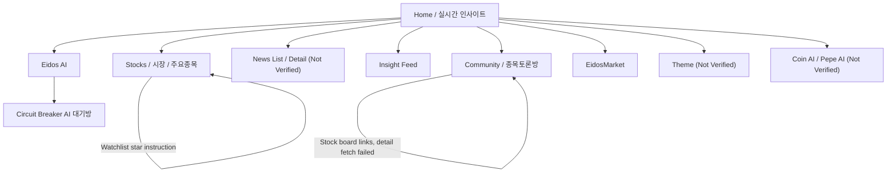

# Navigation Map 문서

## Global Navigation 기록

Observation:
The Home header shows links for `Stocks`, `홈`, `시장`, `Eidos AI`, `뉴스`, `인사이트`, `토론`, `Eidos Market`, and `데스크톱`. Bottom navigation on several pages repeats core destinations: `홈`, `주요종목`, `Eidos AI`, `EidosMarket`, `인사이트`, `커뮤니티`.

Interpretation:
EidosLayer uses a broad global navigation plus a repeated bottom navigation. The visible hierarchy mixes market/entity tools, content feeds, community, and prediction market.

User Impact:
Repeated navigation reduces return cost to major surfaces. Mixed labels may require users to learn which labels are synonyms or route variants, such as `시장`, `Stocks`, and `주요종목`.

DATE Implication:
DATE should evaluate global navigation by user question and entity transition quality, not by feature count.

Confidence:
High.

Evidence:
Official Product Observation, Home and subpage navigation, https://eidoslayer.com/, https://eidoslayer.com/stocks, accessed 2026-07-27.

## Local Navigation 기록

Observation:
Home includes local links for `전체 뉴스`, `시장 속보`, `국내·미국 시장`, `테마 특집`, `코인`, and `종목 토론`. Stocks includes tabs/filters for watchlist, owned stocks, major stocks, representative stocks, real-time ranking, movers, domestic/overseas, value, volume, up, down, and interest. Insight Feed includes persona filters and content category filters. EidosMarket includes ranking and full exploration links.

Interpretation:
Local navigation is used to reframe a surface around adjacent investment questions: market news, stock ranking, AI persona, and prediction category.

User Impact:
Local tabs can preserve surface context if implemented in-place, but this text-only pass cannot verify state preservation or URL behavior for every tab.

DATE Implication:
DATE should distinguish global destination changes from in-surface analytical filters.

Confidence:
High for visible local options, Low for interaction state.

Evidence:
Official Product Observation, Home, Stocks, Insight Feed, EidosMarket, accessed 2026-07-27.

## Search Entry 기록

Observation:
Home shows an input placeholder `종목 검색 (예: 삼성, AAPL)`. Community states users can search a stock and immediately enter a stock discussion room. Stocks page tells users to press `★` in stock lists to add watchlist items.

Interpretation:
Search appears to be stock-first. There was no verified public search result page or grouped result view for themes, news, people, or industries.

User Impact:
Users with a known stock can start quickly. Users with a theme, news, event, or macro question may rely on navigation links rather than search.

DATE Implication:
Provides neutral-to-limited evidence for H-001. Search is visible, but current observation does not prove broad entity search.

Confidence:
Medium.

Evidence:
Official Product Observation, https://eidoslayer.com/, https://eidoslayer.com/community, accessed 2026-07-27.

## Entity Transition 기록

Observation:
Home news cards link to news detail routes. Home shortcut links go to market, theme, AI/analysis tools, and coin analysis. Community links stock names to stock discussion detail routes, but those detail routes were not fetched successfully. Community also states stock charts include a stock discussion room button.

Interpretation:
Entity transition is present as links between market/news/stock/community surfaces, but relationship semantics are not fully exposed in the public text extraction.

User Impact:
Users can move between content and stock/social contexts, but it is unclear whether context is preserved or whether users land on full-page destinations.

DATE Implication:
Relevant to H-006 and H-010. DATE should record whether entity transitions explain relationship reasons, not only whether links exist.

Confidence:
Medium.

Evidence:
Official Product Observation and fetch limitation, Home and Community, accessed 2026-07-27.

## Back Navigation과 Context Preservation

Observation:
Circuit Breaker AI page includes `← 주요종목으로`. Other observed pages rely on global/bottom navigation links. No side panel or overlay interaction was verified in public text extraction.

Interpretation:
The observed route pattern is page navigation with some explicit return links. Context preservation beyond browser back/global navigation is not verified.

User Impact:
Users may need to rely on page-level navigation for recovery. If live filters or loaded states reset, analysis context could be lost, but this was not directly verified.

DATE Implication:
Evidence for H-006 is insufficient. Phase 1 comparison should distinguish explicit return paths from true context retention.

Confidence:
Low to Medium.

Evidence:
Official Product Observation, https://eidoslayer.com/stocks/circuit-breaker, accessed 2026-07-27.

## Mobile Navigation 기록

Observation:
Rendered text shows repeated bottom navigation across pages. Actual mobile breakpoint and menu behavior were not directly tested.

Interpretation:
Bottom navigation may support mobile or repeated primary route access, but this is not verified as responsive navigation.

User Impact:
Potentially lowers navigation cost on smaller devices; confirmation requires viewport testing.

DATE Implication:
Record mobile navigation separately in future benchmarks using screenshots or responsive testing.

Confidence:
Low.

Evidence:
Official Product Observation, repeated bottom nav in rendered text, accessed 2026-07-27.

## Navigation Sketch 기록

