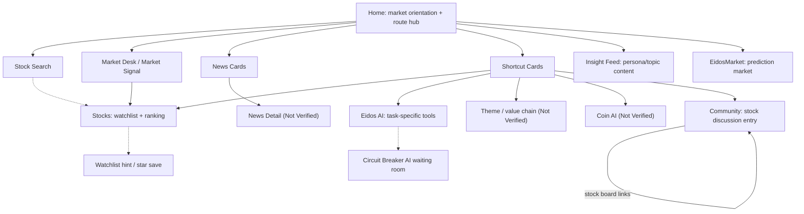

# EidosLayer Product Flow Architecture 문서

Phase: 1.15 — Eidos Product Flow Architecture
Service: EidosLayer
Source Basis: Phase 1.1 공개 공식 Product Observation
Access Date of Source Observations: 2026-07-27

## 목적

이 문서는 EidosLayer에서 관찰된 Product Flow Architecture를 요약한다. DATE IA, DATE Navigation, DATE Entity Model, DATE Screen System을 제안하지 않는다.

목적은 EidosLayer가 Surface, Entity, Evidence cue, AI Tool, Personal Continuity hint 사이에서 사용자를 어떻게 이동시키는지 정리해 이후 Benchmark의 Flow Architecture를 같은 기준으로 비교할 수 있게 하는 것이다.

## Source 경계

이 문서의 Observation은 기존 EidosLayer Phase 1.1 문서에서 도출했다.

- [01-product-surface-map.md](01-product-surface-map.md)
- [02-navigation-map.md](02-navigation-map.md)
- [04-core-journey-observations.md](04-core-journey-observations.md)
- [05-entity-and-relationship-observations.md](05-entity-and-relationship-observations.md)
- [06-information-density-observations.md](06-information-density-observations.md)
- [07-trust-and-evidence-observations.md](07-trust-and-evidence-observations.md)
- [09-phase-1-1-summary.md](09-phase-1-1-summary.md)

Phase 1.15에서는 새로운 서비스 접속을 수행하지 않았다.

## Product Flow Architecture 요약

Observation:
공개 접근에서 관찰된 EidosLayer Product에는 다섯 가지 visible Flow 계열이 있다: Market Discovery Flow, Stock/Entity Flow, AI Tool Flow, Insight/Content Flow, Participation/Community Flow. Home은 Search, Market Desk, News, shortcut을 노출한다. Stocks는 Watchlist와 public ranking을 함께 배치한다. Eidos AI는 task-specific Tool을 노출한다. Insight Feed는 AI-curated content를 persona와 topic으로 구성한다. Community와 EidosMarket은 사용자를 Discussion과 Prediction Surface로 이동시킨다.

Interpretation:
EidosLayer는 Home을 single-task Dashboard가 아니라 orientation과 routing layer로 사용하는 것으로 해석된다. Product Flow는 "지금 무엇이 일어나고 있는가?"에서 시작해 전문화된 Surface로 사용자를 분산시킨다.

User Impact:
사용자는 여러 low-friction entry path를 얻지만, detail page, logged-in Tool, dynamic data를 사용할 수 없을 때 Flow가 분절될 수 있다.

DATE Implication:
DATE는 방향을 선택하기 전에 이 distributed Flow model을 Search-first, Entity-first, Evidence-first, Portfolio-monitoring model과 비교해야 한다.

Confidence:
Medium.

Evidence:
Phase 1.1 문서에서 요약한 Official Product Observation, 접근일 2026-07-27.

## Flow 계열

| Flow Family | Primary Entry | Primary Object | Visible Destination | Verified Depth | Main Blocker |
|---|---|---|---|---|---|
| Market Discovery | Home | Market, News | Stocks, News, Theme, AI, Coin, Discussion | Partial | Live loading과 미검증 detail page |
| Stock / Entity | Search, Stocks, Community | Stock | Stocks, Stock Discussion, Watchlist hint | Partial | Stock detail과 Search result 미검증 |
| AI Tool | Eidos AI | AI Tool, Market Event | Market Dashboard, Korea AI, Circuit Breaker AI, mover cause AI, US AI | Partial | Live data와 detail comment에 login 필요 |
| Insight / Content | Insight Feed | Insight, Persona, Topic | Article/news filters, persona filters, topic filters | Partial | Empty content state와 Source link 미검증 |
| Participation | Community, EidosMarket | Discussion, Prediction Market | Stock board links, prediction list | Partial | Detail route와 login/write behavior 미검증 |
| Personal Continuity | Stocks | Watchlist | Empty state, star-save instruction | Low | Persistence와 logged-in behavior 미검증 |

## Flow 검증 수준

| Flow | Flow Type | Verification Level | Reason |
|---|---|---|---|
| Home to market orientation | User Decision Flow | Observed Flow | Home content에 market sentiment, Market Desk, News, shortcut이 포함된다. |
| Home to Stocks / Eidos AI / Feed / Community / EidosMarket | Navigation Flow | Observed Flow | Global link와 shortcut link가 관찰되었다. |
| Home news cards to News detail | Evidence Flow | Partial Flow | News card와 link는 관찰되었지만 News detail은 검증되지 않았다. |
| Home to Theme / Coin | Navigation Flow | Partial Flow | Shortcut label은 관찰되었지만 destination page는 검증되지 않았다. |
| Search to stock context | Entity Flow | Inferred Flow | Stock Search input은 관찰되었지만 result behavior는 테스트하지 않았다. |
| Stock to Watchlist | Action Flow | Partial Flow | Star-save instruction은 관찰되었지만 persistence는 검증되지 않았다. |
| Stock to Discussion | Entity Flow | Partial Flow | Community Stock board link는 관찰되었지만 detail behavior는 검증되지 않았다. |
| Eidos AI to Circuit Breaker AI | Navigation / State Transition | Partial Flow | Tool과 waiting-room shell은 관찰되었지만 member-only live content는 gated 상태였다. |
| Insight persona/topic filtering | Information Flow | Partial Flow | Filter와 disclosure는 관찰되었지만 populated insight content는 검증되지 않았다. |
| EidosMarket prediction browsing | Participation Flow | Partial Flow | Prediction list는 관찰되었지만 detail/vote behavior는 검증되지 않았다. |
| Cross-session analysis continuation | Context Preservation Flow | Not Verified Flow | Saved workspace, history, next-day state는 관찰되지 않았다. |
| Side panel or overlay evidence checking | Context Preservation Flow | Not Verified Flow | Side panel, overlay, split view, retained workspace는 검증되지 않았다. |

## 주요 Flow 모델

아래 diagram은 observed relationship과 partial navigation relationship을 함께 보여준다. `Not Verified`로 표시된 node는 link 또는 label로만 보였으며 destination behavior는 검증되지 않았다.

## Market Discovery Flow 기록

Observation:
Home은 market sentiment, Market Desk tab, live/loading market signal, Source/time이 표시된 latest news, real-time market, Theme analysis, analysis tools, coin analysis shortcut을 포함한다.

Interpretation:
Market Discovery Flow는 first-pass triage로 설계된 것으로 해석된다. 사용자는 ranking, News, AI Tool, Theme, crypto Surface 중 어디로 이어갈지 선택할 수 있다.

User Impact:
이 Flow는 시작 전에 ticker를 알아야 하는 부담을 낮춘다. 약점은 여러 follow-up path가 dynamic-loading 상태이거나 검증되지 않았다는 점이다.

DATE Implication:
This flow should be compared against other benchmark homes to evaluate H-004 and H-015.

Confidence:
Medium.

Evidence:
Official Product Observation, Home, accessed 2026-07-27.

### Flow 단계

1. User lands on Home.
2. User scans market sentiment, market desk, and market signal news.
3. User chooses a route: Stocks, News, Theme, Eidos AI, Coin, or Community.
4. User enters a specialized surface.
5. Evidence validation depends on destination; News/Theme/Coin detail were not verified.

## Stock / Entity Flow 기록

Observation:
Home은 Stock Search를 노출한다. Stocks page는 Watchlist, major stocks, ranking filter를 노출한다. Community는 사용자가 Stock을 검색해 Stock Discussion room으로 들어갈 수 있다고 설명한다. 또한 Stock chart에서 Discussion room으로 이동할 수 있다고 설명한다.

Interpretation:
Stock은 가장 명확하게 관찰된 Navigation object다. visible Flow는 Stock discovery, personal saving, ranking, social context를 연결한다.

User Impact:
Known-stock task는 Theme, News, macro Entity task보다 먼저 지원되는 것으로 보인다. Stock detail page 없이 분석 깊이는 검증할 수 없다.

DATE Implication:
This provides limited evidence for H-001 and insufficient evidence for H-003. DATE should not infer broad entity search from stock-first search.

Confidence:
Medium for stock-first flow; Low for detail architecture.

Evidence:
Official Product Observation, Home, Stocks, Community, accessed 2026-07-27.

### Flow 단계

1. User enters or selects a stock.
2. User reaches stock-related market/ranking or discussion context.
3. User may add stock to watchlist using star instruction.
4. User may move from chart to discussion, but chart page was not directly observed.
5. Company/security separation, financial data, and peer comparison are not verified.

## AI Tool Flow 기록

Observation:
Eidos AI lists task-specific tools: live market dashboard, Korea market AI, Circuit Breaker AI, mover cause AI, US movers AI, and a prepared crypto AI. The page states member-only tools require login for live data and detailed AI comments. Circuit Breaker AI page describes live countdown, AI comments, and comment room together.

Interpretation:
AI는 chat-like entry만으로 제공되지 않는다. 특화된 Market situation Tool collection으로 구조화되어 있다. 일부 AI Tool은 Event-driven으로 보인다.

User Impact:
사용자는 Market problem에 따라 AI Tool을 선택할 수 있다. 다만 public user는 AI output quality, Source grounding, detailed commentary를 확인할 수 없다.

DATE Implication:
DATE는 AI를 standalone destination으로 둘지, Market/Stock/Event Surface에 붙는 contextual layer로 볼지 추가로 평가해야 한다.

Confidence:
Medium.

Evidence:
Official Product Observation, Eidos AI and Circuit Breaker AI, accessed 2026-07-27.

### Flow 단계

1. User opens Eidos AI.
2. User selects a tool by market condition or asset class.
3. User enters a tool surface such as Circuit Breaker AI.
4. Tool value may depend on login-gated live data and AI comments.
5. Evidence source linking is not verified.

## Insight / Content Flow 기록

Observation:
Insight Feed는 AI-curated Insight를 persona filter와 market condition, stock analysis, macro, ETF, investment strategy 같은 category로 grouping한다. profile은 실제 발언이 아니라 AI editorial avatar라고 disclosure한다.

Interpretation:
Insight Flow는 Market analysis를 editorial perspective로 전환한다. Persona는 factual Source가 아니라 browsing frame으로 사용되는 것으로 해석된다.

User Impact:
이 Flow는 engagement와 이해를 높일 수 있지만, persona framing이 authority confusion을 만들 수 있으므로 Source grounding이 중요하다.

DATE Implication:
Relevant to H-009 and H-012. DATE should separate source, author, AI voice, and persona if generated interpretation is used.

Confidence:
Disclosure와 filter structure는 High, detail Evidence는 Low.

Evidence:
Official Product Observation, Insight Feed, accessed 2026-07-27.

### Flow 단계

1. User enters Insight Feed.
2. User chooses article/news mode.
3. User filters by persona or topic.
4. User reads AI-curated content if available.
5. Individual insight source traceability is not verified.

## Participation Flow 기록

Observation:
Community는 Stock-specific Discussion board를 노출한다. EidosMarket은 percentage와 vote count가 포함된 popular Prediction을 노출한다. Circuit Breaker AI는 trading resumption 주변의 comment room을 언급한다.

Interpretation:
Participation은 social Discussion, Prediction, Event-specific comment context로 분리된다. 이러한 Surface는 Market sentiment Signal을 만들 수 있지만 Evidence-linked analysis로 검증되지는 않았다.

User Impact:
사용자는 passive reading에서 social 또는 Prediction participation으로 이동할 수 있다. Write, vote, comment, persistence behavior는 검증되지 않았다.

DATE Implication:
DATE는 community sentiment를 context로 다루는 경우와 Evidence를 검증 가능한 Source material로 다루는 경우를 구분해야 한다.

Confidence:
visible Surface는 Medium, participation depth는 Low.

Evidence:
Official Product Observation, Community, EidosMarket, Circuit Breaker AI, accessed 2026-07-27.

### Flow 단계

1. User opens Community or EidosMarket.
2. User selects a stock board or prediction topic.
3. User views discussion/prediction summary.
4. User may participate, but login/write behavior is not verified.
5. Relationship back to investment entity or evidence is not verified.

## Personal Continuity Flow 기록

Observation:
Stocks page shows `내 관심종목 실시간`, an empty state, and instruction to add stocks with `★`.

Interpretation:
Watchlist는 직접 관찰된 유일한 Personal Continuity hook이다. 선택한 Stock을 repeat-entry object로 바꾸는 구조로 보이지만 persistence는 검증되지 않았다.

User Impact:
사용자는 monitoring을 어떻게 시작하는지 이해할 수 있지만, public 접근에서는 next-day analysis continuation을 검증할 수 없다.

DATE Implication:
H-007 receives partial support, while H-014 remains unverified.

Confidence:
Watchlist concept은 Medium, continuity architecture는 Low.

Evidence:
Official Product Observation, Stocks, accessed 2026-07-27.

### Flow 단계

1. User discovers or selects a stock.
2. User adds it with star instruction.
3. Stock appears in watchlist if supported.
4. User revisits watchlist later.
5. Persistence, notifications, and analysis session restoration are not verified.

## Flow 역할 매트릭스

| Surface | Discovery | Analysis | Evidence | Participation | Personal Continuity | Verified Notes |
|---|---|---|---|---|---|---|
| Home | High | Low to Medium | Partial via news source/time | Low | Not Verified | Route hub and market desk |
| Stocks | Medium | Partial | Low | Low | Partial via watchlist | Dynamic ranking/loading observed |
| Eidos AI | Medium | Medium | Not Verified | Low | Login-gated | Tool cards observed |
| Insight Feed | Medium | Medium | Not Verified | Low | Not Verified | AI persona disclosure observed |
| Community | Medium | Low | Low | Medium | Not Verified | Stock-specific discussion entry |
| EidosMarket | Medium | Low | Low | Medium | Not Verified | Probability/vote signals |
| Circuit Breaker AI | Low | Medium | Not Verified | Medium | Login-gated | Event-specific waiting room |

## Context Preservation 평가

Observation:
관찰된 Flow는 대부분 page-based Navigation과 반복되는 global/bottom Navigation에 의존한다. Side panel, overlay, split view, retained analysis Workspace는 검증되지 않았다.

Interpretation:
Public Observation 기준으로 EidosLayer는 검증된 in-place Context Preservation보다 route clarity와 broad Surface access를 우선하는 것으로 해석된다.

User Impact:
사용자는 주요 Surface에 빠르게 도달할 수 있지만 News, AI explanation, Discussion을 검증하는 과정에서 analytical context를 잃을 수 있다.

DATE Implication:
H-006 should remain `Needs Evidence` for EidosLayer until direct interaction or logged-in observation confirms state preservation.

Confidence:
Low to Medium.

Evidence:
Official Product Observation, Navigation Map and public surfaces, accessed 2026-07-27.

## Flow Architecture 강점

- Home은 known ticker 없이도 시작할 수 있는 여러 entry path를 만든다.
- Stock은 Search, Stocks, Watchlist, Community를 가로지르는 명확한 Navigation object다.
- AI Tool은 generic AI branding만이 아니라 Market task 기준으로 grouping된다.
- Insight Feed는 AI editorial avatar framing을 명시적으로 disclosure한다.
- Watchlist empty state는 다음 Action을 알려준다.
- EidosMarket은 빠른 scanning을 위해 compact probability/vote metadata를 사용한다.

## Flow Architecture Friction 기록

- Search result breadth와 grouping은 검증되지 않았다.
- Market Discovery route는 여러 Surface로 분산되며 검증 깊이가 고르지 않다.
- Public view에서 Evidence validation은 headline source/time 수준에 머무는 경우가 많다.
- Login gate는 AI detail, live data, Personal Continuity verification을 막는다.
- News, Theme, Stock Detail, Prediction Detail Flow는 incomplete 상태로 남아 있다.
- Context loss를 낮추는 Evidence checking용 side panel 또는 overlay Flow는 검증되지 않았다.

## 검증되지 않은 Flow 질문

1. Does stock search produce a typed result set or direct navigation only?
2. Does News Detail connect to Stock, Company, Industry, Theme, or Event?
3. Does Theme connect value chain, industry, and stock relationships?
4. Does AI output cite source news, rankings, or market data?
5. Does Watchlist preserve user research context or only saved stock symbols?
6. Does EidosMarket link prediction topics to investable entities?
7. Does mobile navigation preserve the same flow model?
8. Does logged-in mode add notification or next-day continuity flows?

## DATE Research Implication 요약

- EidosLayer는 public mode에서 하나의 Flow를 완전히 dominant하게 만들지 않고 Market Discovery, Stock-first Search, AI Tool, Participation Surface를 결합할 수 있음을 보여주는 Benchmark Evidence로만 사용한다.
- EidosLayer를 DATE가 Home-first, Search-first, AI-first, Watchlist-first가 되어야 한다는 proof로 취급하지 않는다.
- 이후 Benchmark에서는 Product Flow가 user question, Entity type, content type, personal Workspace 중 무엇으로 route되는지 비교한다.
- DATE에서는 Flow Observation과 Architecture Decision을 계속 분리한다.
