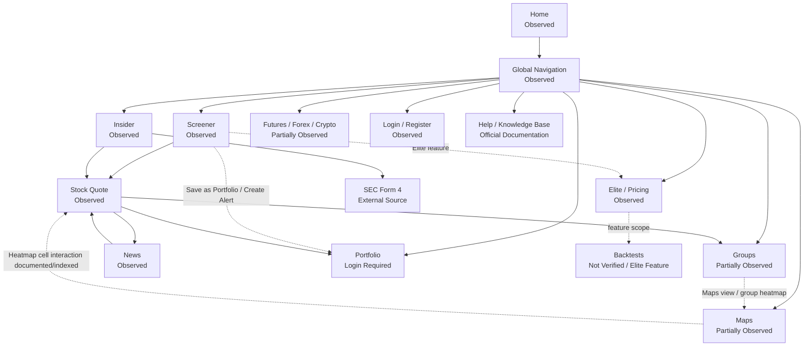

# Finviz Product Surface Map 기록

## 문서 목적

이 문서는 Finviz에서 공식 자료로 확인 가능한 Product Surface를 정리한다.

이번 단계에서는 Surface 존재 여부, 접근 수준, User Goal, Primary Entity, Surface Responsibility를 기록한다. Product Flow, Candidate Principle, Registry 업데이트는 수행하지 않는다.

## Surface 요약

| 항목 | 수 |
| --- | ---: |
| 기록한 Product Surface | 17 |
| Public Access Surface | 11 |
| Login Required Surface | 3 |
| Elite Feature 영향을 받는 Surface | 7 |
| Not Verified 또는 Partially Observed Surface | 5 |

## Product Surface 관계 기록

실선은 공개 Product page에서 확인한 연결이다. 점선은 공식 Documentation, 공식 Blog, 또는 로그인 / Elite 접근이 필요한 연결이다. 이 Diagram은 Product Architecture 확정안이 아니다.

## Surface Inventory

| Surface ID | 공식 명칭 | URL | Access Level | Observation Status | User Goal | Primary Entity | Supporting Entities | Primary Action | Navigation Entry | Surface Responsibility | Related Surface | Information Form | Evidence | Confidence | Open Question |
| --- | --- | --- | --- | --- | --- | --- | --- | --- | --- | --- | --- | --- | --- | --- | --- |
| FNV-SF-001 | Home | https://finviz.com/ | Public Access | Observed | 오늘 Market 상태와 주요 Stock / News / Event를 빠르게 파악한다. | Market | Stock, News, Calendar Event, Insider Transaction, Futures, Forex, Crypto | Signal, News, Market summary scan | Global Navigation Home | Dense Market Summary와 multi-surface entry를 제공한다. | Screener, Maps, News, Insider, Calendar, Futures, Forex, Crypto | Dense Summary, Table, Heatmap, News List | 공식 Home에서 Market breadth, Signal lists, S&P 500 Heatmap area, Headlines, Major News, Calendar, Insider, Futures, Forex & Bonds, delay disclosure 확인. Access Date: 2026-07-28. | High | 로그인 후 Home layout customization 상태는 Not Verified. |
| FNV-SF-002 | Global Navigation | https://finviz.com/ | Public Access | Observed | Product Surface 사이를 이동한다. | Product Surface | Tool, Asset Class, Account, Subscription | Surface 선택 | Top navigation | Home, News, Screener, Maps, Groups, Portfolio, Insider, Futures, Forex, Crypto, Calendar, Pricing, Theme, Help, Login, Register를 연결한다. | 전체 Surface | Navigation | 모든 확인 페이지 상단에 동일 Navigation 항목이 표시됨. Access Date: 2026-07-28. | High | Mobile 또는 responsive Navigation은 Not Verified. |
| FNV-SF-003 | Screener | https://finviz.com/screener | Public Access / Elite Feature 일부 | Observed | 조건에 맞는 Stock 또는 ETF 후보를 발견하고 비교한다. | Stock | Company, Sector, Industry, Country, Filter, Signal, ETF | filter 적용, result row 선택, view 전환 | Global Navigation Screener | filter-first discovery와 table / chart / map result view를 제공한다. | Stock Quote, Portfolio, Alerts, Maps | Form, Table, Chart, Snapshot, Heatmap | 공식 Screener는 Descriptive, Fundamental, Technical, News, ETF, All filter와 Overview, Valuation, Financial, Ownership, Performance, Technical, ETF, Charts, News, Snapshot, Maps 등 view tabs를 표시함. Help는 rich-information output, multiple views, fast navigation, instant update를 설명함. | High | Saved preset이 free registered와 Elite에서 어떻게 다른지 direct UI 확인 필요. |
| FNV-SF-004 | Maps | https://finviz.com/map | Public Access / Elite Feature 일부 | Partially Observed | Market 구조와 Stock performance를 Heatmap으로 파악한다. | Stock | Sector, Industry, Index, ETF, Crypto, Futures, Theme | Heatmap scan, hover, double-click 또는 ticker search | Global Navigation Maps | Heatmap 기반 Market summary, Discovery, Navigation 역할을 수행할 수 있다. | Screener, Groups, Stock Quote | Heatmap | 공식 indexed Map text는 S&P 500 index stocks categorized by sectors and industries, size represents market cap, filter options, ticker search, zoom / pan, double-click detail, hover competitor view를 표시함. 공식 Blog는 Maps 확장과 Themes / Insider / Market Cap Map을 설명함. | Medium | 현재 UI에서 double-click이 Stock Detail로 이동하는지 직접 조작 검증 필요. |
| FNV-SF-005 | Groups | https://finviz.com/groups | Public Access / Elite Feature 일부 | Partially Observed | Sector, Industry, Country, Capitalization 단위로 Market group을 비교한다. | Sector / Industry | Country, Market Cap group, Stock, Metric | group 기준 선택, view 전환, sorting | Global Navigation Groups | group-level comparison과 Market rotation 확인을 제공한다. | Maps, Screener, Stock Quote | Table, Bar Chart, Chart, Heatmap | 공식 Groups 화면은 Group, Order By, Overview, Valuation, Performance, Custom, Performance Chart, Spectrum, Charts, Maps tabs를 표시함. 공식 Knowledge Base indexed text는 group-level performance, valuation, chart view를 설명함. | Medium | Sector to Industry to Company drill-down의 실제 click path는 Not Verified. |
| FNV-SF-006 | Stock Quote / Stock Detail | https://finviz.com/stock?t=AAPL | Public Access / Elite Feature 일부 | Observed | 특정 Stock의 가격, company context, metrics, News, related entities를 확인한다. | Stock | Company, Sector, Industry, Peer Stock, ETF, Analyst, News, Option, Filing | detail scan, tab 전환, related Stock 이동 | Screener row, ticker link, direct URL | Stock Context를 유지하는 dense information hub 역할을 한다. | Screener, News, Insider, Options, Filings, Peers | Detail Page, Dense Summary, Table, Chart, News List | AAPL page에서 Overview, Compare, Short Interest, Financials, Options, Filings tabs, Sector / Industry / Country / market cap category / exchange, Peers, Held by ETF, metrics, ratings, News를 확인. | High | Chart interaction, Options tab, Filings detail은 이번 단계에서 깊게 확인하지 않음. |
| FNV-SF-007 | News | https://finviz.com/news | Public Access / Elite Feature 일부 | Observed | Market과 Stock 관련 News를 시간 또는 Source 기준으로 스캔한다. | News | Source, Stock, Market Category, Blog | News item 선택, category 전환, Time / Source view 전환 | Global Navigation News, Home Headlines | 독립 News Surface와 Home / Stock Quote supporting content 역할을 동시에 수행한다. | Home, Stock Quote | News List | 공식 News page는 Market News, Market Pulse, Stocks News, ETF News, Crypto News, News / Blogs, View by Time / Source, timestamp, external Source links를 표시함. | High | News item에서 Stock Context로 돌아오는 구조는 Not Verified. |
| FNV-SF-008 | Insider | https://finviz.com/insidertrading | Public Access | Observed | insider transaction을 Person, Company, Transaction 기준으로 조사한다. | Insider Transaction | Stock, Owner, Relationship, SEC Form 4 | transaction table scan, ticker 또는 SEC Form 4 이동 | Global Navigation Insider, Home Insider table | insider activity discovery와 SEC external traceability를 제공한다. | Stock Quote, SEC Form 4 | Table | 공식 Insider page는 Latest Insider Trading, Top Insider Trading Recent Week, Top 10% Owner Trading Recent Week, Filter, Ticker, Owner, Relationship, Date, Transaction, Cost, Shares, SEC Form 4를 표시함. | High | Owner detail page의 역할은 Not Verified. |
| FNV-SF-009 | Portfolio | https://finviz.com/portfolio | Login Required / Elite Feature 일부 | Login Required | Stock list 또는 holdings를 저장하고 관리한다. | Portfolio | Stock, Flag, Note, Alert | account 생성 또는 로그인 후 Portfolio 사용 | Global Navigation Portfolio, Screener Save as Portfolio | Personal list / Portfolio management Surface로 보인다. | Screener, Stock Quote, Elite | Table, Form, Personal Surface | Portfolio URL은 not logged in 상태에서 Create a Free Account로 redirect됨. Elite page는 Portfolios 100, Tickers per Portfolio 500을 표시함. 공식 Blog는 Portfolios와 Screener의 Color Flags를 설명함. | Medium | Portfolio가 Watchlist인지 Holdings 관리 Surface인지 direct UI 확인 필요. |
| FNV-SF-010 | Futures | https://finviz.com/futures | Public Access / Elite freshness 차이 | Partially Observed | futures asset class 가격을 확인한다. | Futures Contract | Commodity, Index Future | asset class table 또는 chart scan | Global Navigation Futures, Home Futures summary | Stock 외 asset class summary Surface다. | Home, Forex, Crypto | Table, Chart | 공식 Futures page URL과 heading, Global Navigation, "Futures quotes delayed 20 minutes" disclosure를 확인. Home에도 Futures table이 표시됨. FAQ는 Futures data delay를 설명함. | Medium | Futures Detail 또는 drill-down pattern은 Not Verified. |
| FNV-SF-011 | Forex | https://finviz.com/forex | Public Access | Partially Observed | currency pair 가격을 확인한다. | Currency Pair | Bond Yield, Crypto Pair | asset class scan | Global Navigation Forex, Home Forex & Bonds summary | currency / bonds summary Surface다. | Home, Futures, Crypto | Table, Chart | 공식 Forex page URL과 heading, Global Navigation을 확인. Home에 Forex & Bonds table이 표시됨. | Low | Forex page body와 pair detail interaction은 Not Verified. |
| FNV-SF-012 | Crypto | https://finviz.com/crypto | Public Access | Partially Observed | crypto asset 가격을 확인한다. | Crypto Asset | Currency Pair | asset class scan | Global Navigation Crypto, Home Forex & Bonds summary | crypto summary Surface다. | Home, News, Maps | Table, Chart, Heatmap | 공식 Crypto page URL과 heading, Global Navigation을 확인. News page에는 Crypto News category가 표시됨. Maps indexed text에는 Crypto map filter가 표시됨. | Low | Crypto Detail 또는 drill-down pattern은 Not Verified. |
| FNV-SF-013 | Calendar | https://finviz.com/calendar/economic | Public Access | Partially Observed | economic release와 earnings 같은 Event를 확인한다. | Calendar Event | Stock, Economic Indicator | event scan | Global Navigation Calendar, Home Calendar section | Event timing summary Surface다. | Home, Stock Quote | Calendar, Table | Home에서 economic releases와 earnings release table을 확인. Calendar URL과 Global Navigation을 확인. | Medium | Calendar 내부 category와 filter는 Not Verified. |
| FNV-SF-014 | Elite / Pricing | https://finviz.com/elite | Public Access | Observed | Free / Elite 기능 차이와 subscription 조건을 확인한다. | Subscription Plan | Feature, Data, Alert, Portfolio, API | plan 비교, free trial 시작 | Global Navigation Pricing | 접근 제한과 Elite Feature scope를 설명한다. | Authentication, Screener, Maps, Portfolio, Backtests | Pricing Table, Marketing Page | Elite page는 real-time data, ad-free, advanced Screener, alerts, export/API, ETF data, portfolio limits, statement years, layout customization, pricing을 표시함. FAQ도 subscription과 trial을 설명함. | High | Registered free 계정의 정확한 limits는 direct account UI 확인 필요. |
| FNV-SF-015 | Authentication | https://finviz.com/login | Public Access | Observed | Login 또는 free account 생성으로 개인 기능에 접근한다. | User Account | Subscription Plan | Login, Register | Global Navigation Login / Register, Portfolio redirect | Public Surface에서 Login Required Surface로 전환한다. | Portfolio, Elite, Settings | Form | Login page와 Register page에서 Google / Email entry, Create a free account, Log in link를 확인. | High | Login 후 default landing Surface는 Not Verified. |
| FNV-SF-016 | Search | https://finviz.com/ | Public Access | Partially Observed | ticker 또는 Stock을 빠르게 찾는다. | Stock | Company, Ticker | ticker input 또는 quick search | Maps / Screener / Stock URL | 명시적 entity lookup 또는 Surface 내부 ticker filter 역할을 한다. | Stock Quote, Screener, Maps | Input, Search | Maps indexed text는 Quick search ticker를 표시함. Screener에는 Tickers input이 표시됨. Stock Quote direct URL은 ticker parameter를 사용함. | Medium | site-wide global Search 위치와 autocomplete behavior는 Not Verified. |
| FNV-SF-017 | Backtests | https://finviz.com/backtests | Elite Feature | Not Verified | technical strategy를 과거 데이터로 검증한다. | Strategy | Technical Indicator, Stock, Benchmark | backtest 실행 | Elite-related feature entry | Strategy validation tool로 설명되지만 이번 조사에서 실제 Product interaction은 확인하지 못했다. | Screener, Charts, Elite | Tool, Chart, Table | direct Backtests URL은 정상 body를 확인하지 못함. Official Elite-related indexed page는 backtesting capabilities를 언급하지만 현재 public Elite page의 직접 table에서는 별도 Surface body를 확인하지 못함. | Low | 현재 Backtests URL, access gate, Screener linkage를 direct UI로 확인 필요. |

## 핵심 Surface Observation 기록

### Home

Observation:
Home은 Global Navigation, Market breadth, Signal 기반 Stock lists, S&P 500 Heatmap area, Headlines, Major News ticker list, economic releases, earnings releases, insider tables, Futures, Forex & Bonds summary를 한 화면에 배치한다.

Interpretation:
Home은 단일 landing page보다 Dense Market Summary와 여러 Surface로 향하는 Link Hub 역할을 동시에 수행하는 구조로 해석된다.

User Impact:
사용자는 오늘 Market에서 움직인 Stock, News, Event, Insider activity, Futures / Forex 상태를 같은 시작점에서 스캔할 수 있다.

DATE Implication:
DATE에서 Home이 Market Dashboard인지, Link Hub인지, Dense Market Summary인지 검증할 질문으로 남긴다.

Confidence:
High

Evidence:
Official Product Observation, https://finviz.com/, 확인일 2026-07-28.

### Screener

Observation:
Screener는 Descriptive, Fundamental, Technical, News, ETF, All filter를 제공하고, Overview, Valuation, Financial, Ownership, Performance, Technical, ETF, Charts, News, Snapshot, Maps 등 result view를 전환한다.

Interpretation:
Screener는 filter capability만이 아니라 Table, Chart, Snapshot, Maps로 결과를 재표현하는 Discovery Surface로 해석된다.

User Impact:
사용자는 하나의 filter set을 유지한 채 비교, chart scan, Stock Detail 진입을 반복할 수 있다.

DATE Implication:
DATE에서 Screener Result View와 filter builder를 같은 Surface로 둘지 분리할지 검토할 질문이 된다.

Confidence:
High

Evidence:
Official Product Observation, https://finviz.com/screener, Official Documentation, https://finviz.com/help/screener, 확인일 2026-07-28.

### Maps / Heatmap

Observation:
Maps는 S&P 500, Dow Jones 30, Nasdaq 100, Russell 2000, All Stocks, Market Cap, World, ETFs, Crypto, Futures, Themes 같은 map filter를 제공하는 것으로 공식 indexed text에서 확인된다. 공식 text는 size가 market cap을 나타낸다고 설명한다.

Interpretation:
Heatmap은 단순 Visualization이 아니라 Market 구조를 압축하고 ticker hover / double-click 같은 Navigation action을 제공하는 Surface일 가능성이 있다.

User Impact:
사용자는 Sector / Industry 구조 안에서 Stock의 상대 규모와 performance를 한 번에 파악할 수 있지만, 색상과 크기의 의미를 모르면 해석 비용이 발생한다.

DATE Implication:
DATE에서 Heatmap을 Chart로만 분류하지 않고 Navigation Surface 후보로 따로 검증해야 한다.

Confidence:
Medium

Evidence:
Official Product Observation / indexed text, https://finviz.com/map, Official Product Blog, https://finviz.com/blog/new-stock-market-maps-for-market-cap-52-week-highs-lows-themes-and-insider-trading/, 확인일 2026-07-28.

### Stock Quote / Detail

Observation:
AAPL Stock Quote는 ticker, company link, last close, timestamp, tabs, Sector, Industry, Country, Peers, Held by ETF, dense financial / valuation / ownership / technical / performance metrics, analyst rating changes, News를 같은 Stock Context에 배치한다.

Interpretation:
Stock Quote는 단일 Quote page보다 Stock Research Hub에 가깝게 해석된다.

User Impact:
사용자는 Stock Context를 유지하면서 peer, ETF exposure, News, Financials, Options, Filings로 이동할 수 있다.

DATE Implication:
DATE에서 Stock, Company, Security, Peer, ETF holder, News의 관계를 분리해 검증할 필요가 있다.

Confidence:
High

Evidence:
Official Product Observation, https://finviz.com/stock?t=AAPL, 확인일 2026-07-28.

## Product Surface와 Capability 구분

| 항목 | 분류 | 이유 |
| --- | --- | --- |
| Screener filters | Capability | Screener Surface 내부 조건 구성 기능이다. |
| Screener result views | Surface 내부 view | 동일 Screener 결과를 Table, Chart, Snapshot, Maps로 재표현한다. |
| Heatmap cell hover / double-click | Capability / Navigation Action | Maps Surface 내부 interaction이다. |
| Saved presets | Personalization Capability | Login 또는 Elite limit과 연결되지만 독립 Surface로 확정하지 않는다. |
| Alerts | Capability | Elite page는 alert types를 설명하지만 독립 Surface 구조는 이번 단계에서 확인하지 못했다. |
| Color Flags | Cross-surface Capability | 공식 Blog에서 Portfolio와 Screener에 걸친 organizing 기능으로 설명된다. |
| Export / API | Capability | Elite Feature이며 Surface가 아니라 data output 기능이다. |
| Layout customization | Personalization Capability | Home, Portfolio, Signals에 적용되는 Elite capability로 기록한다. |
| Backtests | Tool Surface 후보 | official indexed Elite text는 존재를 시사하지만 direct interaction이 Not Verified다. |

## 선택적 Comparison Note

- Finviz Screener는 TradingView Screener처럼 Table-first discovery를 제공하지만, 공식 Screener 화면에서 Maps, Snapshot, News 같은 result view를 같은 filter context 안에 노출한다는 점이 비교 질문으로 남는다.
- Finviz Maps는 EidosLayer의 Market Discovery와 달리 Heatmap cell, Sector / Industry grouping, ticker search를 통해 visual Market structure를 직접 살펴보는 Surface일 수 있다.
- Finviz Stock Quote는 TradingView Symbol Hub처럼 tab을 제공하지만, Overview에는 매우 많은 Metric과 related ticker link가 단일 dense page로 배치된다.

이 내용은 결론이나 Candidate Principle이 아니다. Registry에 반영하지 않는다.

## 남아 있는 Open Question

- 로그인 후 Home과 Portfolio의 실제 default Surface는 무엇인가.
- Portfolio가 Watchlist인지 holdings management인지 direct UI 확인이 필요하다.
- Saved Screener와 My Presets의 free registered / Elite limits를 현재 UI에서 확인해야 한다.
- Maps cell double-click이 현재 Stock Detail로 이동하는지 직접 조작 확인이 필요하다.
- Groups에서 Sector to Industry to Company drill-down이 가능한지 확인이 필요하다.
- Futures, Forex, Crypto가 table 중심인지 Heatmap / Chart 중심인지 body rendering 확인이 필요하다.
- Backtests가 현재 Product Surface로 접근 가능한지, Elite gate가 어떻게 표시되는지 확인이 필요하다.
