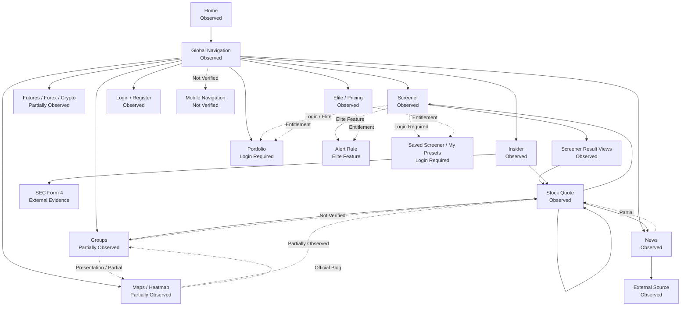

# Finviz Navigation Map 기록

## 문서 목적

이 문서는 Finviz의 Navigation Entry, Surface 간 연결, Entity Transition, Context Preservation 확인 수준을 기록한다.

이번 문서는 DATE Navigation Architecture를 확정하지 않는다. 공식 Product 화면, 공식 Help / FAQ, 공식 Blog, Elite / Pricing 안내에서 확인 가능한 관계만 사용한다.

## Navigation 관계 요약

실선은 public Product 화면에서 확인한 관계다. 점선은 공식 Documentation, 공식 Blog, Login Required, Elite Feature, Partial, Not Verified 관계다. 이 Diagram은 Product Flow Architecture가 아니다.

## Navigation Entry Inventory

| Navigation ID | Entry | Navigation Type | Access Level | Observation Status | Primary Destination | Navigation Responsibility | Context Preservation | Evidence Type | Evidence | Confidence | Open Question |
| --- | --- | --- | --- | --- | --- | --- | --- | --- | --- | --- | --- |
| FNV-NAV-001 | Home | Market Navigation | Public Access | Observed | Signal lists, Heatmap area, News, Calendar, Insider, Futures / Forex summary | Market 상태와 여러 Surface entry를 한 Screen에 노출한다. | Home 내부 section context는 유지되지만 Page 이동 후 Home state는 Not Verified | Official Product Observation | https://finviz.com/, 확인일 2026-07-28 | High | 로그인 후 Home customization state 확인 필요. |
| FNV-NAV-002 | Top Global Navigation | Global Navigation | Public Access | Observed | Home, News, Screener, Maps, Groups, Portfolio, Insider, Futures, Forex, Crypto, Calendar, Pricing, Theme, Help, Login, Register | Product Surface, Asset Class, User State, Subscription entry를 한 줄에 제공한다. | 모든 확인된 public page와 Stock Quote에서 유지된다. | Official Product Observation | Home, Screener, News, Insider, Stock Quote top navigation, 확인일 2026-07-28 | High | Mobile Navigation은 Not Verified. |
| FNV-NAV-003 | Screener | Discovery Navigation | Public Access / Elite Feature 일부 | Observed | Filter controls, Result Views, Stock Quote | 조건 기반 Stock discovery와 result comparison을 연결한다. | filter state가 URL parameter로 일부 표현될 가능성은 있으나 Back Navigation state는 Not Verified | Official Product Observation / Official Documentation | https://finviz.com/screener, https://finviz.com/help/screener | High | Back Navigation 후 filter state 유지 확인 필요. |
| FNV-NAV-004 | Screener Result Row | Entity Navigation | Public Access | Observed | Stock Quote | result row의 ticker / company / category link가 Stock Context로 이동한다. | Screener filter context가 Stock Quote에 표시되지는 않는다. | Official Product Observation | Screener result table row, 확인일 2026-07-28 | High | Stock Quote에서 원래 Screener filter로 복귀하는 UI 확인 필요. |
| FNV-NAV-005 | Screener Result View Tabs | Contextual Navigation / Presentation Transition | Public Access / Elite Feature 일부 | Observed | Overview, Valuation, Financial, Ownership, Performance, Technical, ETF, Charts, News, Snapshot, Maps, Stats | 같은 result set을 다른 Information Form으로 전환한다. | 같은 Screener context 안에서 view가 바뀌는 구조로 보인다. | Official Product Observation | Screener view tabs, 확인일 2026-07-28 | High | Stats와 Custom의 Elite gate 확인 필요. |
| FNV-NAV-006 | Descriptive / Fundamental / Technical / News / ETF Filters | Filter Navigation | Public Access / Elite Feature 일부 | Observed | Filter categories | Stock universe와 criteria를 분류한다. | filter 조합 저장은 Login Required 또는 Elite limit과 연결된다. | Official Product Observation / Official Documentation | Screener filter tabs와 Help Screener | High | Saved Screener access level 확인 필요. |
| FNV-NAV-007 | Maps / Heatmap | Market / Discovery Navigation | Public Access / Elite Feature 일부 | Partially Observed | Heatmap, ticker search, Stock detail candidate | visual Market structure에서 Stock 또는 group으로 이동하는 Navigation 후보이다. | Heatmap selection 이후 context 유지 여부는 Not Verified | Official Product Observation / Official Blog | https://finviz.com/map, official Maps Blog | Medium | Heatmap cell click, hover, double-click을 직접 확인 필요. |
| FNV-NAV-008 | Groups | Market Navigation / Comparison Navigation | Public Access / Elite Feature 일부 | Partially Observed | Sector, Industry, Country, Capitalization group views | aggregate group comparison과 Maps view 전환을 제공한다. | selected group context 유지 여부는 Not Verified | Official Product Observation / Official Documentation indexed text | https://finviz.com/groups, Knowledge Base indexed text | Medium | Sector to Industry to Stock drill-down 확인 필요. |
| FNV-NAV-009 | Stock Quote Tabs | Entity Local Navigation | Public Access / Elite Feature 일부 | Observed | Overview, Compare, Short Interest, Financials, Options, Filings | Stock Context 내부 analysis mode를 분리한다. | 동일 Stock Context는 header와 ticker로 유지된다. | Official Product Observation | https://finviz.com/stock?t=AAPL | High | 다른 Stock으로 이동할 때 현재 tab 유지 여부는 Not Verified. |
| FNV-NAV-010 | Peer / Held by Links | Entity Navigation | Public Access | Observed | related Stock 또는 ETF | Stock Quote에서 related Entity로 이동한다. | Peer 이동 후 original Stock relation reason은 URL에 남지 않는 것으로 보인다. | Official Product Observation | AAPL Stock Quote peers and held-by area | High | Peer relation Source와 grouping 기준 확인 필요. |
| FNV-NAV-011 | News Categories | Evidence Navigation | Public Access / Elite Feature 일부 | Observed | Market News, Market Pulse, Stocks News, ETF News, Crypto News | News를 Market category와 Source / Time 기준으로 분류한다. | External Source 이동 후 Finviz context는 손실된다. | Official Product Observation | https://finviz.com/news | High | News에서 Stock Quote로 직접 가는 구조는 Partial. |
| FNV-NAV-012 | Insider Table | Evidence / Entity Navigation | Public Access | Observed | Stock Quote, Owner candidate, SEC Form 4 | Insider Transaction에서 Stock과 External Evidence로 이동한다. | SEC external 이동 후 Finviz context는 손실된다. | Official Product Observation | https://finviz.com/insidertrading | High | Owner Detail의 독립 Surface 여부 확인 필요. |
| FNV-NAV-013 | Portfolio | User State Navigation | Login Required / Elite Feature 일부 | Login Required | Register / Login, Portfolio | personal Stock set 또는 holdings state로 진입한다. | Persistence는 account 기반으로 보이나 direct UI Not Verified | Official Product Observation / Official Pricing / Official Blog | https://finviz.com/portfolio, https://finviz.com/elite | Medium | Watchlist인지 holdings Surface인지 확인 필요. |
| FNV-NAV-014 | Save as Portfolio | User State Navigation | Login Required | Partially Observed | Portfolio creation candidate | Screener result를 Portfolio state로 저장하는 action으로 표시된다. | 실제 생성되는 State는 Not Verified | Official Product Observation | Screener action row | Medium | 결과 전체 저장인지 선택 row 저장인지 확인 필요. |
| FNV-NAV-015 | Create Alert | User State Navigation | Elite Feature | Partially Observed | Alert Rule candidate | Screener result 또는 Stock condition monitoring으로 이어지는 action으로 표시된다. | Alert Rule persistence는 Elite Feature로만 확인 | Official Product Observation / Official Pricing | Screener action row, Elite page | Medium | condition builder와 trigger scope 확인 필요. |
| FNV-NAV-016 | Futures / Forex / Crypto | Asset Class Navigation | Public Access | Partially Observed | Asset Class pages | Stock 외 asset class entry를 제공한다. | detail Surface와 Stock Navigation pattern 차이는 Not Verified | Official Product Observation | Futures, Forex, Crypto pages | Low to Medium | body rendering과 detail drill-down 확인 필요. |
| FNV-NAV-017 | Pricing / Elite | Subscription Navigation | Public Access | Observed | Elite trial, plan comparison | Public, Login Required, Elite Feature 차이를 설명한다. | Subscription Entitlement는 account state와 연결된다. | Official Pricing | https://finviz.com/elite | High | App 내부 gate message 확인 필요. |
| FNV-NAV-018 | Login / Register | User State Navigation | Public Access | Observed | User Account | personal state와 subscription state 진입점이다. | post-login landing은 Not Verified | Official Product Observation | https://finviz.com/login, https://finviz.com/register | High | 로그인 후 Recent Stock 또는 History 존재 확인 필요. |

## Global Navigation 분류

| Navigation Category | Entry | Observation Status | Access Level | Note |
| --- | --- | --- | --- | --- |
| Market Navigation | Home, Groups, Calendar | Observed / Partially Observed | Public Access | Home은 Market summary, Groups는 group comparison, Calendar는 Event timing entry다. |
| Discovery Navigation | Screener, Maps, Theme | Observed / Partially Observed | Public Access / Elite 일부 | Screener는 강하게 확인됨. Maps와 Theme는 Partial이다. |
| Entity Navigation | Stock Quote, Screener rows, peer links, Insider ticker links | Observed | Public Access | Stock ticker link가 Entity transition을 수행한다. |
| Asset Class Navigation | Futures, Forex, Crypto | Partially Observed | Public Access | body detail은 제한적으로만 확인됐다. |
| User State Navigation | Portfolio, Save as Portfolio, My Presets, Create Alert | Login Required / Elite Feature | Login 또는 Elite | persistence는 직접 확인하지 않았다. |
| Subscription Navigation | Pricing / Elite, Start Free Trial | Observed | Public Access | Elite entitlement scope를 설명한다. |
| Contextual Navigation | Stock Quote tabs, Screener result views, News categories, Insider filters | Observed / Partially Observed | Public Access | 같은 Surface 안의 context 또는 presentation transition이다. |

## Screener Navigation 기록

Observation:
Screener는 `My Presets`, `Order by`, `Signal`, `Tickers` input, filter category tabs, result view tabs, result count, `Open in Compare`, `Save as Portfolio`, `Create Alert`, `Refresh: 3min`, result table, pagination을 제공한다. Help는 Screener가 filters로 large stock data를 검색하고 multiple views와 fast navigation을 제공한다고 설명한다.

Interpretation:
Screener는 단순 Filter Tool보다 중심 Discovery Surface에 가깝게 해석된다. Filter category는 Stock universe를 줄이고, result view tabs는 같은 result context를 비교 가능한 정보 형태로 바꾸는 구조일 수 있다.

User Impact:
사용자는 Stock 후보를 filter로 찾고, 같은 result set을 Table, Chart, Snapshot, Maps로 확인한 뒤 Stock Quote로 이동할 수 있다. Saved state와 Alert는 account 또는 Elite 제한을 받는다.

DATE Implication:
DATE에서 Screener Filter, Result View, Saved State, Alert Rule을 하나의 기능으로 묶지 않고 별도 책임으로 검토할 필요가 있다.

Confidence:
High

Evidence:
Official Product Observation, https://finviz.com/screener, 확인일 2026-07-28. Official Documentation, https://finviz.com/help/screener.

## Maps / Heatmap Navigation 기록

Observation:
Maps URL과 Global Navigation은 public page에서 확인된다. 공식 indexed text와 Blog는 Heatmap이 S&P 500, Dow Jones 30, Nasdaq 100, Russell 2000, All Stocks, Market Cap, World, ETFs, Crypto, Futures, Themes filter를 제공하고, size가 market cap을 나타내며, zoom / pan / hover / double-click interaction이 있다고 설명한다.

Interpretation:
Maps는 Heatmap을 Market summary, visual discovery, Stock Navigation 후보로 결합하는 Surface일 수 있다. 다만 이번 조사에서는 dynamic interaction을 직접 확인하지 못했다.

User Impact:
사용자는 color와 size를 통해 Market structure를 빠르게 볼 수 있다. 그러나 cell click과 drill-down의 실제 비용은 Not Verified다.

DATE Implication:
DATE에서 Heatmap Cell을 Chart element로만 볼지, Entity Navigation Unit으로 볼지 별도 검증해야 한다.

Confidence:
Medium

Evidence:
Official Product Observation, https://finviz.com/map, 확인일 2026-07-28. Official Blog: Maps update posts.

## Groups Navigation 기록

Observation:
Groups는 `Group`, `Order By`, Overview, Valuation, Performance, Custom, Performance Chart, Spectrum, Charts, Maps view tabs를 제공한다. indexed official Knowledge Base text는 group-level data에서 performance, valuation, chart view로 Sector와 Industry를 비교한다고 설명한다.

Interpretation:
Groups는 Screener처럼 individual Stock result를 만드는 Surface라기보다 Sector / Industry / Country / Capitalization group의 aggregate comparison을 제공하는 Surface로 해석된다. view tab은 Navigation보다는 presentation transition에 가깝다.

User Impact:
사용자는 Stock 전 단계에서 group rotation과 aggregate Metric을 확인할 수 있다. Sector to Industry to Stock drill-down이 없다면 Stock discovery로 이어지는 비용이 남는다.

DATE Implication:
DATE에서 Sector / Industry Surface가 Stock discovery 전 단계인지, 별도 Market analysis Surface인지 구분해 검토할 필요가 있다.

Confidence:
Medium

Evidence:
Official Product Observation, https://finviz.com/groups, 확인일 2026-07-28. Official Documentation indexed text: Group Views & Performance.

## Stock Quote Local Navigation 기록

Observation:
AAPL Stock Quote는 Global Navigation을 유지하고, header에서 ticker, company link, Last Close, Aftermarket Close, timestamp를 표시한다. Local Navigation은 Overview, Compare, Short Interest, Financials, Options, Filings tab으로 구성된다. 같은 영역에 Sector, Industry, Country, market cap class, exchange, Peers, Held by ETF links가 표시된다.

Interpretation:
Stock Quote는 Single Dense Page와 Tab 기반 Hub 성격을 동시에 가진다. Overview는 많은 Metric을 동시에 제공하고, tabs는 analysis mode를 분리한다.

User Impact:
사용자는 Stock Context를 유지하며 financial, short interest, options, filings, peer, ETF holder, News로 이동할 수 있다. 그러나 external company site와 external News로 이동하면 Finviz context가 손실된다.

DATE Implication:
DATE에서 Stock Context 내부에 어떤 related Entity를 노출할지, external Evidence 이동 후 복귀 비용을 어떻게 낮출지 검토할 질문이 된다.

Confidence:
High

Evidence:
Official Product Observation, https://finviz.com/stock?t=AAPL, 확인일 2026-07-28.

## News Navigation 기록

Observation:
News page는 Global Navigation을 유지하고 Market News, Market Pulse, Stocks News, ETF News, Crypto News category를 제공한다. News / Blogs split과 `View by Time / Source`를 제공한다. Headline은 external Source로 이동한다. Stock Quote 내부에도 timestamp와 Source label이 있는 News list가 표시된다.

Interpretation:
News는 독립 Surface이면서 Stock Quote의 supporting content다. Finviz 내부 News Detail보다 external Source transition이 중심인 구조로 보인다.

User Impact:
사용자는 timestamp와 Source를 보고 원문으로 이동할 수 있다. external Source 이후 Finviz Stock Context로 돌아오는 비용은 높을 수 있다.

DATE Implication:
DATE에서 News를 Evidence로 사용할 경우 external Source traceability와 internal Entity context 복귀를 함께 검토해야 한다.

Confidence:
High

Evidence:
Official Product Observation, https://finviz.com/news, https://finviz.com/stock?t=AAPL, 확인일 2026-07-28.

## Insider Navigation 기록

Observation:
Insider page는 Latest Insider Trading, Top Insider Trading Recent Week, Top 10% Owner Trading Recent Week, Filter, transaction table을 제공한다. Table row는 Ticker, Owner, Relationship, Date, Transaction, Cost, Shares, Value, SEC Form 4를 포함한다. Ticker는 Stock Quote로, SEC Form 4는 sec.gov로 이동한다.

Interpretation:
Insider는 Transaction-first Evidence Surface로 해석된다. Owner는 표시되지만 Person Detail이 독립 Surface인지 확인되지 않았다.

User Impact:
사용자는 insider activity에서 Stock Quote와 SEC original filing으로 이동할 수 있다. SEC 이동 후 Finviz context는 손실된다.

DATE Implication:
DATE에서 Insider Transaction을 다룰 때 Transaction, Insider Person, Stock, SEC Filing의 관계를 분리해 검토해야 한다.

Confidence:
High

Evidence:
Official Product Observation, https://finviz.com/insidertrading, 확인일 2026-07-28.

## Portfolio와 Personal Continuity 기록

Observation:
Portfolio URL은 not logged in 상태에서 Create a Free Account로 redirect된다. Screener에는 `Save as Portfolio` action이 표시된다. Elite page는 Portfolios 100, Tickers per Portfolio 500, layout customization, alerts, export/API를 표시한다. FAQ는 saved data가 account email에 linked되어 renewal 후 접근 가능하다고 설명한다.

Interpretation:
Portfolio는 Login Required User-owned Entity Candidate다. Saved Screener, Alert Rule, Layout Preference는 Personal Continuity를 강화할 수 있지만 이번 조사에서는 실제 internal state를 확인하지 못했다.

User Impact:
Public 사용자는 discovery와 Stock Quote 확인은 가능하지만 saved state와 recurring monitoring은 제한된다. Elite 사용자는 저장 수, alert, layout, export/API에서 더 강한 continuity를 얻을 수 있다.

DATE Implication:
DATE에서 Portfolio, Saved Screener, Alert Rule, Layout Preference를 각각 다른 User State로 분리해 검증해야 한다.

Confidence:
Medium

Evidence:
Official Product Observation, https://finviz.com/portfolio, https://finviz.com/screener. Official Pricing, https://finviz.com/elite. Official Documentation, https://finviz.com/help/faq. 확인일 2026-07-28.

## Asset Class Navigation 기록

| Asset Class | Primary Entity | Observation Status | Navigation Pattern | Detail Surface | Freshness / Delay | Confidence | Open Question |
| --- | --- | --- | --- | --- | --- | --- | --- |
| Futures | Futures Contract | Partially Observed | Global Navigation과 Home summary에서 확인 | Not Verified | Futures quotes delayed 20 minutes | Medium | Contract detail과 chart path 확인 필요. |
| Forex | Currency Pair | Partially Observed | Global Navigation과 Home summary에서 확인 | Not Verified | page footer는 stock quote delay 문구를 표시하지만 Forex-specific delay는 Not Verified | Low | pair detail과 chart body 확인 필요. |
| Crypto | Crypto Asset / Pair | Partially Observed | Global Navigation, News category, Home BTC/USD row에서 확인 | Not Verified | Not Verified | Low | Crypto map / detail linkage 확인 필요. |

## Navigation Depth 기록

| Path ID | Path | 최소 확인 가능한 Navigation 횟수 | Status | Context Preservation | Confidence |
| --- | --- | ---: | --- | --- | --- |
| FNV-PATH-001 | Home → Global Navigation → Screener | 1 | Observed | Not Applicable | High |
| FNV-PATH-002 | Screener → Result Row → Stock Quote | 1 | Observed | Screener filter context display는 Not Verified | High |
| FNV-PATH-003 | Screener → Result View Tab | 1 | Observed | 같은 result context 안에서 view 전환 가능 | High |
| FNV-PATH-004 | Stock Quote → Peer Stock | 1 | Observed | original Stock relation reason은 유지되지 않는 것으로 보임 | High |
| FNV-PATH-005 | Stock Quote → News external Source | 1 | Observed | Finviz context loss | High |
| FNV-PATH-006 | Insider → Ticker → Stock Quote | 1 | Observed | Insider transaction context는 Stock Quote에 유지되지 않음 | High |
| FNV-PATH-007 | Insider → SEC Form 4 | 1 | Observed | external Source로 context loss | High |
| FNV-PATH-008 | Portfolio → Register | 1 | Observed | personal state creation은 Not Verified | Medium |
| FNV-PATH-009 | Maps → Heatmap Cell → Stock Quote | Not Verified | Partially Observed | Not Verified | Medium |
| FNV-PATH-010 | Groups → Maps View | 1 | Partially Observed | selected group context Not Verified | Medium |
| FNV-PATH-011 | Screener → Save as Portfolio | 1 | Partially Observed / Login Required | saved state Not Verified | Medium |
| FNV-PATH-012 | Screener → Create Alert | 1 | Partially Observed / Elite Feature | Alert Rule Not Verified | Medium |

## Context Preservation 요약

| Pattern | Status | Observation | Limitation |
| --- | --- | --- | --- |
| Global Navigation persistence | Observed | Home, Screener, News, Insider, Stock Quote에서 top Navigation이 유지된다. | Mobile은 Not Verified. |
| Stock Quote Local Context | Observed | ticker, company, tabs, peer links, metrics, News가 같은 Stock Context에 있다. | peer 이동 후 previous Stock context는 보이지 않는다. |
| Screener Result Context | Observed / Partial | result view tabs는 같은 result set을 전환한다. | Stock Quote 이동 후 filter context preservation은 Not Verified. |
| External Evidence Trace | Observed | News external Source와 SEC Form 4 link가 있다. | external 이동 후 Finviz context loss. |
| Saved State | Login Required / Elite Feature | Portfolio, presets, alerts, layout customization이 account 또는 Elite와 연결된다. | 실제 persistence는 Not Verified. |

## Mobile Navigation 기록

Observation:
이번 조사에서는 Finviz Mobile 또는 responsive Navigation을 직접 확인하지 못했다.

Interpretation:
Desktop의 dense top Navigation과 table-heavy 구조가 mobile에서 어떻게 재구성되는지는 판단할 수 없다.

User Impact:
Mobile 사용자의 Context Preservation과 table / Heatmap 사용 비용은 미확인 상태다.

DATE Implication:
DATE에서 mobile Journey를 검토할 때 Finviz의 desktop pattern을 그대로 비교 기준으로 사용하면 안 된다.

Confidence:
Low

Evidence:
Not Verified. 확인일 2026-07-28.

## 남아 있는 Open Question

- Maps cell click, hover, double-click이 현재 public UI에서 어떤 Navigation을 만드는가.
- Groups에서 Sector to Industry to Stock drill-down이 가능한가.
- Screener filter state가 Stock Quote 이동 후 Back Navigation에서 유지되는가.
- Saved Screener와 My Presets가 free registered와 Elite에서 어떻게 구분되는가.
- Portfolio가 Watchlist인지 holdings Surface인지 확인 필요.
- Recent Stock 또는 History 기능이 존재하는가.
- Asset Class pages가 Stock Quote와 동일한 pattern을 사용하는가.
