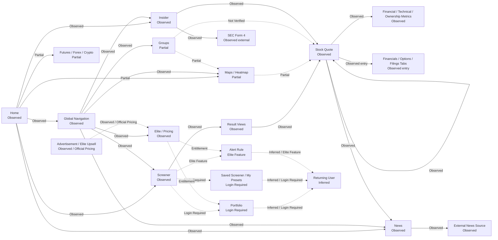
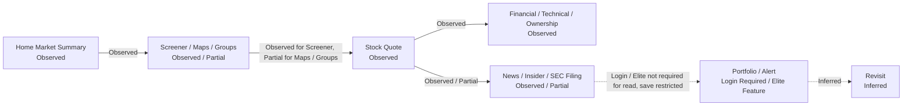
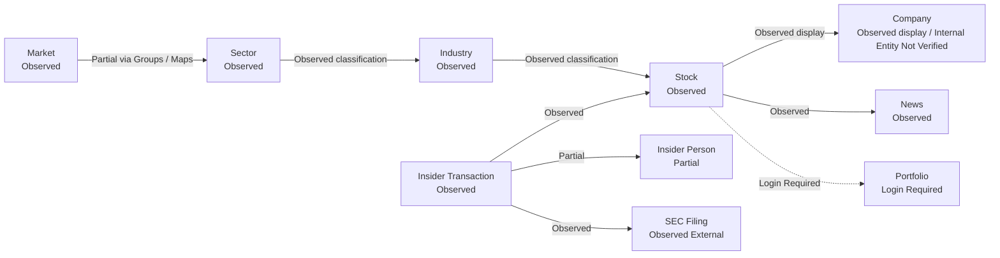
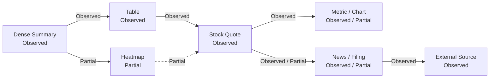
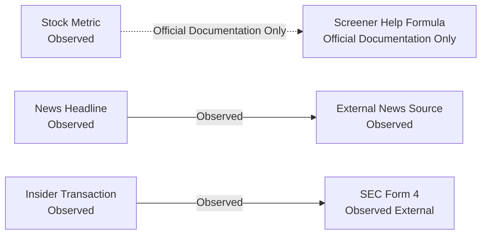
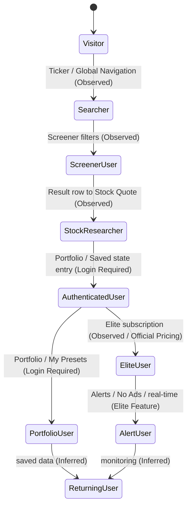
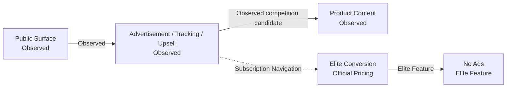

# Finviz Product Flow Architecture 기록

## 문서 목적

이 문서는 Phase 4.1, Phase 4.2, Phase 4.3에서 기록한 Finviz Product Surface, Navigation, Journey, Entity / State, Information Density, Trust / Evidence Observation을 통합해 Product Flow를 정리한다.

이번 문서는 Finviz Product Flow Architecture Observation이다. DATE Architecture를 제안하지 않고, Candidate Principle과 Registry 업데이트를 수행하지 않는다.

## Flow 상태 기준

| Status | 의미 |
| --- | --- |
| Observed | public Product 화면에서 직접 확인한 관계 |
| Partial | public Product 화면과 공식 Documentation / Blog가 함께 있으나 dynamic interaction은 확인하지 못한 관계 |
| Official Documentation Only | Help / FAQ / Blog / Pricing에서 설명되지만 실제 Product 조작은 확인하지 않은 관계 |
| Login Required | account state가 필요해 public mode에서 조작하지 못한 관계 |
| Elite Feature | Finviz Elite entitlement가 필요한 관계 |
| Inferred | 기존 Observation을 바탕으로 한 Interpretation이며 Observation으로 사용하지 않는 관계 |
| Not Verified | 공식 자료 또는 public observation으로 충분히 확인하지 못한 관계 |

## Product Flow 통합 Diagram

이 Diagram은 Finviz Product Architecture 확정안이 아니다. 관계 label은 확인 수준을 표시한다.

## Flow Role Matrix

| Flow Type | 핵심 질문 | 주요 Surface | 확인 상태 | 주요 Evidence | Confidence |
| --- | --- | --- | --- | --- | --- |
| User Decision Flow | user가 Market summary에서 Stock 판단과 저장 / monitoring까지 이동할 수 있는가. | Home, Screener, Maps, Groups, Stock Quote, News, Insider, Portfolio, Alert | Partial | Home, Screener, Stock Quote, News, Insider, Elite | Medium |
| Navigation Flow | top-level Surface와 local Stock context가 어떻게 연결되는가. | Global Navigation, Screener Result Row, Stock Quote tabs, News, Insider | Observed / Partial | Navigation Map, public Product pages | High |
| Discovery Flow | Stock 후보 발견이 어떤 방식으로 나뉘는가. | Home, Screener, Maps, Groups | Observed / Partial | Product Surface Map, Screen Inventory | High for Screener, Medium for Maps / Groups |
| Entity Flow | Market, Sector, Industry, Stock, Company, News, Insider Transaction, SEC Filing이 어떻게 전환되는가. | Screener, Groups, Stock Quote, News, Insider | Observed / Partial / Inferred | Entity and State Observation | Medium |
| Information Flow | Dense Summary에서 Table / Heatmap / Metric / News / Filing으로 내려가는가. | Home, Screener, Maps, Stock Quote, Insider | Observed / Partial | Information Density Observation | Medium |
| Evidence Flow | Metric, News, Insider Transaction에서 original Source로 추적되는가. | Stock Quote, News, Insider, SEC, Help Screener | Observed / Documentation Only / Partial | Trust and Evidence Observation | Medium |
| Action Flow | Scan, Filter, Compare, Open, Validate, Save, Alert, Revisit가 연결되는가. | Screener, Stock Quote, Portfolio, Alert | Partial / Login Required / Elite Feature | Core Journey Observation | Medium |
| State Transition | visitor가 authenticated / Elite user state로 전환되는가. | Login, Register, Portfolio, Elite | Observed / Login Required / Elite Feature / Inferred | Access and Method, Elite page, FAQ | Medium |
| Context Preservation Flow | 어떤 context가 유지되고 어디서 손실되는가. | Global Navigation, Screener, Stock Quote, external News, SEC | Observed / Partial / Not Verified | Navigation Map | Medium |
| Advertisement Flow | Public Surface ad / upsell이 content와 subscription transition에 어떤 역할을 하는가. | Public pages, Stock Quote, Elite | Observed / Official Pricing | Information Density, Elite page | Medium |

## User Decision Flow

Observation:
Home, Screener, Stock Quote, News, Insider는 public mode에서 연결된다. Portfolio, Saved Screener, Alert는 Login Required 또는 Elite Feature다.

Interpretation:
Finviz decision path는 discovery와 validation은 public으로 열고, persistence와 monitoring은 account / Elite로 전환하는 structure로 보인다.

User Impact:
user는 빠르게 candidate를 발견하고 Stock context를 열 수 있지만, 다음 날 같은 analysis state를 복원하려면 account 또는 Elite feature에 의존해야 한다.

Confidence:
Medium

Evidence:
Official Product Observation: Home, Screener, Stock Quote, News, Insider, Portfolio redirect. Official Pricing: Elite. Access Date: 2026-07-28.

## Navigation Flow

Observation:
Global Navigation은 Home, News, Screener, Maps, Groups, Portfolio, Insider, Futures, Forex, Crypto, Calendar, Pricing, Theme, Help, Login, Register를 public pages에서 유지한다. Stock Quote도 Global Navigation과 local tabs를 동시에 제공한다.

Interpretation:
Finviz는 Surface switching과 Stock local analysis를 한 page frame 안에서 유지한다. Breadcrumb보다는 persistent top navigation과 ticker URL이 중심이다.

User Impact:
user는 Product Surface로 쉽게 돌아갈 수 있지만, original Screener filter 또는 Insider row context는 Stock Quote에 표시되지 않는다.

Confidence:
High

Evidence:
Official Product Observation across public Finviz pages. Access Date: 2026-07-28.

## Discovery Flow

| Discovery Surface | Flow | Status | 역할 | Context Preservation | Confidence |
| --- | --- | --- | --- | --- | --- |
| Home | Signal / summary discovery | Observed | broad Market scan과 Surface entry | Home section context는 page 이동 후 유지 Not Verified | High |
| Screener | Filter-based Discovery | Observed | criteria, table, result views, Stock Quote transition | result view는 Surface 내부 유지, Stock Quote 이동 후 filter context Not Verified | High |
| Maps | Visual Market Discovery | Partial | Heatmap compression, ticker search, hover / drill-down candidate | heatmap selection context Not Verified | Medium |
| Groups | Aggregate Comparison Discovery | Partial | Sector / Industry / Country / Capitalization comparison | selected group context Not Verified | Medium |

## Entity Flow

Observation:
Screener, Stock Quote, Groups, Insider, News에서 Stock, Sector, Industry, News, Insider Transaction, SEC Filing relation이 확인된다. Company는 Stock Quote header에서 display되지만 internal independent Surface 여부는 Not Verified다.

Interpretation:
Finviz public Product는 ticker / Stock 중심으로 many related entity를 묶는다. Sector와 Industry는 classification이면서 group comparison의 axis다.

User Impact:
Stock context는 강하게 유지되지만 Company와 Security boundary는 사용자에게 명시적으로 분리되지 않을 수 있다.

Confidence:
Medium

Evidence:
Official Product Observation: Screener, Stock Quote, Insider. Official Documentation: Screener Help. Access Date: 2026-07-28.

## Information Flow

Observation:
Home과 Screener는 dense summary와 table을 제공하고, Maps는 Heatmap compression을 제공한다. Stock Quote는 dense metric context, News, local tabs를 제공한다.

Interpretation:
Information Flow는 summary에서 candidate table / heatmap으로, 이후 Stock Quote와 evidence-like content로 내려가는 structure다.

User Impact:
user는 broad scan에서 detail로 빠르게 이동할 수 있다. External Source에서는 Finviz context가 손실된다.

Confidence:
Medium

Evidence:
Phase 4.1-4.3 Finviz Observation.

## Evidence Flow

Observation:
Screener Help provides many Metric definitions and formulas. News links to external publisher pages. Insider table links to SEC Form 4.

Interpretation:
Finviz has strong external evidence routing for News and Insider, and documentation-level methodology for many screener metrics. Value-to-filing trace from Stock Quote metric is not confirmed.

User Impact:
user can verify some content externally, but evidence trace is not uniformly item-level.

Confidence:
Medium

Evidence:
Official Documentation: https://finviz.com/help/screener. Official Product Observation: News, Insider. Access Date: 2026-07-28.

## Action Flow

| Action | Surface | Status | State 변화 | Evidence | Confidence |
| --- | --- | --- | --- | --- | --- |
| Scan | Home, News, Insider, Maps | Observed / Partial | no saved state | Home, News, Insider, Maps Blog | High |
| Filter | Screener | Observed | Screener Filter state | Screener, Help Screener | High |
| Compare | Screener Result Views, Groups, Stock Quote Peers | Observed / Partial | result view state | Screener, Groups, Stock Quote | High |
| Open | Screener Row, Insider Ticker, News Headline | Observed | page transition | Screener, Insider, News | High |
| Validate | News external Source, SEC Form 4, Help formula | Observed / Documentation Only | external evidence transition | News, Insider, Help | Medium |
| Save | Save as Portfolio, My Presets | Login Required / Partial | Portfolio or Saved Screener candidate | Screener, FAQ, Elite | Medium |
| Alert | Create Alert | Elite Feature / Partial | Alert Rule candidate | Screener, Elite | Medium |
| Monitor | Portfolio, Alert, Home customization | Login Required / Elite Feature | personal continuity candidate | Elite, FAQ | Medium |
| Revisit | account-linked saved data | Inferred / Official Documentation Only | Returning User state | FAQ | Low to Medium |

## State Transition

State Transition은 official Product Observation과 FAQ / Elite 안내를 바탕으로 한 structure다. 실제 logged-in session은 조작하지 않았다.

## Context Preservation Flow

| Context | 유지 Pattern | Status | Context Loss 지점 | Evidence | Confidence |
| --- | --- | --- | --- | --- | --- |
| Global Navigation | public pages와 Stock Quote에서 top navigation 유지 | Observed | mobile navigation Not Verified | Home, Screener, News, Insider, Stock Quote | High |
| Screener Filter | filter와 result views가 같은 Surface 안에 있음 | Observed / Partial | Stock Quote 이동 후 filter context 표시 Not Verified | Screener | Medium |
| Screener Result View | view tabs는 same result context를 전환 | Observed | Back Navigation state Not Verified | Screener Result Views | Medium |
| Stock Ticker Context | Stock Quote header와 tabs가 ticker context 유지 | Observed | peer 이동 후 previous ticker relation reason 손실 | Stock Quote | High |
| External News | original article link 제공 | Observed | external Source 이동 후 Finviz context loss | News | High |
| SEC Form 4 | filing link 제공 | Observed | sec.gov 이동 후 Insider row context loss | Insider | High |
| Portfolio / Saved Screener | account-linked saved data candidate | Login Required / Official Documentation Only | direct persistence Not Verified | FAQ, Elite | Medium |
| Alert Rule | monitoring state candidate | Elite Feature | trigger scope Not Verified | Elite, Screener | Medium |
| Recent / History | Not Verified | Not Verified | feature existence unknown | Not Verified | Low |

## Advertisement Flow

Observation:
Public pages include ad / tracking elements, and Elite explicitly offers No Ads. Stock Quote shows Elite upsell near top content.

Interpretation:
Advertisement can be both interference and subscription routing. No Ads can function as Density Control for public high-density surfaces.

User Impact:
Public user may experience content competition, while Elite user may gain cleaner scan context.

Confidence:
Medium

Evidence:
Official Product Observation: public pages. Official Pricing: https://finviz.com/elite. Access Date: 2026-07-28.

## Verified / Not Verified Flow 수 요약

| Status | Flow 수 |
| --- | ---: |
| Observed | 18 |
| Partial | 11 |
| Official Documentation Only | 5 |
| Login Required / Elite Feature | 8 |
| Inferred | 6 |
| Not Verified | 7 |

## Context Loss Points

- Screener Result Row에서 Stock Quote로 이동하면 original filter context가 Stock Quote에 표시되지 않는다.
- Maps Heatmap cell selection 이후 context preservation은 Not Verified다.
- Groups에서 Stock Quote로 직접 내려가는 path는 Not Verified다.
- News external Source 이동 후 Finviz context가 손실된다.
- SEC Form 4 external 이동 후 Insider row context가 손실된다.
- Peer Stock 이동 후 original Stock relation reason이 유지되는지는 Not Verified다.
- Portfolio, Saved Screener, Alert Rule은 public mode에서 state creation을 확인하지 못했다.
- Recent Stock 또는 History는 Not Verified다.

## Frictions

- Dense Single Page는 빠른 scan을 돕지만 novice user에게 priority 판단 비용을 남긴다.
- Screener Metric Traceability는 Help documentation 중심이며 item-level direct trace는 Not Verified다.
- Heatmap Methodology는 일부 공식 설명이 있지만 current UI에서 모든 map type의 encoding 설명이 확인되지는 않았다.
- Public user는 save / alert / no ads / real-time에서 제한을 받는다.
- External Evidence는 strong traceability를 제공하지만 context preservation은 약하다.

## Open Questions

- Screener filter state가 Back Navigation에서 유지되는가.
- Maps cell click / double-click이 Stock Quote 또는 detail modal로 연결되는가.
- Groups에서 Sector to Industry to Stock drill-down이 가능한가.
- Stock Quote Filings tab이 SEC Filing과 어떤 depth로 연결되는가.
- Portfolio가 Watchlist인지 holdings Surface인지 확인해야 한다.
- Saved Screener와 Portfolio의 update behavior 차이를 확인해야 한다.
- Alert Rule이 Stock, Screener, Portfolio 중 어디에 attach되는지 확인해야 한다.
- Elite No Ads가 actual layout과 scan path를 얼마나 바꾸는지 확인해야 한다.
