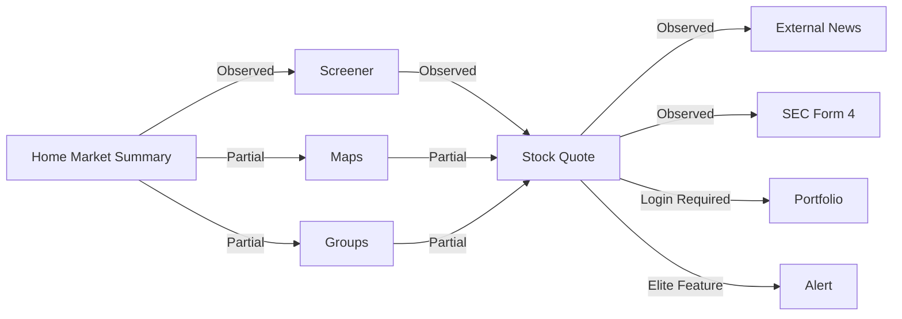

# Finviz Phase 4 Summary

## 조사 범위

Phase 4는 Finviz의 Public Product Surface, Navigation, Core Journey, Entity / User State 후보, Information Density, Trust / Evidence, Product Flow, Evidence Hardening, Candidate Principle Readiness를 문서화했다.

새로운 웹 조사는 Phase 4.5에서 수행하지 않았다. 이 Summary는 [01-product-surface-map.md](./01-product-surface-map.md)부터 [12-hypothesis-evidence-log.md](./12-hypothesis-evidence-log.md)까지의 기존 문서만 사용한다.

## 접근 제한

- Public: Home, Screener, Maps, Groups, News, Insider, Futures, Forex, Crypto, Stock Quote의 주요 Observation.
- Login Required: Portfolio, 일부 saved state 후보.
- Elite Feature: Alert, real-time data, no ads, export, advanced screener, Backtests 등 Pricing / Product 설명 기반 항목.
- Not Verified: Mobile, Recent / History, Portfolio persistence, Alert rule behavior, Maps dynamic interaction 일부, Asset Class detail 일부.

## Product Surface 요약

Finviz는 Home, Screener, Maps, Groups, Stock Quote, News, Insider, Portfolio, Futures, Forex, Crypto, Backtests, Elite / Pricing을 별도 Surface 또는 Tool로 제공한다.

Home은 Dense Market Summary, Screener는 filter-based Discovery, Maps는 Heatmap compression, Groups는 aggregate comparison, Stock Quote는 Dense Entity Hub 역할로 정리되었다.

## Navigation 요약

Global Navigation은 주요 Public Surface에서 유지된다. Screener result row, Stock Quote ticker context, News item, Insider Transaction, SEC Form 4 link가 Contextual Navigation 후보로 기록되었다.

Breadcrumb, Recent / History, Mobile Navigation은 Not Verified다.

## User Journey 요약

12개 Scenario 중 Public Surface에서 가능한 journey는 Market scan, Stock discovery, Stock analysis, News / Insider에서 Stock Quote 이동이다. Portfolio save, Alert creation, next-session revisit는 Login Required 또는 Elite Feature로 제한되며 내부 behavior는 확인되지 않았다.

## Entity / User State 요약

Entity Candidate는 20개로 정리되었다. 전체 Inventory는 Market, Stock, Company, Security, Sector, Industry, Country, Exchange, News, Insider Transaction, Insider Person, SEC Filing, Calendar Event, Futures Contract, Currency Pair, Crypto Asset, Strategy, Portfolio, Subscription Plan, User Account다.

User State Candidate는 12개로 정리되었다. 전체 Inventory는 Screener Filter, Screener View, Saved Screener / My Presets, Portfolio Membership, Alert Rule, Recent Stock, Theme Preference, Layout Preference, Elite Entitlement, Advertisement State, Media Source Preference, Export / API Access State다. Portfolio와 Saved Screener의 persistence는 Not Verified다.

## Information Density 요약

Finviz는 Simultaneous Disclosure를 강하게 사용한다. Home과 Stock Quote는 여러 Information Form을 동시에 노출하고, Screener는 filter와 result를 같은 Page에 배치한다.

Density Enabler는 repeated table grammar, row-based navigation, dense summary block, heatmap compression, Stock ticker Context다. Density Risk는 novice learning cost, small cell readability, column overload, advertisement competition, Mobile risk다.

## Trust / Evidence 요약

Strong Traceability는 News to original source, Insider Transaction to SEC Form 4, Screener Metric to Help formula에서 확인되었다.

Partial Traceability는 Stock Quote metric source, Heatmap methodology, Financial metric to filing, Portfolio calculation, Alert trigger에 남아 있다.

## Product Flow 요약

주요 Product Flow는 다음처럼 정리된다.

Internal Product Flow는 Stock Context를 비교적 잘 유지하지만, External News와 SEC Form 4 이동 후 Finviz Context는 손실된다.

## 주요 Structural Strength

- Dense Market Summary
- Screener filter / result co-location
- Table-first comparison grammar
- Stock Quote Dense Entity Hub
- Stock Quote local tabs
- News Source / Timestamp
- Insider Transaction to SEC Form 4
- Screener Metric formula documentation
- Global Navigation persistence
- Public / Elite feature transparency

## 주요 User Friction

- Dense Home novice cost
- Screener filter learning cost
- column overload
- Maps small cell readability
- Groups drill-down ambiguity
- Stock Quote overload
- advertisement competition
- External Evidence Context Loss
- Portfolio / Alert access restriction
- Mobile Not Verified

## Advertisement 영향

Advertisement는 Public access를 가능하게 하는 business constraint이면서 Dense UI의 Density Risk로 기록되었다. Elite no ads는 단순 convenience가 아니라 Density Control benefit으로 분류되지만, Advertisement 자체는 Candidate Principle로 일반화하지 않았다.

## Context Preservation

Preserved Context는 Global Navigation, Stock ticker Context, Stock Quote local tabs, row-based Stock Quote transition이다.

Context Loss는 External News, SEC Form 4, Peer transition, Screener filter return, Portfolio / Alert access gate에서 확인 또는 후보로 기록되었다.

## Candidate Principle 요약

Finviz Evidence는 기존 P-001, P-003, P-006, P-007, P-009, P-012, P-013, P-014, P-018, P-020에 연결되었다.

신규 Candidate Principle은 P-022~P-025로 정리되었다. 모든 항목은 Cross Validation이 필요하다.

## Cross Benchmark 분류

### Shared Pattern

- Home 또는 Summary Surface가 Market orientation entry로 작동
- Stock / Symbol Context Hub
- Screener / Table-first Discovery
- Source / Freshness Trust Signal
- Methodology documentation as Trust layer

### Variant Pattern

- Dense Single Page vs dashboard composition
- Screener-centered Discovery vs chart-centered workspace
- External Evidence Link vs embedded Evidence Surface
- Public dense screener UX

### Benchmark-specific Pattern

- Advertisement as Density Trade-off
- Insider Transaction to SEC Form 4 trace
- Finviz-style Simultaneous Disclosure Home
- Public / Elite transparency as Product boundary

### Potential Contradiction

직접 Contradicting Evidence는 기록하지 않았다. H-015는 cause-based grouping Hypothesis에 대한 Variant로 처리했다.

### Insufficient Evidence

- Maps dynamic Navigation
- Groups drill-down
- Portfolio persistence
- Alert rule behavior
- Mobile
- Recent / History
- Asset Class detail
- Backtests interaction

## Product Hypothesis 영향

H-004, H-006, H-008, H-009, H-010, H-012는 Strengthen 후보로 기록되었다. H-001, H-003, H-005, H-013, H-015는 Narrow Scope 후보이며 H-002, H-007, H-011, H-014는 Needs More Evidence다.

## 남아 있는 Open Question

- Portfolio는 Watchlist인지 holdings management인지.
- Saved Screener와 Portfolio가 어떤 saved state를 생성하는지.
- Alert Rule의 trigger semantics가 무엇인지.
- Maps cell click과 drill-down behavior가 어느 범위까지 가능한지.
- Mobile에서 Dense Surface가 유지되는지.
- External Evidence 이동 후 return support가 있는지.

## Evidence 품질

Evidence Hardening 결과는 `Ready for Principle Extraction`이다. 단, Principle Extraction 결과는 DATE Product Principle이 아니며, Yahoo Finance, Bloomberg Terminal, SaveTicker 및 기존 benchmark 재검토가 필요하다.

## Final Quality Review 상태

Final Quality Review Passed

Commit Readiness: Ready to Commit
