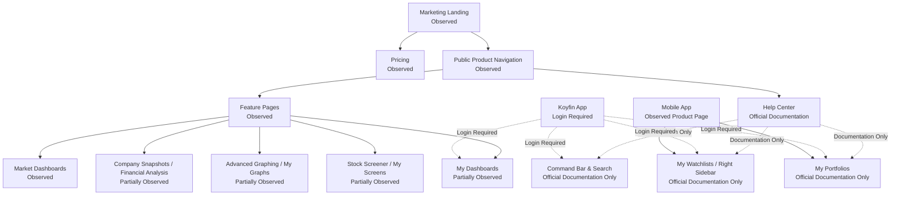

# Koyfin Product Surface Map 기록

## 문서 목적

이 문서는 Koyfin에서 공식 자료로 확인 가능한 Product Surface를 정리한다.

이번 단계에서는 Surface 존재 여부, 접근 수준, User Goal, Primary Entity, Surface Responsibility를 기록한다. Product Flow, Candidate Principle, Registry 업데이트는 수행하지 않는다.

## Surface 요약

| 항목 | 수 |
| --- | ---: |
| 기록한 Product Surface | 18 |
| Public Access Surface | 7 |
| Login Required 또는 Partially Observed Surface | 8 |
| Paid Feature 영향을 받는 Surface | 6 |
| Not Verified 독립 Surface | 1 |

## Product Surface 관계 기록

Mermaid의 실선은 공개 Product page에서 확인한 연결이다. 점선은 Help Center에서 확인했지만 App 내부 조작이 필요한 연결이다.

## Surface Inventory 목록

| Surface ID | 공식 명칭 | URL | Access Level | Observation Status | User Goal | Primary Entity | Supporting Entities | Primary Action | Navigation Entry | Surface Responsibility | Related Surface | Evidence | Confidence | Open Question |
| --- | --- | --- | --- | --- | --- | --- | --- | --- | --- | --- | --- | --- | --- | --- |
| KYF-SF-001 | Marketing Landing | https://www.koyfin.com/ | Public Access | Observed | Koyfin의 Product 목적과 가입 경로를 파악한다. | Product Surface | Market, Portfolio, Report | Sign Up, Log In, Product 탐색 | Public Header | 투자 Research, Portfolio 분석, client-ready report를 하나의 Product로 설명한다. | Pricing, Feature Pages, Data Coverage | 공식 Home은 public Navigation, Sign Up, Log In, Platform positioning, Feature entry를 표시한다. Access Date: 2026-07-27. | High | 로그인 후 기본 Home이 같은 구조인지 확인 필요. |
| KYF-SF-002 | Authentication Entry | https://app.koyfin.com/ | Login Required | Partially Observed | 계정을 생성하거나 기존 계정으로 App에 진입한다. | User Account | Subscription Plan | Sign Up, Log In | Public Header | Public Surface에서 App 내부 Surface로 전환하는 진입점이다. | Pricing, My Dashboards, My Portfolios | Home public header에 Sign Up For Free와 Log In entry가 표시된다. Access Date: 2026-07-27. | Medium | 로그인 후 첫 Landing Surface는 Not Verified. |
| KYF-SF-003 | Public Product Navigation | https://www.koyfin.com/ | Public Access | Observed | Product, Features, Data Coverage, Mobile App, 대상 사용자, Pricing을 탐색한다. | Product Surface | Feature, Plan, User Segment | Product section 이동 | Public Header | Public Product 정보 구조를 제공한다. | Marketing Landing, Feature Pages, Pricing | Home header에 Product, Features, Data Coverage, Mobile App, For Financial Advisors, For Investors, Pricing이 표시된다. Access Date: 2026-07-27. | High | App 내부 Global Navigation과 동일한지 확인 필요. |
| KYF-SF-004 | Command Bar & Search | https://www.koyfin.com/help/command-bar-search/ | Login Required | Official Documentation Only | Security 또는 Function으로 빠르게 이동한다. | Security | Chart, Function, Field, Country, Asset Type | ticker 또는 command 입력 | App top command bar | Search를 App 내부 Navigation shortcut과 Entity entry로 제공한다. | Graph, Estimates, Snapshot, Advanced Search | Help Center는 command bar가 top에 있고 `/`로 활성화되며 ticker-function 조합, asset type/country filter, Advanced Search를 설명한다. Access Date: 2026-07-27. | Medium | 실제 검색 결과 grouping과 ranking은 Not Verified. |
| KYF-SF-005 | Custom Dashboards / My Dashboards | https://www.koyfin.com/features/custom-dashboards/ | Login Required | Partially Observed | 투자자가 직접 Dashboard를 구성하고 저장한다. | Dashboard | Watchlist, Security, Chart, News, Widget | Dashboard 생성, 저장, widget 구성 | Product Feature page, App left sidebar | 사용자 정의 Dashboard와 saved Workspace 역할을 수행할 수 있다. | My Dashboard Groups, Watchlist, Graph, News | Product page는 separate dashboards, custom data tables를 설명한다. Help Center는 blank dashboard, template, widget resize, drag behavior를 설명한다. Access Date: 2026-07-27. | High | Dashboard 간 Context 공유는 일부만 확인됨. |
| KYF-SF-006 | My Dashboard Groups | https://www.koyfin.com/help/my-dashboards-groups/ | Login Required | Official Documentation Only | 여러 widget의 Security selection을 연결한다. | Widget Group | Security, Watchlist, Graph, News, Table | group 지정, ticker selection 공유 | My Dashboards 내부 설정 | Dashboard 내부 Context Preservation을 지원한다. | My Dashboards, Watchlist, Graph, News | Help Center는 7개 color group, single/multiple security, My Watchlists selection, widget 간 ticker update를 설명한다. Access Date: 2026-07-27. | Medium | 실제 widget별 지원 차이는 Not Verified. |
| KYF-SF-007 | Market Dashboards / Macro Dashboards | https://www.koyfin.com/features/market-dashboards/ | Public Access | Observed | Market와 Macro 데이터를 curated Dashboard로 빠르게 확인한다. | Market | Index, Sector, Country, Yield, Currency, Commodity, Economic Event | Dashboard 탐색 | Feature page, App Dashboard | broad market와 Macro monitoring을 packaged Dashboard로 제공한다. | World Economic Calendar, Dashboard, Data Coverage | Product page는 IPOs, global yields, economic data, currencies, commodities, corporate credit, World Economic Calendar를 설명한다. Access Date: 2026-07-27. | High | App 내부 default Market Dashboard 구조는 Not Verified. |
| KYF-SF-008 | Company Snapshots | https://www.koyfin.com/features/company-snapshots/ | Login Required / Paid Feature | Official Documentation Only | Company를 top-down view로 빠르게 분석한다. | Company | Security, ETF Exposure, Analyst Estimate, Price Target, News | Company overview 확인 | Search, Snapshot command, Right Sidebar | Company Research의 summary hub 역할을 할 수 있다. | Financial Analysis, Estimates, News, Graph | 공식 Product snippet은 Company overview, ETF exposure, analyst estimates, price targets, earnings history를 설명한다. Pricing은 Free limited company snapshots, Plus 100K+ global company snapshots를 표시한다. Access Date: 2026-07-27. | Medium | Snapshot 내 Local Navigation과 full tab 구조는 Not Verified. |
| KYF-SF-009 | Financial Analysis | https://www.koyfin.com/features/financial-analysis/ | Login Required / Paid Feature | Partially Observed | Company financials, valuation, statements를 분석한다. | Company | Financial Statement, Metric, Estimate, Template | Financial metrics 확인, template 저장 | Feature page, Company Research | Company Research의 deep analysis Surface다. | Company Snapshot, Actuals and Consensus, Dashboard | Product page는 financial overview, valuation metrics, quarterly/annual data, statements, custom financial templates를 설명한다. Access Date: 2026-07-27. | High | 실제 데이터 Freshness와 Source 표시는 Not Verified. |
| KYF-SF-010 | Advanced Graphing / My Graphs | https://www.koyfin.com/features/advanced-graphing/ | Login Required | Partially Observed | Security, Metric, Asset Class series를 chart로 분석하고 저장한다. | Chart | Security, Metric, Template, Folder | Graph 생성, template 저장, export | Feature page, Command Bar, Dashboard widget | 분석 chart와 reusable template를 제공한다. | My Graphs, Dashboard, Financial Analysis | Product page는 My Graphs save, folders, PNG export, reusable chart templates, over 100 series를 설명한다. Access Date: 2026-07-27. | High | 실제 chart interaction과 indicator catalog는 Not Verified. |
| KYF-SF-011 | Stock Screener / My Screens | https://www.koyfin.com/features/stock-screener/ | Login Required / Paid Feature | Partially Observed | 조건에 맞는 Stock 또는 Security 후보를 발견한다. | Security | Company, Region, Sector, Industry, Filter, Screen | filter 적용, screen 저장, watchlist 추가 | Feature page, My Screens, right side nav | table-first Discovery와 saved screen 역할을 수행한다. | Watchlist, Company Snapshot, CSV Export | Product page와 Help Center는 100K+ securities, 5,900+ filters, region/universe criteria, saved screens, templates, watchlist export, CSV export를 설명한다. Access Date: 2026-07-27. | High | 실제 filter UI와 result grouping은 Not Verified. |
| KYF-SF-012 | My Watchlists | https://www.koyfin.com/help/mydashboards-myd/amp/ | Login Required / Paid Feature | Official Documentation Only | Security 목록을 저장하고 Dashboard, table, sidebar에서 재사용한다. | Watchlist | Security, Table View, Field, Group, Summary Row | Watchlist 생성, view 구성, ticker 선택 | My Watchlists, My Dashboards, Right Sidebar | Monitoring과 Navigation entry를 겸할 수 있다. | My Dashboards, My Screens, Right Sidebar, Mobile App | Help Center는 watchlist widget, stocks, ETFs, mutual funds, FX, economic data, data series, table template를 설명한다. Pricing은 Free 2 watchlists, Plus unlimited watchlists를 표시한다. Access Date: 2026-07-27. | Medium | 독립 Watchlist Screen 구조는 Not Verified. |
| KYF-SF-013 | My Portfolios | https://www.koyfin.com/help/my-portfolios/ | Login Required / Paid Feature | Official Documentation Only | holding, account, lot, performance, exposure를 관리한다. | Portfolio | Account, Holding, Lot, Currency, Exposure, P/L | portfolio 생성, holding 입력, P/L 분석 | Help Functionality, Mobile App | Portfolio analysis와 continuity Surface 역할을 수행한다. | Mobile App, News, Reports, Pricing | Help Center는 current holdings, account, purchase date, quantity, average cost, lots, P/L, exposure exhibits, custom views를 설명한다. Access Date: 2026-07-27. | High | 실제 Portfolio import, broker integration, alert state는 Not Verified. |
| KYF-SF-014 | News | https://www.koyfin.com/mobile-app/ | Public Access / Paid Feature | Partially Observed | Market, Watchlist, Portfolio, ticker 관련 News를 확인한다. | News | Ticker, Watchlist, Portfolio, Transcript, Press Release | News 읽기, ticker-specific News 탐색 | Home, Mobile App, Dashboard widget, Right Sidebar | monitoring과 Research context 보조 Surface다. | Watchlist, Portfolio, Company Snapshot | Home은 combined news를 설명한다. Mobile page는 trending/latest/ticker-specific News, portfolio-level news, transcripts, press releases를 설명한다. Pricing은 limited news와 premium news 차이를 표시한다. Access Date: 2026-07-27. | Medium | News Detail과 Source link behavior는 Not Verified. |
| KYF-SF-015 | Economic Calendar / Event Surface | https://www.koyfin.com/features/market-dashboards/ | Public Access | Partially Observed | economic data release와 Macro Event를 확인한다. | Economic Event | Country, Indicator, Calendar, Market | calendar 확인 | Market Dashboards | Macro monitoring의 Event-oriented Surface다. | Macro Dashboards, Market Dashboards | Market Dashboards page는 World Economic Calendar와 country economic data releases를 설명한다. Access Date: 2026-07-27. | Medium | Event에서 Security impact로 연결되는 구조는 Not Verified. |
| KYF-SF-016 | Mobile App | https://www.koyfin.com/mobile-app/ | Public Access / Login Required | Observed | mobile에서 Market, Portfolio, News, Watchlists를 확인한다. | Product Surface | Market, Portfolio, News, Watchlist | mobile app 사용, synced data 확인 | Public Mobile App page | desktop Surface의 mobile monitoring entry를 제공한다. | My Portfolio, Watchlists, News | Mobile page는 market overview, My Portfolio, News, Watchlists, desktop sync, alerts, exposures를 설명한다. Access Date: 2026-07-27. | High | 실제 responsive Navigation 구조는 Not Verified. |
| KYF-SF-017 | Pricing / Feature Comparison | https://www.koyfin.com/pricing/ | Public Access | Observed | plan별 Access Level과 기능 제한을 확인한다. | Subscription Plan | Feature, Watchlist, Screen, Dashboard, Portfolio | plan 비교, 가입 | Public Header | Product Surface 접근 제한을 설명한다. | Authentication Entry, Product Features | Pricing은 Free, Plus, Premium, Advisor Core, Advisor Pro의 기능 차이를 표시한다. Access Date: 2026-07-27. | High | Enterprise 또는 custom contract 조건은 Not Verified. |
| KYF-SF-018 | Right Sidebar | https://www.koyfin.com/help/right-sidebar/amp/ | Login Required | Official Documentation Only | Watchlist, Movers, News에서 Security를 선택하고 주요 Screen으로 로드한다. | Panel | Watchlist, Movers, News, Security, Snapshot, Estimates, Graph | ticker 선택, target Screen load | App right sidebar | Monitoring Panel과 Contextual Navigation entry 역할을 수행한다. | My Watchlists, News, Snapshot, Graph | Help Center는 right sidebar가 watchlists, movers, News를 포함하고 securities를 Snapshot, Estimates, Graph로 load한다고 설명한다. Access Date: 2026-07-27. | Medium | 실제 Panel persistence와 mobile 대응은 Not Verified. |

## Product Surface와 Capability 구분

다음 항목은 독립 Product Surface로 확정하지 않고 Capability 또는 설정 영역으로 기록한다.

| 항목 | 분류 | 이유 |
| --- | --- | --- |
| Widget resizing | Capability | My Dashboards 내부 편집 동작으로 설명된다. |
| Dashboard template | Capability / Template | My Dashboards와 Custom Dashboards 내부 생성 방식으로 설명된다. |
| Table template | Capability / Template | Watchlist table 또는 Screener column configuration과 연결된다. |
| Alerts | Capability | Mobile page에서 create alerts가 언급되지만 독립 Surface 구조는 확인되지 않았다. |
| Settings | Not Verified | 독립 Settings Screen의 공식 위치와 책임은 이번 조사에서 확인하지 못했다. |
| Personalization | Cross-surface Capability | Dashboard, Watchlist, Graph, Portfolio에서 customization이 확인되지만 독립 Surface로 확정하지 않는다. |

## 주요 Comparison Note

이 비교는 결론이 아니다. 다음 Benchmark 단계에서 재검토해야 한다.

- Koyfin은 Dashboard, Watchlist, Screener, Graph, Portfolio처럼 사용자가 저장하거나 재사용할 수 있는 Surface를 공개 문서에서 반복적으로 설명한다.
- TradingView가 Chart-centered Workspace를 강하게 드러낸 것과 달리, Koyfin은 Dashboard와 table/chart/widget 조합을 Product Surface의 중심 언어로 제시한다.
- EidosLayer와 비교할 때 Koyfin은 Marketing Landing에서 Market, Macro, Company, Portfolio, Advisor report를 더 명시적으로 분리해 설명한다.

## 남아 있는 Open Question

- 로그인 후 기본 Home 또는 default Dashboard가 무엇인지 확인 필요.
- App 내부 Global Navigation과 Public Product Navigation의 차이를 확인 필요.
- Command Bar Search 결과가 Entity Type별로 group되는지 확인 필요.
- Company와 Security가 UI에서 분리 표기되는지 확인 필요.
- Watchlist가 독립 Screen인지 Right Sidebar와 Dashboard widget 중심인지 확인 필요.
- Portfolio가 Navigation 역할을 수행하는지, 분석 Surface인지 확인 필요.
- Alert가 독립 Surface인지 Portfolio/Watchlist/News의 Capability인지 확인 필요.
