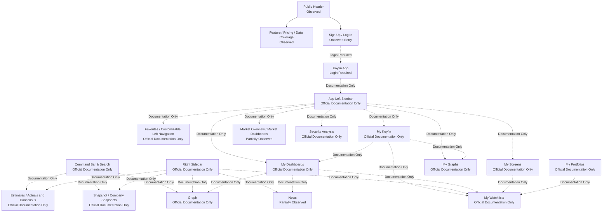

# Koyfin Navigation Map 기록

## 문서 목적

이 문서는 Koyfin의 Navigation Entry와 Navigation 책임을 기록한다.

이번 단계에서는 공식 Product page와 공식 Help Center에서 확인 가능한 Navigation 구조만 사용한다. 로그인 후 실제 App 조작이 필요한 관계는 `Official Documentation Only`, `Login Required`, `Not Verified`로 구분한다.

## Navigation 관계 요약

실선은 공개 Product Surface에서 확인한 관계다. 점선은 공식 Help Center에 설명되지만 로그인 후 실제 App에서 재확인이 필요한 관계다.

## Navigation Entry Inventory

| Navigation ID | Entry | Type | Access Level | Observation Status | Navigation Responsibility | Primary Destination | Context Preservation | Evidence | Confidence | Open Question |
| --- | --- | --- | --- | --- | --- | --- | --- | --- | --- | --- |
| KYF-NAV-001 | Public Header | Global Navigation | Public Access | Observed | public Product, audience, Pricing, Sign Up, Log In으로 이동한다. | Product pages, Pricing, Authentication Entry | Not Applicable | Official Product Observation: Home public header. Access Date: 2026-07-27. | High | App 내부 Global Navigation과 동일한지 Not Verified. |
| KYF-NAV-002 | Sign Up / Log In | Authentication Navigation | Public Access / Login Required | Observed Entry | Public Surface에서 App으로 전환한다. | Koyfin App | 로그인 후 default state는 Not Verified | Official Product Observation: Home header. Access Date: 2026-07-27. | Medium | 로그인 후 첫 Surface가 Dashboard인지 Market Overview인지 확인 필요. |
| KYF-NAV-003 | App Left Sidebar | Global / Tool / Workspace Navigation | Login Required | Official Documentation Only | My Dashboards, My Screens, My Graphs, Security Analysis, Market Overview 같은 App 내부 Surface로 이동한다. | App internal Surface | Favorites와 reorder는 사용자별 저장으로 보인다. | Official Documentation: My Dashboards, My Screens, My Graphs, Customizable Left Navigation. Access Date: 2026-07-27. | Medium | 실제 section 전체 목록과 현재 위치 표시 확인 필요. |
| KYF-NAV-004 | Customizable Left Navigation | Personal Navigation | Login Required | Official Documentation Only | Favorites, collapsible sections, reorder로 자주 쓰는 Tool 접근을 조정한다. | Favorites, left navigation sections | layout saves automatically로 설명된다. | Official Documentation: Customizable Left Navigation release note. Access Date: 2026-07-27. | Medium | plan별 차이와 초기 default structure 확인 필요. |
| KYF-NAV-005 | Command Bar & Search | Command Navigation / Search | Login Required | Official Documentation Only | Security와 Function을 조합해 Snapshot, Estimates, Graph 등으로 빠르게 이동한다. | Security functions, Advanced Search | 기존 Dashboard Context 유지 여부는 Not Verified | Official Documentation: Command Bar & Search. Access Date: 2026-07-27. | Medium | Search result가 Entity Type별로 group되는지 확인 필요. |
| KYF-NAV-006 | Right Sidebar | Contextual Panel / Monitoring Navigation | Login Required | Official Documentation Only | Watchlists, movers, News를 열고 Security를 Snapshot, Estimates, Graph로 load한다. | Watchlist, News, Snapshot, Estimates, Graph | 선택한 Security를 target function으로 전달하는 Contextual Navigation으로 보인다. | Official Documentation: Right Sidebar. Access Date: 2026-07-27. | Medium | Panel state persistence와 active target 선택 방식 확인 필요. |
| KYF-NAV-007 | My Dashboards | Workspace Navigation | Login Required | Official Documentation Only | saved Dashboard, blank Dashboard, template Dashboard로 이동한다. | Dashboard, widgets | Dashboard Layout과 widget 구성이 저장되는 User State로 보인다. | Official Documentation: My Dashboards. Access Date: 2026-07-27. | Medium | Dashboard 간 Entity Context 공유 여부 확인 필요. |
| KYF-NAV-008 | My Dashboard Groups | Contextual Navigation / State Transition | Login Required | Official Documentation Only | 같은 group의 widget이 Security selection을 공유한다. | linked widgets | group 내 Security selection은 Context Preservation을 지원한다. | Official Documentation: My Dashboard Groups. Access Date: 2026-07-27. | Medium | widget type별 예외와 saved state 범위 확인 필요. |
| KYF-NAV-009 | My Screens | Discovery Tool Navigation | Login Required / Paid Feature | Official Documentation Only | saved Screen 생성, filter 설정, result table, Watchlist export로 이동한다. | Screener, Result Table, Watchlist | Saved Screen Configuration은 User State로 보인다. | Official Documentation: My Screens. Access Date: 2026-07-27. | High | Result Row에서 Snapshot 또는 Graph로 가는 실제 step 확인 필요. |
| KYF-NAV-010 | My Watchlists | Personal Monitoring Navigation | Login Required / Paid Feature | Official Documentation Only | Watchlist를 만들고 열람하며 Dashboard와 Right Sidebar에서 재사용한다. | Watchlist, Dashboard widget, Right Sidebar | Watchlist Membership과 Table View가 저장되는 User State로 보인다. | Official Documentation: My Watchlists, Watchlist Views. Access Date: 2026-07-27. | Medium | Watchlist Item의 default click target 확인 필요. |
| KYF-NAV-011 | My Portfolios | Portfolio Navigation / Analysis Surface | Login Required / Paid Feature | Official Documentation Only | holdings, lots, account, P/L, exposure, analysis views로 이동한다. | Portfolio, Holdings, Exposure, Analysis | Portfolio Holding과 Portfolio View가 저장되는 User State로 보인다. | Official Documentation: My Portfolios. Access Date: 2026-07-27. | High | Portfolio에서 Company Snapshot으로 직접 이동 가능한지 확인 필요. |
| KYF-NAV-012 | My Graphs | Saved Chart Navigation | Login Required / Paid Feature | Official Documentation Only | saved graph와 folder를 열고 chart configuration을 재방문한다. | Saved Graph, Folder, Graph editor | saved graph는 full configuration을 유지한다고 설명된다. | Official Documentation: My Graphs release note. Access Date: 2026-07-27. | Medium | Graph와 Dashboard widget 사이의 saved state 차이 확인 필요. |
| KYF-NAV-013 | Mobile App Navigation | Mobile Navigation | Public Access / Login Required | Partially Observed | mobile에서 Market Overview, My Portfolio, News, Watchlists에 접근한다. | Market, Portfolio, News, Watchlist | desktop sync가 설명되지만 실제 mobile state는 Not Verified | Official Product Page: Mobile App. Access Date: 2026-07-27. | Medium | mobile tab structure와 back navigation 확인 필요. |

## Command Bar & Search 기록

Observation:
공식 Help Center는 Command Bar가 상단에 있으며 `/` key로 활성화된다고 설명한다. ticker와 function을 조합해 `AAPL G`, `AAPL EST`, `SPY HDS` 같은 방식으로 Graph, Estimates, Holdings로 이동할 수 있다고 설명한다. 결과는 best match와 volume 또는 AUM 기준으로 sorting되며 asset type과 country filter가 제공된다고 설명한다.

Interpretation:
Command Bar는 단순 Search라기보다 Security와 Function을 결합하는 Command Navigation일 수 있다. 전문 사용자가 left sidebar를 거치지 않고 원하는 분석 Surface로 이동하도록 설계된 구조로 볼 수 있다.

User Impact:
사용자는 ticker를 이미 알고 있을 때 Page Navigation 깊이를 줄일 수 있다. 반대로 function shortcut을 모르는 사용자는 학습 비용이 생길 수 있다.

DATE Implication:
DATE에서 Search가 Entity lookup인지, command-driven Navigation인지, discovery인지 구분해 검토할 필요가 있다.

Confidence:
Medium

Evidence:
Official Documentation: https://www.koyfin.com/help/command-bar-search/. Access Date: 2026-07-27.

## Dashboard Navigation 기록

Observation:
공식 Help Center는 My Dashboards가 left sidebar 아래에 있고 `Create New`로 blank dashboard 또는 customized template를 만들 수 있다고 설명한다. Dashboard는 watchlist, chart, News widget을 포함할 수 있고 widget은 resize와 drag가 가능하다. My Dashboard Groups는 7개 color group으로 widget을 연결하고 Security selection을 공유한다고 설명한다.

Interpretation:
Koyfin의 Dashboard는 단순 Page보다 저장 가능한 Workspace Surface에 가까울 수 있다. Widget grouping은 Dashboard 안에서 Page 전환 없이 Entity Context를 재사용하기 위한 구조로 볼 수 있다.

User Impact:
반복 분석 루틴을 가진 사용자는 Dashboard Layout과 grouped widget을 저장해 다음 세션에서 재사용할 수 있다. 반면 초기 사용자는 Dashboard, Widget, Template, Group의 개념을 이해해야 한다.

DATE Implication:
DATE에서 Dashboard를 Home으로 볼지, saved Workspace로 볼지, monitoring Surface로 볼지는 추가 Benchmark와 사용자 Journey에서 분리 검증해야 한다.

Confidence:
Medium

Evidence:
Official Documentation: https://www.koyfin.com/help/mydashboards-myd/amp/, https://www.koyfin.com/help/my-dashboards-groups/. Access Date: 2026-07-27.

## Left Sidebar와 Right Sidebar 구분

| Sidebar | 분류 | Observation Status | 책임 | 확인된 대상 | 확인 제한 |
| --- | --- | --- | --- | --- | --- |
| App Left Sidebar | Global / Tool / Workspace Navigation | Official Documentation Only | App 내부 Surface와 사용자 저장 Surface에 접근한다. | My Dashboards, My Screens, My Graphs, Security Analysis, Favorites, Market Overview | 실제 전체 section 목록과 현재 위치 표시는 Not Verified |
| App Right Sidebar | Contextual Panel / Monitoring Navigation | Official Documentation Only | Watchlists, movers, News를 열고 Security를 function으로 load한다. | Watchlists, Movers, News, Snapshot, Estimates, Graph | 실제 Panel state와 target function 선택 방식은 Not Verified |

## Navigation Depth 기록

| Path ID | Path | 최소 확인 가능한 Navigation 횟수 | Status | Context Preservation | Confidence |
| --- | --- | ---: | --- | --- | --- |
| KYF-PATH-001 | Public Header → Feature page | 1 | Observed | Not Applicable | High |
| KYF-PATH-002 | Public Header → Log In → App | 2 | Partially Observed | 로그인 후 state는 Not Verified | Medium |
| KYF-PATH-003 | Left Sidebar → My Dashboards → Create New Dashboard | Not Verified | Official Documentation Only | Dashboard Layout 저장 가능성 있음 | Medium |
| KYF-PATH-004 | Command Bar → ticker → function | Not Verified | Official Documentation Only | Security가 function으로 전달됨 | Medium |
| KYF-PATH-005 | Right Sidebar → Watchlist security → Snapshot / Estimates / Graph | Not Verified | Official Documentation Only | Security load로 Context 전달 가능성 있음 | Medium |
| KYF-PATH-006 | My Screens → Filter → Result Table → Watchlist export | Not Verified | Official Documentation Only | Saved Screen Configuration과 Watchlist Membership 분리 | High |
| KYF-PATH-007 | My Portfolio → Exposure tab → Analysis table | Not Verified | Official Documentation Only | Portfolio Holding과 Portfolio View 유지 가능성 있음 | High |

## Mobile Navigation 기록

Observation:
공식 Mobile App page는 mobile에서 Market overview, My Portfolio, News, Watchlists에 접근할 수 있고 Watchlists와 My Portfolio가 desktop과 sync된다고 설명한다.

Interpretation:
Mobile App은 full analysis Workspace보다 monitoring과 continuity entry 역할이 강할 수 있다.

User Impact:
사용자는 desktop에서 만든 Watchlist나 Portfolio를 mobile에서 재확인할 수 있다. 다만 실제 mobile Navigation tier는 확인하지 못했다.

DATE Implication:
DATE에서 mobile은 full Research가 아니라 revisit와 monitoring 중심으로 검토할 가치가 있다.

Confidence:
Medium

Evidence:
Official Product Page: https://www.koyfin.com/mobile-app/. Access Date: 2026-07-27.

## 남아 있는 Open Question

- 로그인 후 App의 default entry가 Market Overview인지, My Koyfin인지, 이전 state인지 확인 필요.
- Left Sidebar의 현재 전체 section과 Favorites 저장 상태 확인 필요.
- Command Bar가 Dashboard, Macro Indicator, Company, Security를 Entity Type별로 group하는지 확인 필요.
- Right Sidebar에서 선택한 Security가 어떤 function으로 load되는지 사용자가 명시 선택하는지 확인 필요.
- Dashboard Group state가 session 간 유지되는지 확인 필요.
- Back Navigation이 App 내부 state를 보존하는지 확인 필요.
