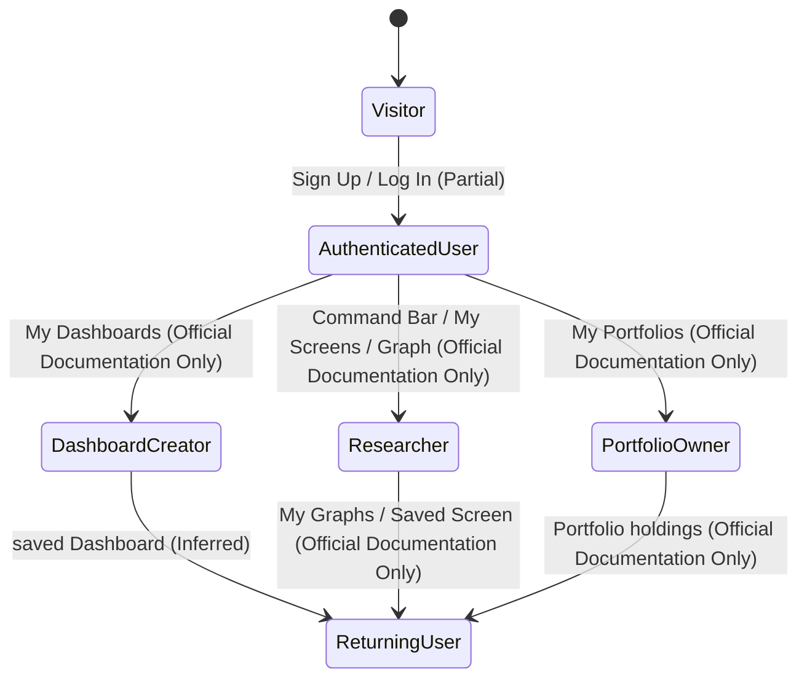

# Koyfin Product Flow Architecture 기록

## 문서 목적

이 문서는 Phase 3.1과 Phase 3.2에서 기록한 Koyfin Product Surface, Navigation, Journey, Entity / State Observation을 통합해 Product Flow를 정리한다.

이번 문서는 Product Flow Architecture Observation이다. DATE Product Flow를 제안하지 않는다. Candidate Principle도 작성하지 않는다.

## Flow 상태 기준

| Status | 의미 |
| --- | --- |
| Observed | 공개 Product page에서 직접 확인한 관계 |
| Partial | 공개 Product page와 공식 Documentation이 함께 있으나 App 내부 Interaction은 확인하지 못한 관계 |
| Official Documentation Only | Help Center에서 설명되지만 실제 App에서 조작하지 않은 관계 |
| Inferred | 기존 Observation을 바탕으로 한 Interpretation이며 Observation으로 사용하지 않는 관계 |
| Not Verified | 공식 자료 또는 실제 조작으로 확인하지 못한 관계 |

## Product Flow 통합 Diagram

```mermaid
flowchart LR
  Public["Public Entry<br/>Observed"]
  Auth["Authentication<br/>Partial"]
  App["Koyfin App<br/>Login Required"]
  Left["Left Sidebar<br/>Official Documentation Only"]
  Command["Command Bar<br/>Official Documentation Only"]
  Right["Right Sidebar<br/>Official Documentation Only"]
  Market["Market Dashboards<br/>Observed"]
  Macro["Economic Calendar / Macro<br/>Partial"]
  Screener["My Screens<br/>Official Documentation Only"]
  Result["Screener Result Table<br/>Official Documentation Only"]
  Company["Company Snapshot<br/>Official Documentation Only"]
  FA["Financial Analysis<br/>Partial"]
  Estimates["Actuals and Consensus<br/>Official Documentation Only"]
  Graph["Graph / My Graphs<br/>Partial"]
  Watchlist["My Watchlists<br/>Official Documentation Only"]
  Portfolio["My Portfolios<br/>Official Documentation Only"]
  Dashboard["My Dashboards<br/>Official Documentation Only"]
  News["News<br/>Partial"]
  Revisit["Returning User State<br/>Inferred"]

  Public -->|Observed| Auth
  Auth -. "Login Required" .-> App
  App -. "Official Documentation Only" .-> Left
  App -. "Official Documentation Only" .-> Command
  App -. "Official Documentation Only" .-> Right
  Left -->|Official Documentation Only| Market
  Left -->|Official Documentation Only| Screener
  Left -->|Official Documentation Only| Dashboard
  Left -->|Official Documentation Only| Graph
  Command -->|Official Documentation Only| Company
  Command -->|Official Documentation Only| FA
  Command -->|Official Documentation Only| Estimates
  Command -->|Official Documentation Only| Graph
  Market -. "Partial" .-> Macro
  Macro -. "Official Documentation Only" .-> Graph
  Screener -->|Official Documentation Only| Result
  Result -->|Official Documentation Only| Watchlist
  Result -. "Inferred" .-> Company
  Company -->|Official Documentation Only| FA
  FA -->|Official Documentation Only| Estimates
  FA -->|Official Documentation Only| Graph
  Right -->|Official Documentation Only| Watchlist
  Right -->|Official Documentation Only| News
  Right -->|Official Documentation Only| Company
  Right -->|Official Documentation Only| Estimates
  Right -->|Official Documentation Only| Graph
  Watchlist -->|Official Documentation Only| Dashboard
  Watchlist -->|Official Documentation Only| Portfolio
  Portfolio -. "Inferred" .-> Company
  Dashboard -->|Official Documentation Only| Watchlist
  Dashboard -->|Official Documentation Only| Graph
  Dashboard -->|Official Documentation Only| News
  Dashboard -. "Inferred" .-> Revisit
  Graph -. "Official Documentation Only" .-> Revisit
  Watchlist -. "Official Documentation Only" .-> Revisit
  Portfolio -. "Official Documentation Only" .-> Revisit
```

이 Diagram은 Koyfin의 확정 Product Architecture가 아니다. 상태 label은 Evidence 수준을 표시한다.

## Flow Role Matrix

| Flow Type | 핵심 질문 | 주요 Surface | 확인 상태 | 주요 Evidence | Confidence |
| --- | --- | --- | --- | --- | --- |
| User Decision Flow | 사용자가 Market discovery에서 저장과 재방문까지 이어갈 수 있는가. | Market Dashboards, My Screens, Company Snapshot, Financial Analysis, Watchlist, Portfolio, Dashboard | Partial | Market Dashboards, My Screens, Financial Analysis, My Watchlists, My Portfolios | Medium |
| Navigation Flow | 사용자가 App 내부 Surface에 어떤 Entry로 접근하는가. | Public Header, Left Sidebar, Right Sidebar, Command Bar | Official Documentation Only / Observed | Home, Command Bar, Customizable Left Navigation, Right Sidebar | Medium |
| Entity Flow | Market, Security, Company, Metric, News, Watchlist, Portfolio가 연결되는가. | Market, Security, Company, Financial Metric, News, Watchlist, Portfolio | Partial / Inferred | Entity and State Observation | Medium |
| Information Flow | Summary에서 Table, Chart, Detail, Methodology로 내려갈 수 있는가. | Dashboard, Table, Graph, Data Dictionary | Partial | My Dashboards, Graph, Data Dictionary | Medium |
| Evidence Flow | Metric과 Source, Actual, Estimate, Consensus, News가 추적되는가. | Actuals and Consensus, Data Dictionary, News, Economic Calendar | Partial | Actuals and Consensus, Data Overview, Data Dictionary | Medium |
| Action Flow | Search, Open, Compare, Filter, Save, Monitor, Revisit가 연결되는가. | Command Bar, My Screens, Watchlist, My Graphs, Dashboard | Official Documentation Only | Command Bar, My Screens, My Graphs, My Watchlists | Medium |
| State Transition | Visitor가 Returning User로 전환되며 saved state를 쌓는가. | Sign Up, My Dashboards, My Graphs, Watchlists, Portfolio | Partial / Inferred | Pricing, My Dashboards, My Graphs, My Portfolios | Medium |
| Context Preservation Flow | Entity selection, Filter, Layout, Chart state가 유지되는가. | Dashboard Groups, Watchlist Views, Saved Screen, My Graphs, Portfolio | Official Documentation Only | My Dashboard Groups, My Views, My Screens, My Graphs, My Portfolios | Medium |

## User Decision Flow 기록

```mermaid
flowchart LR
  Market["Market Discovery<br/>Observed"]
  Screen["Screener Filter<br/>Official Documentation Only"]
  Result["Result Table<br/>Official Documentation Only"]
  Company["Company Snapshot<br/>Official Documentation Only"]
  Finance["Financial Analysis<br/>Partial"]
  Compare["Peer / Industry Comparison<br/>Inferred"]
  Evidence["Actuals / Consensus / News<br/>Partial"]
  Save["Watchlist / Portfolio / Dashboard<br/>Official Documentation Only"]
  Revisit["Revisit<br/>Inferred"]

  Market -. "Partial" .-> Screen
  Screen -->|Official Documentation Only| Result
  Result -. "Inferred" .-> Company
  Company -->|Official Documentation Only| Finance
  Finance -. "Inferred" .-> Compare
  Finance -->|Official Documentation Only| Evidence
  Evidence -. "Partial" .-> Save
  Save -. "Inferred" .-> Revisit
```

Observation:
Koyfin은 Market Dashboards, Stock Screener, Company Snapshots, Financial Analysis, Watchlists, Portfolios, Custom Dashboards를 공식 자료에서 각각 설명한다. My Screens는 result를 Watchlist로 export할 수 있다고 설명한다.

Interpretation:
User Decision Flow는 Market discovery에서 Screener와 Company analysis를 거쳐 saved state로 이어질 수 있다. 그러나 실제 App에서 end-to-end로 수행한 것은 아니다.

User Impact:
사용자는 discovery, analysis, save, revisit를 여러 Surface에 나누어 수행할 수 있다.

Confidence:
Medium

Evidence:
Official Product Pages: Market Dashboards, Stock Screener, Financial Analysis, Custom Dashboards. Official Documentation: My Screens, My Watchlists, My Portfolios. Access Date: 2026-07-28.

## Navigation Flow 기록

Observation:
Public Header는 Product pages, Pricing, Sign Up, Log In을 제공한다. 공식 Documentation은 App Left Sidebar, Command Bar, Right Sidebar를 설명한다.

Interpretation:
Koyfin의 Navigation Flow는 public marketing navigation과 App 내부 professional navigation이 분리되어 있을 수 있다. App 내부에서는 Left Sidebar가 broad entry, Command Bar가 direct entry, Right Sidebar가 contextual entry를 담당하는 것으로 보인다.

User Impact:
숙련 사용자는 Command Bar와 Sidebar로 Page Transition을 줄일 수 있다. 신규 사용자는 여러 Navigation entry의 책임 차이를 익혀야 한다.

Confidence:
Medium

Evidence:
Official Product Observation: Home. Official Documentation: Command Bar & Search, Right Sidebar, Customizable Left Navigation. Access Date: 2026-07-28.

## Entity Flow 기록

Observation:
Command Bar와 Watchlist, Screener, Graph는 Security 또는 ticker를 중심 입력으로 설명한다. Company Snapshots와 Financial Analysis는 Company information과 financials를 설명한다. Portfolio는 holdings와 Security position을 설명한다.

Interpretation:
Entity Flow는 Security 입력에서 Company analysis로 이어질 수 있다. 하지만 Koyfin 내부에서 Company와 Security가 별도 Entity로 분리되는지 확정할 수 없다.

User Impact:
사용자는 ticker를 알고 있으면 여러 analysis Surface로 빠르게 이동할 수 있다. Company와 Security의 경계가 불분명하면 DATE 비교 시 Entity 모델을 단정하면 안 된다.

Confidence:
Medium

Evidence:
Official Documentation: Command Bar & Search, My Screens, My Watchlists, My Portfolios, Actuals and Consensus. Official Product Page: Financial Analysis. Access Date: 2026-07-28.

## Information Flow 기록

```mermaid
flowchart LR
  Summary["Summary / Snapshot<br/>Official Documentation Only"]
  Table["Table<br/>Official Documentation Only"]
  Chart["Chart<br/>Partial"]
  Detail["Detail / Formula<br/>Official Documentation Only"]
  Source["Source / Provider<br/>Official Documentation Only"]

  Summary -->|Official Documentation Only| Table
  Table -->|Official Documentation Only| Chart
  Chart -. "Not Verified direct link" .-> Detail
  Detail -->|Official Documentation Only| Source
```

Observation:
Company Snapshots는 overview를 설명한다. Financial Analysis는 table과 graphical view를 설명한다. Data Dictionary는 Metric formula를 제공한다. Data Overview는 provider를 설명한다.

Interpretation:
Information Flow는 summary에서 table/chart로 내려가고, Methodology는 별도 Documentation에서 확인하는 구조일 수 있다.

User Impact:
사용자는 analysis surface에서 값을 보고, 필요하면 공식 Documentation에서 Methodology를 확인할 수 있다.

Confidence:
Medium

Evidence:
Official Product Page: Financial Analysis. Official Documentation: Data Dictionary, Data Overview. Access Date: 2026-07-28.

## Evidence Flow 기록

Observation:
Actuals and Consensus는 Actual, Estimate, Consensus, analyst count, median, high, low를 설명한다. Data Dictionary는 Metric formula를 제공한다. Data Overview는 provider category를 설명한다. News Detail Source와 timestamp는 직접 확인하지 않았다.

Interpretation:
Financial Evidence는 비교적 구조화되어 있지만 News Evidence와 item-level Source traceability는 추가 확인이 필요하다.

User Impact:
사용자는 financial Metric의 status를 일부 구분할 수 있다. 하지만 News와 chart series의 item-level Source가 보이지 않으면 재검증 비용이 남는다.

Confidence:
Medium

Evidence:
Official Documentation: Actuals and Consensus, Data Dictionary, Data Overview. Official Pricing: Pricing page. Access Date: 2026-07-28.

## Action Flow 기록

| Action | Surface | Status | State 변화 | Evidence | Confidence |
| --- | --- | --- | --- | --- | --- |
| Search | Command Bar | Official Documentation Only | Security와 Function 선택 | Command Bar & Search | Medium |
| Open | Snapshot / Graph / Estimates | Official Documentation Only | active function 변경 | Command Bar & Search, Right Sidebar | Medium |
| Compare | My Screens / Watchlist Views / Graph | Official Documentation Only | filter, columns, chart series 변경 | My Screens, My Views, Graph | High |
| Filter | My Screens / Economic Calendar | Official Documentation Only | Saved Screen Configuration 또는 calendar filter | My Screens, Economic Calendar article | High |
| Save | Watchlist / Saved Screen / My Graphs / Dashboard | Official Documentation Only | User State 생성 | My Watchlists, My Screens, My Graphs, My Dashboards | High |
| Monitor | Right Sidebar / Mobile App / Portfolio | Partial | Watchlist, News, Portfolio state 사용 | Right Sidebar, Mobile App, My Portfolios | Medium |
| Revisit | My Dashboards / My Graphs / Watchlists / Portfolio | Inferred / Official Documentation Only | saved state 재사용 | My Dashboards, My Graphs, My Watchlists, My Portfolios | Medium |

## State Transition 기록

State Transition은 공식 자료와 기존 Observation을 바탕으로 한 구조화다. 실제 user session transition을 조작하지 않았다.

## Context Preservation Assessment

| Context | 유지 Pattern | Status | 손실 가능 지점 | Evidence | Confidence |
| --- | --- | --- | --- | --- | --- |
| Security Selection | Dashboard Groups, Right Sidebar load, Command Bar function | Official Documentation Only | App 내부 Back Navigation과 multi-Surface transition | My Dashboard Groups, Right Sidebar, Command Bar | Medium |
| Watchlist Membership | My Watchlists, Right Sidebar, Dashboard widget | Official Documentation Only | Watchlist Item default action | My Watchlists, My Dashboards, Right Sidebar | Medium |
| Table Configuration | Watchlist Views, Saved Screen Configuration | Official Documentation Only | Dashboard widget와 My Screens 간 exact reuse | My Views, My Screens | Medium |
| Chart Configuration | My Graphs, Graph Templates | Official Documentation Only | Graph widget와 standalone Graph state boundary | My Graphs, Historical Graph | Medium |
| Portfolio Holding | My Portfolios, Mobile sync | Official Documentation Only / Partial | Portfolio to Company Research transition | My Portfolios, Mobile App | Medium |
| Macro Event | Economic Calendar to Chart | Official Documentation Only | Macro Event to Security impact | Economic Calendar article | Medium |

## Context Loss 지점

- Result Table에서 Company Snapshot 또는 Graph로 이동할 때 filter context가 유지되는지는 Not Verified다.
- News Detail에서 related Company, Security, Event가 연결되는지는 Not Verified다.
- Command Bar로 function 이동 후 이전 Dashboard Context가 유지되는지는 Not Verified다.
- Right Sidebar에서 Security를 load할 때 main Surface state가 유지되는지는 Not Verified다.
- My Graphs와 Dashboard graph widget의 state boundary는 Not Verified다.
- Portfolio holdings에서 Company Research로 직접 전환되는지는 Not Verified다.

## Flow 수 요약

| Status | Flow 수 |
| --- | ---: |
| Observed | 2 |
| Partial | 8 |
| Official Documentation Only | 24 |
| Inferred | 9 |
| Not Verified | 8 |

## 남아 있는 Open Question

- Koyfin App의 default entry와 Returning User restore behavior 확인 필요.
- Command Bar가 Search result를 Entity Type별로 group하는지 확인 필요.
- Screener result row의 default action과 context retention 확인 필요.
- Company Snapshot이 Company hub인지 Security function인지 확인 필요.
- News Detail의 Source, timestamp, related Entity link 확인 필요.
- Dashboard Group이 session 간 유지되는지 확인 필요.
- Portfolio에서 Company / Security research로 전환되는 실제 path 확인 필요.
