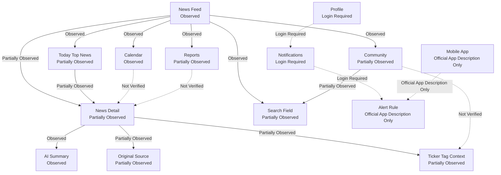

# SaveTicker Navigation Map

## 문서 목적

이 문서는 Phase 7.2 범위에서 SaveTicker의 Public Navigation, Context Navigation, Personal Navigation 후보를 기록한다.

Information Density, Trust / Evidence, Product Flow, Candidate Principle은 작성하지 않는다.

## 조사 기준

| 항목 | 내용 |
| --- | --- |
| 조사 날짜 | 2026-07-28 KST |
| Timezone | Asia/Seoul |
| Environment | Desktop web extraction / official URL review |
| Public Access | Partially Observed |
| Login | Not Logged In |
| Subscription | Not Verified |
| Mobile App | Official App Description Only |
| Secondary Source | Not Used |

## Navigation Status

| Status | 기준 |
| --- | --- |
| Observed | 공식 Product 화면에서 entry와 target을 확인했다. |
| Partially Observed | entry 또는 target 일부는 확인했지만 body, interaction, state는 제한됐다. |
| Official App Description Only | App Store / Google Play 설명에서만 확인했다. |
| Login Required | 로그인 전에는 target state를 확인할 수 없다. |
| App Only | mobile app에서만 확인 가능한 후보로 기록한다. |
| Inference | 기존 Observation에서 가능한 관계 후보로만 기록한다. |
| Not Verified | 이번 단계에서 확인하지 못했다. |

## Navigation 관계 요약

Diagram은 Navigation 관계의 확인 수준만 표시한다. Product Flow Architecture가 아니다.

## Public Navigation

| Navigation ID | Entry | Destination | Access Level | Observation Status | Navigation Responsibility | Evidence Type | Confidence | Open Question |
| --- | --- | --- | --- | --- | --- | --- | --- | --- |
| ST-NAV-001 | News | News Feed | Public Access | Observed | News Consumption의 main entry다. | Official Product Observation | High | feed ranking logic은 Not Verified |
| ST-NAV-002 | Report | Reports | Public Access candidate | Partially Observed | Report / Research entry 후보를 제공한다. | Official Product Observation | Low | report body와 detail URL은 Not Verified |
| ST-NAV-003 | Calendar | Calendar | Public Access | Observed | dated Event view entry다. | Official Product Observation | High | Event detail과 related News는 Not Verified |
| ST-NAV-004 | Community | Community | Public Access / Login Required 일부 | Partially Observed | Discussion entry를 제공한다. | Official Product Observation | Medium | write permission과 post detail은 Not Verified |
| ST-NAV-005 | News Search Field | Search Result candidate | Public Access | Partially Observed | News keyword query entry다. | Official Product Observation | Medium | Suggestion, Result Grouping, History는 Not Verified |
| ST-NAV-006 | Community Search Field | Community Search Result candidate | Public Access | Partially Observed | Community content query entry다. | Official Product Observation | Medium | tag / title / body result grouping은 Not Verified |
| ST-NAV-007 | Login | Login / Register | Public Access | Observed | account access entry다. | Official Product Observation | High | auth success state는 Not Verified |
| ST-NAV-008 | Profile | Login | Login Required | Observed | personal account target이 login gate로 연결된다. | Official Product Observation | High | logged-in Profile body는 Not Verified |
| ST-NAV-009 | Notification | Login | Login Required | Observed | personal notification target이 login gate로 연결된다. | Official Product Observation | High | Notification Center body는 Not Verified |
| ST-NAV-010 | Mobile App Listing | App install | App Only | Official App Description Only | app access와 push 후보 entry다. | Official App Description | Medium | actual App Navigation은 Not Verified |

## Context Navigation

| Navigation ID | Context Entry | Destination Candidate | Access Level | Observation Status | Context Responsibility | Evidence Type | Confidence | Open Question |
| --- | --- | --- | --- | --- | --- | --- | --- | --- |
| ST-NAV-011 | Today Top News | News Detail | Public Access | Partially Observed | curated News block에서 detail로 전환하는 후보 관계다. | Official Product Observation | Medium | selection rule은 Not Verified |
| ST-NAV-012 | News Feed item | News Detail | Public Access | Partially Observed | headline list에서 Article / News detail로 전환한다. | Official Product Observation | High | all item metadata는 Not Verified |
| ST-NAV-013 | AI Summary | News Detail body | Public Access | Observed | Article compression을 같은 detail context 안에 둔다. | Official Product Observation | High | summary method는 Not Verified |
| ST-NAV-014 | Translation / Original | Original Source candidate | Public Access | Partially Observed | SaveTicker translated / summarized content에서 Original Source 확인 후보를 제공한다. | Official Product Observation | Medium | external URL과 return state는 Not Verified |
| ST-NAV-015 | Ticker Tag | Ticker Detail candidate | Public Access | Partially Observed | News와 Ticker Context를 연결하는 후보다. | Official Product Observation | Medium | tag click target은 Not Verified |
| ST-NAV-016 | Related News | News Detail candidate | Public Access | Not Verified | same News Context 후보를 확장할 수 있다. | Inference | Low | related module existence는 Not Verified |
| ST-NAV-017 | Related Company | Company Detail candidate | Public Access / Login Required candidate | Not Verified | Company Context 후보로 전환할 수 있다. | Inference | Low | Company Detail Surface는 Not Verified |
| ST-NAV-018 | Related Calendar | Event Detail candidate | Public Access | Not Verified | News와 Calendar Event 후보를 연결할 수 있다. | Inference | Low | Event relation은 Not Verified |
| ST-NAV-019 | Related Report | Report Detail candidate | Public Access candidate | Not Verified | News와 Research Report 후보를 연결할 수 있다. | Inference | Low | report relation은 Not Verified |

## Personal Navigation

| Navigation ID | Entry | Destination | Access Level | Observation Status | Personal Responsibility | Evidence Type | Confidence | Open Question |
| --- | --- | --- | --- | --- | --- | --- | --- | --- |
| ST-NAV-020 | Notifications | Notification Center candidate | Login Required | Login Required | account 기반 Monitoring entry 후보다. | Official Product Observation | High | actual list and rule builder are Not Verified |
| ST-NAV-021 | Alert Rule | Alert Settings candidate | Login Required / App Only | Official App Description Only | keyword, company, economic indicator, report schedule alert 후보다. | Official App Description | Medium | rule structure and delivery are Not Verified |
| ST-NAV-022 | Follow | Follow List candidate | Login Required / App Only candidate | Inference | 관심 Ticker / Company / Keyword 후보를 저장할 수 있다. | Official App Description / Inference | Low | actual Follow UI is Not Verified |
| ST-NAV-023 | Bookmark | Saved News candidate | Login Required candidate | Not Verified | News 또는 Report 저장 후보다. | Inference | Low | Product wording directly verified 안 됨 |
| ST-NAV-024 | Profile | Profile body candidate | Login Required | Login Required | personal state 관리 후보다. | Official Product Observation | High | profile settings and history are Not Verified |

## News Navigation 결과

Observation:
News Feed는 top-level entry이고 Today Top News, Search Field, News list, Source label, latest sort candidate를 노출한다. News Detail은 AI Summary, Translation / Original control, Source label, Reaction, Comment area를 포함한다.

Interpretation:
SaveTicker의 News Navigation은 Feed scanning에서 Article / News Detail consumption으로 이어지는 구조다. Ticker Tag와 Original Source control은 Investment Workflow로 연결될 수 있는 후보이지만, 실제 Ticker Detail과 external return state는 확인하지 못했다.

Confidence:
Medium

## Calendar Navigation 결과

Observation:
Calendar는 month grid, selected date, local time basis, whole / weekly / monthly / custom labels를 제공한다.

Interpretation:
Calendar는 News Supporting Surface가 아니라 독립 top-level entry로 보인다. 그러나 Event Detail, Related News, Related Company, Related Report는 Not Verified다.

Confidence:
Medium

## Community Navigation 결과

Observation:
Community는 top-level entry, search input, user news / free board / popular post labels를 제공한다.

Interpretation:
Community는 Editorial Surface와 분리된 Discussion entry다. Community Reaction을 editorial priority나 News Evidence처럼 Interpretation하지 않는다.

Confidence:
Medium

## Search Navigation 결과

Observation:
News와 Community에서 Search Field를 확인했다. Search Result Surface, Suggestion, History, Grouping은 확인하지 못했다.

Interpretation:
Search는 현재 Phase 7.2에서 keyword-driven entry 후보로만 기록한다. Company / Ticker result를 확정하지 않는다.

Confidence:
Medium for entry, Low for result behavior.

## Context Preservation Candidate

| Context ID | Context | Status | Preserved Across | Context Loss | Restriction | Confidence |
| --- | --- | --- | --- | --- | --- | --- |
| ST-CTX-001 | News Feed category / sort | Partially Observed | News Feed 내부 | detail open 이후 return state Not Verified | Public | Medium |
| ST-CTX-002 | News Detail article context | Observed | AI Summary, Source label, Reaction, Comment area | Original Source transition | Public | High |
| ST-CTX-003 | Ticker Tag context | Partially Observed | News Detail body | Ticker Detail target Not Verified | Public | Medium |
| ST-CTX-004 | Calendar date context | Partially Observed | Calendar month / selected date | Event Detail Not Verified | Public | Medium |
| ST-CTX-005 | Community query context | Partially Observed | Community Search Field candidate | result grouping Not Verified | Public | Low |
| ST-CTX-006 | Notification context | Login Required | Notification Center candidate | Not logged in | Login Required | Low |
| ST-CTX-007 | Alert Rule context | Official App Description Only | mobile app candidate | actual rule UI Not Verified | App Only / Login Required | Low |

## Context Loss

| Loss ID | Context Loss | Status | User Impact Candidate | Open Question |
| --- | --- | --- | --- | --- |
| ST-LOSS-001 | News Feed에서 Detail로 이동 후 feed scroll / sort state | Not Verified | News scanning continuity 확인 필요 | browser Back state가 유지되는가 |
| ST-LOSS-002 | Original Source 이동 후 SaveTicker context | Not Verified | external article 확인 후 복귀 비용 발생 가능 | return path가 제공되는가 |
| ST-LOSS-003 | Ticker Tag 클릭 후 original News relation | Not Verified | Ticker 중심 follow-up 확인 불가 | related origin이 표시되는가 |
| ST-LOSS-004 | Calendar date에서 Event Detail 이동 | Not Verified | 날짜 context 보존 여부 확인 불가 | selected date가 유지되는가 |
| ST-LOSS-005 | Community Post에서 News / Ticker로 이동 | Not Verified | Discussion과 News Context 연결 확인 불가 | tag relation이 있는가 |
| ST-LOSS-006 | Notification / Alert에서 source News로 이동 | Login Required / Not Verified | alert-triggered consumption 확인 불가 | notification payload가 어떤 context를 포함하는가 |

## Open Question

- Today Top News가 editorial curation인지 ranking result인지 확인 필요.
- News Search Result가 News, Ticker, Company, Report, Community를 구분하는가.
- Ticker Tag 클릭 target이 Ticker Detail인지 filtered News Feed인지 확인 필요.
- News Detail의 Original Source 이동 후 SaveTicker return path가 있는가.
- Calendar Event와 Related News / Report / Company가 연결되는가.
- Community Post에 Ticker Tag 또는 Company Tag가 실제로 연결되는가.
- Notification과 Alert Rule이 News Consumption을 어떻게 재진입시키는가.
