# SaveTicker Product Flow Architecture

## 문서 목적

이 문서는 Phase 7.3 범위에서 SaveTicker의 Product Flow Architecture 후보를 기록한다.

이 문서는 Flow 후보와 상태만 다룬다. Candidate Principle, Registry 수정, Phase Summary는 작성하지 않는다.

## 조사 기준

| 항목 | 내용 |
| --- | --- |
| 조사 날짜 | 2026-07-28 KST |
| Timezone | Asia/Seoul |
| Access | Public Access / Not Logged In |
| Subscription | Not Verified |
| Mobile App | Official App Description Only |
| Secondary Source | Not Used |

## Flow Status 정의

| Status | 기준 |
| --- | --- |
| Observed | 공식 Product 화면에서 관계를 확인했다. |
| Partial | 관계 후보 또는 일부 context만 확인했다. |
| Official App Description Only | 공식 App listing에서만 확인했다. |
| Login Required | login gate 때문에 target state를 확인하지 못했다. |
| App Only | actual app session이 필요한 관계다. |
| Inferred | 기존 Observation에서 가능한 관계 후보로만 기록한다. |
| Not Verified | 이번 단계에서 확인하지 못했다. |

## Product Flow Overview

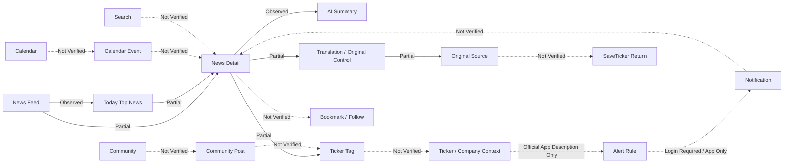

Diagram은 Product Flow 후보와 확인 상태만 표시한다. DATE Architecture 확정안이 아니다.

## Flow 유형 요약

| Flow Type | Status Summary | Confidence |
| --- | --- | --- |
| News Consumption Flow | Observed / Partial 중심 | High |
| Curation Flow | Partial / Observed | Medium |
| Entity Connection Flow | Partial / Not Verified | Low |
| Evidence Flow | Observed / Partial | Medium |
| Calendar Flow | Observed entry, Not Verified relation | Low |
| Community Flow | Partial entry, Not Verified detail | Low |
| Search Flow | Partially Observed entry, Not Verified result | Low |
| Monitoring Flow | Official App Description Only / Login Required | Low |
| Personal Continuity Flow | Inferred / Not Verified | Low |
| External Source Flow | Partial / Not Verified | Medium |
| Aggregation Flow | Observed / Inferred | Medium |
| News Intelligence Flow | Product Responsibility Candidate | Low |

작성한 Flow 유형 수: 12

## News Consumption Flow

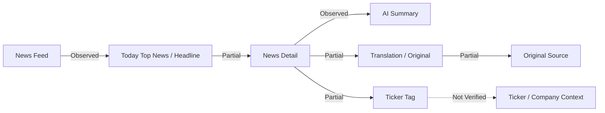

Observation:
News Feed, Today Top News, News Detail, AI Summary, Translation / Original control, Ticker Tag 후보가 Phase 7.1~7.2에서 기록됐다.

Interpretation:
이 Flow는 News consumption을 scan, detail read, summary, original check, Entity follow-up candidate로 나눈다.

Confidence:
High for Feed and Detail, Low for Entity follow-up.

## Curation Flow

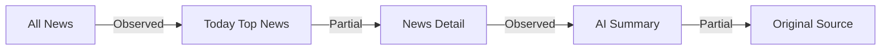

Observation:
Today Top News와 AI Summary는 확인됐다. Today Top News selection rule and AI Summary method are Not Verified.

Interpretation:
Curation은 selection과 compression을 분리해 볼 수 있다. Selection rule을 추론하지 않는다.

Confidence:
Medium

## Entity Connection Flow

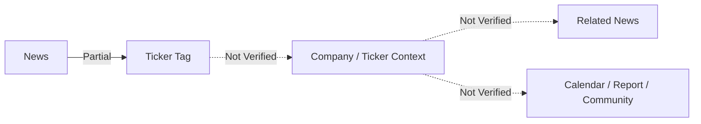

Observation:
Ticker Tag는 SAVE-authored detail에서 Partially Observed다. Independent Ticker / Company Surface and related modules are Not Verified.

Interpretation:
Entity Connection Flow는 SaveTicker의 Intelligence role 후보지만, 현재는 tag label 이상의 관계로 확정하지 않는다.

Confidence:
Low

## Evidence Flow

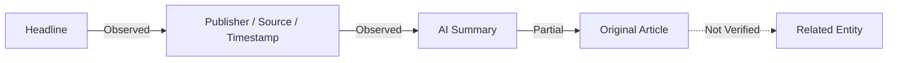

Observation:
Headline, publisher / Source label, timestamp candidate, AI Summary, Original control were observed or partially observed.

Interpretation:
AI Summary는 Evidence가 아니라 compression layer다. Original Article Traceability는 Partial이고 related Entity traceability는 Not Verified다.

Confidence:
Medium

## Calendar Flow

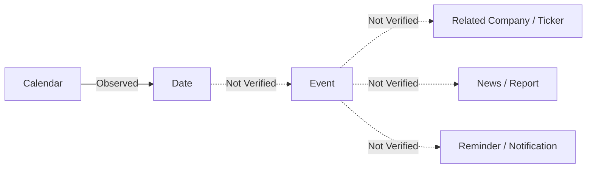

Observation:
Calendar month view, selected date, local time basis, view labels were observed. Event Detail and relation modules are Not Verified.

Interpretation:
Calendar Flow is time-based discovery candidate. It cannot yet be treated as Event Evidence Flow.

Confidence:
Low

## Community Flow

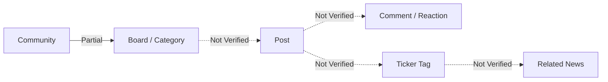

Observation:
Community entry, board labels, popular post candidate and Search Field are Partially Observed. Post Detail, author, moderation, ticker relation are Not Verified.

Interpretation:
Community Flow is Discussion-centered and should not be mixed with Editorial Flow.

Confidence:
Low

## Search Flow

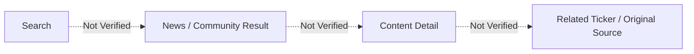

Observation:
Search Field was observed in News and Community. Search Result, grouping, suggestion, history are Not Verified.

Interpretation:
Search is a query entry candidate, not yet a Global Entity Router.

Confidence:
Low

## Monitoring Flow

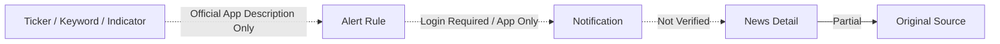

Observation:
App Description mentions personalized notifications for keyword, companies of interest, economic indicators, and report schedules. Notifications route is Login Required.

Interpretation:
Monitoring Flow is app-dependent and account-dependent. Actual alert rule and payload are not observed.

Confidence:
Low

## Personal Continuity Flow

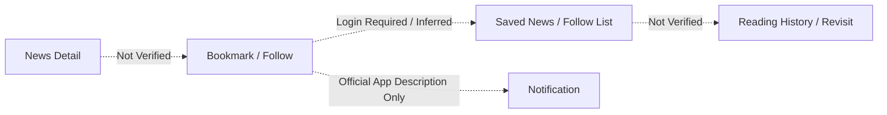

Observation:
Bookmark, Follow, Saved News, Reading History are Not Verified. App Description supports notification and interest monitoring candidate only.

Interpretation:
Personal Continuity is not confirmed. It remains candidate Flow.

Confidence:
Low

## External Source Flow

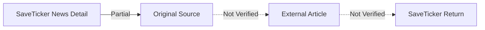

Observation:
Original control and Source label were Partially Observed. External Article target and return behavior are Not Verified.

Interpretation:
External Source Flow provides potential traceability but creates Context Loss risk if return path is absent.

Confidence:
Medium

## Aggregation Flow

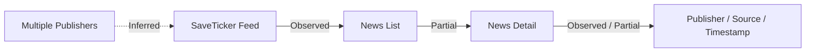

Observation:
News Detail examples include publisher / Source labels, and Feed aggregates News items. Provider coverage and ranking are Not Verified.

Interpretation:
Aggregation is supported at product responsibility level, but ranking algorithm and source coverage are not inferred.

Confidence:
Medium

## News Intelligence Flow

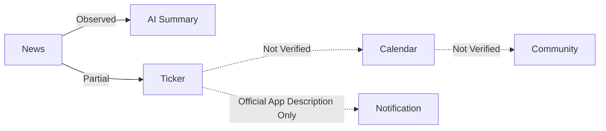

Observation:
AI Summary and Ticker Tag are observed or partially observed. Calendar, Community, Notification are top-level or app-level candidates, but their direct connection to the same News / Ticker is Not Verified.

Interpretation:
News Intelligence Flow is a Product Responsibility Candidate. It should not be treated as verified cross-surface product behavior.

Confidence:
Low

## Context Preservation Flow

| Context ID | Preserved Context | Context Owner | Persistence Scope | Page Transition 후 유지 여부 | External Transition 후 유지 여부 | Login Required 여부 | App Only 여부 | Evidence Level | Context Loss Risk | Open Question |
| --- | --- | --- | --- | --- | --- | --- | --- | --- | --- | --- |
| ST-PC-001 | News Feed Position | Browser / Surface candidate | session candidate | Not Verified | Not Applicable | No | No | Not Verified | High | detail return state |
| ST-PC-002 | Search Query | Search Field | session candidate | Not Verified | Not Applicable | No | No | Partially Observed | Medium | query persistence |
| ST-PC-003 | Search Scope | News / Community | Surface candidate | Not Verified | Not Applicable | No | No | Partially Observed | Medium | scope label after search |
| ST-PC-004 | News Category | News Feed | session candidate | Partially Observed | Not Applicable | No | No | Partially Observed | Medium | category and sort state |
| ST-PC-005 | Today Top News Origin | News Feed | session candidate | Partial | Not Applicable | No | No | Partially Observed | Medium | origin label in detail |
| ST-PC-006 | News Detail | Article | page | Observed | Not Verified | No | No | Observed | Medium | external transition |
| ST-PC-007 | Publisher | Article | page | Observed | Not Verified | No | No | Observed | Medium | external Source relation |
| ST-PC-008 | Source | Article | page | Observed / Partial | Not Verified | No | No | Partially Observed | Medium | Source taxonomy |
| ST-PC-009 | Ticker Tag | Article | page candidate | Partial | Not Verified | No | No | Partially Observed | High | tag destination |
| ST-PC-010 | Original / Translation State | Article | page candidate | Partial | Not Verified | No | No | Partially Observed | Medium | toggle state |
| ST-PC-011 | Calendar Date | Calendar | session candidate | Partial | Not Applicable | No | No | Partially Observed | Medium | Event Detail transition |
| ST-PC-012 | Calendar Event | Event | Not Verified | Not Verified | Not Applicable | candidate | No | Not Verified | High | Event Detail |
| ST-PC-013 | Community Category | Community | session candidate | Partial | Not Applicable | No | No | Partially Observed | Medium | Post Detail |
| ST-PC-014 | Community Post | Post | Not Verified | Not Verified | Not Applicable | Login candidate | No | Not Verified | High | post relation |
| ST-PC-015 | Original Source | External Article | external | Not Verified | Not Verified | No | No | Partially Observed | High | return path |
| ST-PC-016 | Profile | User | account | Not Verified | Not Applicable | Yes | No | Login Required | High | profile body |
| ST-PC-017 | Notification | User | account / app | Not Verified | Not Verified | Yes | App candidate | Login Required / Official App Description Only | High | payload context |
| ST-PC-018 | Alert Rule | User | account / app | Not Verified | Not Verified | Yes | Yes | Official App Description Only | High | rule structure |
| ST-PC-019 | Bookmark | User | account candidate | Not Verified | Not Verified | candidate | candidate | Not Verified | High | existence |
| ST-PC-020 | Follow | User | account / app candidate | Not Verified | Not Verified | candidate | candidate | Official App Description Only / Not Verified | High | target type |
| ST-PC-021 | Reading History | User | account / browser candidate | Not Verified | Not Verified | candidate | candidate | Not Verified | High | existence |

## Product Role Flow Matrix

| Product Role | Supporting Surface | Supporting Flow | Evidence Level | User Benefit | Potential Trade-off | Access Dependency | Confidence | Open Question |
| --- | --- | --- | --- | --- | --- | --- | --- | --- |
| Aggregation | News Feed, News Detail | Aggregation Flow | Observed / Inferred | multiple Source scan | source coverage and ranking unknown | Public | Medium | provider coverage |
| Curation | Today Top News, AI Summary | Curation Flow | Observed / Partial | Reading Cost reduction | selection and method gaps | Public | Medium | selection rule |
| Intelligence | AI Summary, Ticker Tag, Calendar, Notification | News Intelligence Flow | Partial / Not Verified | News to action candidate | over-connection risk | Public / App candidate | Low | verified relation |
| Community | Community, Comment, Reaction | Community Flow | Partial / Not Verified | user response visibility | Community Noise | Login candidate | Low | moderation |
| Monitoring | Notifications, App | Monitoring Flow | Official App Description Only / Login Required | ongoing monitoring | App dependency and payload gap | Login / App | Low | payload and trigger |
| Calendar | Calendar | Calendar Flow | Observed entry / Not Verified relation | time-based orientation | Event Detail gap | Public / Login candidate | Low | Event Evidence |
| Research | Reports | Report / Evidence candidate | Partially Observed / Not Verified | deeper research candidate | Original Report Traceability gap | Not Verified | Low | Report Detail |

## Verified / Not Verified Flow Count

| Flow Status | 관계 수 |
| --- | ---: |
| Observed | 8 |
| Partial | 15 |
| Official App Description Only | 4 |
| Login / App Restricted | 5 |
| Inferred | 3 |
| Not Verified | 30 |

## Context Loss Points

| Loss ID | Context Loss Point | Status | Notes |
| --- | --- | --- | --- |
| ST-FLOW-LOSS-001 | News Detail → Original Source → SaveTicker Return | Not Verified | external return path not observed |
| ST-FLOW-LOSS-002 | News Feed → Detail → Feed state | Not Verified | feed position and sort state not observed |
| ST-FLOW-LOSS-003 | Ticker Tag → Ticker / Company Context | Not Verified | tag target not observed |
| ST-FLOW-LOSS-004 | Calendar Date → Event Detail | Not Verified | Event Detail not observed |
| ST-FLOW-LOSS-005 | Community → Post Detail | Not Verified | post detail not observed |
| ST-FLOW-LOSS-006 | Notification → News Detail | Login Required / App Only | payload and deep link not observed |
| ST-FLOW-LOSS-007 | Bookmark / Follow → Revisit | Not Verified | persistence not observed |

## Access Restriction

| Flow Area | Restriction | Impact |
| --- | --- | --- |
| Monitoring Flow | Login Required / App Only | actual alert rule and notification payload Not Verified |
| Personal Continuity Flow | Login Required candidate / Not Verified | Bookmark, Follow, Reading History not confirmed |
| Community participation | Login Required candidate | comment / reaction write and moderation not observed |
| Reports Flow | Not Verified | Report Detail and original document not confirmed |
| External Source Flow | external transition | Return Path Not Verified |

## Open Questions

- News Feed ranking and Today Top News selection rule are not verified.
- Original Source target and SaveTicker Return Path are not verified.
- Ticker Tag destination and Company / Ticker Context are not verified.
- Calendar Event Detail and relation to News / Report are not verified.
- Community Post Detail, author, moderation, and tag relation are not verified.
- Search Result Grouping, Suggestion, and History are not verified.
- Alert Rule, Notification payload, and deep link behavior are not verified.
- Bookmark, Follow, Saved News, Reading History persistence are not verified.
- Reports Surface does not yet prove Original Report Traceability.
- Advertisement / Sponsored Content remains Not Verified.
