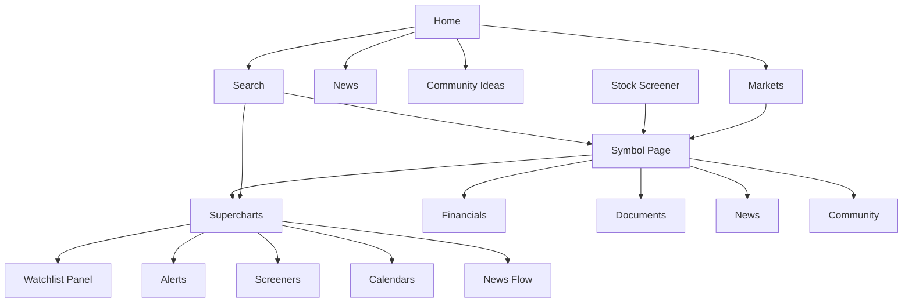

# 벤치마크 TradingView Navigation 구조 지도

## 목적

이 문서는 TradingView에서 확인된 Navigation 구조를 EidosLayer Benchmark와 동일한 기준으로 기록한다. DATE의 Navigation Architecture를 확정하지 않는다.

## 주요 Global Navigation 구조

### Observation

공개 Home Header에는 Search, Products, Community, Markets, Brokers, More, Get started가 노출된다.

### Interpretation

TradingView는 단일 Home Feed보다 Product Surface, Community Surface, Market Surface, broker 연결을 병렬 진입점으로 제공하는 구조일 수 있다.

### User Impact

사용자는 분석, 탐색, 커뮤니티, 거래 연결 중 현재 목적에 맞는 Surface로 빠르게 이동할 수 있다.

### DATE Implication

DATE에서 Global Navigation을 기능 목록이 아니라 투자 판단 단계별 진입점으로 구성할 수 있는지 Cross Validation이 필요하다.

### Confidence

High

### Evidence

Official Product Observation. `https://www.tradingview.com/`, Header, 확인일 2026-07-27.

## 주요 Search Entry 구조

### Observation

공식 Help Center는 Symbol Search가 Chart 실행 또는 Symbol Overview 진입을 제공한다고 설명한다. Supercharts에서는 상단 Symbol 영역 또는 키보드 입력으로 Symbol Search를 열 수 있다고 설명한다.

### Interpretation

Search는 단순 페이지 이동보다 Symbol Entity를 Chart Context 또는 Overview Context로 연결하는 Entity Transition 역할을 수행할 수 있다.

### User Impact

사용자는 같은 Symbol을 분석 화면과 요약 화면 중 원하는 Context로 열 수 있다.

### DATE Implication

DATE Search가 Result List 이후 단일 Destination만 제공해야 하는지, Entity별 Context 선택을 제공해야 하는지 검토할 가치가 있다.

### Confidence

Medium

### Evidence

Official Documentation. TradingView Help Center, Symbol Search, 확인일 2026-07-27.

## 주요 Symbol Local Navigation 구조

### Observation

AAPL Symbol Page에는 Overview, Financials, Documents, News, Community, Technicals, Forecasts, Seasonals, Options, ETFs, Bonds 등의 Local Navigation 탭이 있다.

### Interpretation

Symbol Page는 Company 또는 Stock 관련 정보를 하나의 Hub로 모으되, 사용자의 분석 모드를 탭으로 분리하는 구조일 수 있다.

### User Impact

사용자는 동일 Symbol Context를 유지한 채 재무, 공시, News, Community, Technicals로 이동할 수 있다.

### DATE Implication

DATE에서 Entity Page가 정보 Hub가 될 수 있는지는 다른 Benchmark와 비교해 검증해야 한다.

### Confidence

High

### Evidence

Official Product Observation. `https://www.tradingview.com/symbols/NASDAQ-AAPL/`, Symbol Page Header, 확인일 2026-07-27.

## 주요 Supercharts Contextual Navigation 구조

### Observation

공식 Help Center는 Supercharts 오른쪽 Toolbar에서 Watchlist/details/news, Alerts, Object tree/Data window, Screeners, Pine Editor, Calendars, News Flow에 접근할 수 있다고 설명한다.

### Interpretation

TradingView는 Chart를 중심 Context로 두고 보조 Product Surface를 Panel 또는 Toolbar로 연결해 Context Preservation을 높이는 구조일 수 있다.

### User Impact

사용자는 Chart를 떠나지 않고 Watchlist, Alert, Screener, Calendar, News Flow로 분석을 확장할 수 있다.

### DATE Implication

DATE에서 보조 Evidence나 Monitoring 기능을 새 페이지가 아니라 Contextual Panel로 제공할지 검토할 가치가 있다.

### Confidence

Medium

### Evidence

Official Documentation. TradingView Help Center, Getting started in Supercharts, 확인일 2026-07-27.

## 주요 Entity Transition 구조

### Observation

위 Diagram은 공개 Product Observation과 공식 Help Center에서 확인된 연결만 포함한다.

### Interpretation

TradingView의 Navigation은 Home 또는 Markets에서 시작해 Symbol 또는 Chart로 수렴하고, Chart 안에서 다시 보조 Surface로 확장되는 구조일 수 있다.

### User Impact

Discovery 이후 Analysis, Monitoring, Evidence 확인으로 전환하는 이동 비용이 낮아질 수 있다.

### DATE Implication

DATE에서 Discovery Surface와 Analysis Surface가 분리될 경우 Context 복구 비용을 별도로 검증해야 한다.

### Confidence

Medium

### Evidence

Official Product Observation 및 Official Documentation. 확인일 2026-07-27.

## 주요 Mobile Navigation 확인 상태

### Observation

이번 조사에서는 Mobile Navigation을 직접 확인하지 않았다.

### Interpretation

Mobile에서 Desktop과 같은 Information Density와 Contextual Panel 구조가 유지되는지는 확인할 수 없다.

### User Impact

Mobile 사용자 Journey의 Context Preservation과 Interaction 비용은 미확인 상태다.

### DATE Implication

다음 Benchmark에서는 Desktop과 Mobile Navigation 차이를 별도 Scenario로 기록할 필요가 있다.

### Confidence

Low

### Evidence

Not Verified. 접근 제한이 아니라 조사 범위 제한.
