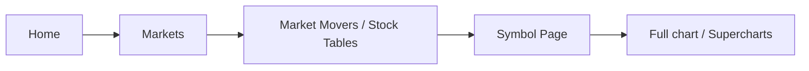
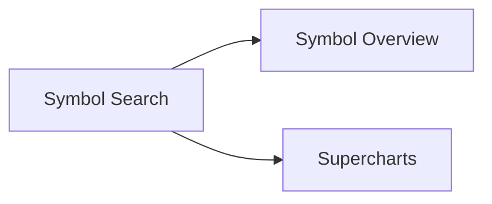
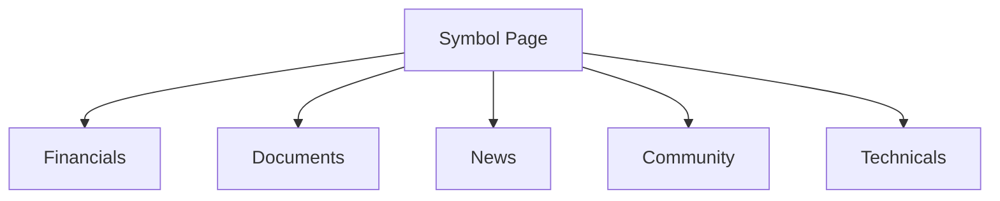
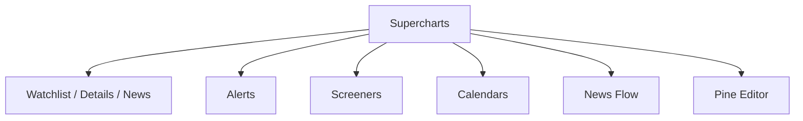
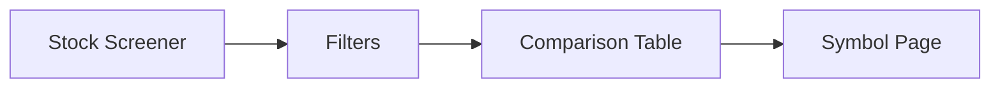
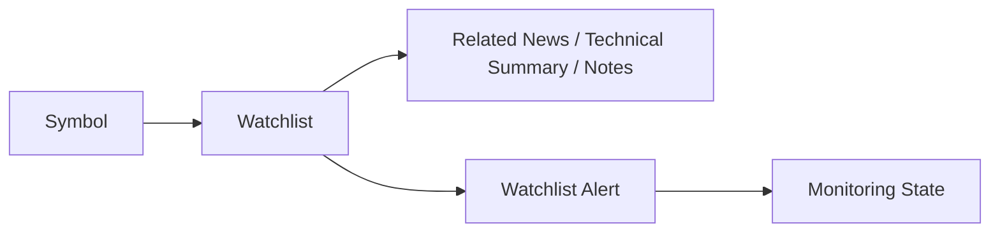
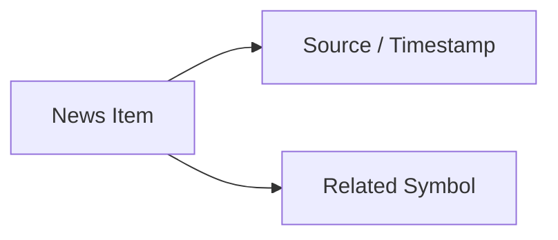

# 벤치마크 TradingView Product Flow Architecture 기록 문서

## 목적

이 문서는 TradingView에서 확인된 Product Flow 후보를 기록한다. 단순 Page 연결을 Product Flow로 과장하지 않으며, Observed Flow, Partial Flow, Inferred Flow, Not Verified Flow를 구분한다.

## 주요 Flow 분류 기준

| Flow Type | 설명 |
| --------- | ---- |
| User Decision Flow | 사용자의 투자 판단 질문이 이동하는 흐름 |
| Navigation Flow | Screen 또는 Product Surface 사이의 이동 흐름 |
| Entity Flow | Entity 사이의 전환 흐름 |
| Information Flow | 정보 유형이 배치되고 확장되는 흐름 |
| Evidence Flow | Source, Document, News, Metric 확인 흐름 |
| Action Flow | 저장, Alert, Publish 등 행동 흐름 |
| State Transition | 저장 상태 또는 Monitoring 상태로 전환되는 흐름 |
| Context Preservation Flow | 기존 분석 Context를 유지한 채 보조 Surface를 여는 흐름 |

## 기록 Flow F-001 Market Discovery to Symbol Analysis

Flow Type: User Decision Flow / Navigation Flow / Entity Flow

Status: Observed Flow

### Observation

Home과 Markets는 Market Summary와 Stock 관련 섹션을 제공하고, Symbol Page는 Full chart 진입을 제공한다.

### Interpretation

TradingView는 Market 수준 Discovery에서 Symbol 분석, Chart 분석으로 점차 깊어지는 Journey를 제공할 수 있다.

### User Impact

사용자는 오늘 Market 변화에서 특정 Symbol 분석으로 자연스럽게 이동할 수 있다.

### DATE Implication

DATE에서 Market-first Journey를 검토할 때 Discovery와 Analysis 전환 지점의 Context 유지 여부를 비교해야 한다.

### Evidence

Official Product Observation. Home, Markets, AAPL Symbol Page, 확인일 2026-07-27.

### Confidence

High

## 기록 Flow F-002 Search to Context Selection

Flow Type: Entity Flow / Navigation Flow

Status: Partial Flow

### Observation

공식 Help Center는 Symbol Search가 Chart 실행 또는 Overview 진입을 제공한다고 설명한다.

### Interpretation

Search는 Result를 보여주는 기능보다 Symbol Entity를 서로 다른 분석 Context로 연결하는 Transition일 수 있다.

### User Impact

사용자는 검색 후 현재 목적에 따라 요약 분석 또는 Chart 분석을 선택할 수 있다.

### DATE Implication

DATE Search가 단일 결과 이동인지, Entity Context 선택인지 비교 검증해야 한다.

### Evidence

Official Documentation. Symbol Search, 확인일 2026-07-27.

### Confidence

Medium

## 기록 Flow F-003 Symbol Hub to Evidence Surfaces

Flow Type: Evidence Flow / Information Flow

Status: Observed Flow

### Observation

AAPL Symbol Page는 Financials, Documents, News, Community, Technicals 탭을 제공한다.

### Interpretation

Symbol Page는 여러 Evidence Type과 분석 관점을 같은 Entity Context 아래 묶는 구조일 수 있다.

### User Impact

사용자는 Symbol Context를 유지하면서 여러 Evidence Surface를 확인할 수 있다.

### DATE Implication

DATE에서 Entity Hub가 Evidence Graph와 어떻게 연결될 수 있는지 Cross Validation이 필요하다.

### Evidence

Official Product Observation. AAPL Symbol Page, 확인일 2026-07-27.

### Confidence

High

## 기록 Flow F-004 Chart Context to Tool Panels

Flow Type: Context Preservation Flow / Action Flow

Status: Partial Flow

### Observation

공식 Help Center는 Supercharts 오른쪽 Toolbar에서 Watchlist, Alerts, Screeners, Pine Editor, Calendars, News Flow에 접근할 수 있다고 설명한다.

### Interpretation

TradingView는 Chart를 분석 Workspace로 유지하며 Tool과 보조 정보 Surface를 Contextual Panel로 연결하는 구조일 수 있다.

### User Impact

사용자는 Chart 분석 흐름을 끊지 않고 보조 작업을 수행할 수 있다.

### DATE Implication

DATE에서 Contextual Panel이 필요한지, 어떤 Evidence를 Panel로 제공할지 검토할 가치가 있다.

### Evidence

Official Documentation. Supercharts, 확인일 2026-07-27.

### Confidence

Medium

## 기록 Flow F-005 Screener to Candidate Comparison

Flow Type: User Decision Flow / Information Flow

Status: Partial Flow

### Observation

US Stocks Screen은 여러 Table View 탭을 제공하고, 공식 Help Center는 Screener가 filter와 table 기반 Stock Discovery를 제공한다고 설명한다.

### Interpretation

TradingView는 투자 후보 발견을 조건 설정, Table 비교, Symbol 분석 전환으로 구성할 수 있다.

### User Impact

사용자는 많은 후보를 Metric 기준으로 줄이고 분석 대상으로 전환할 수 있다.

### DATE Implication

DATE에서 Discovery가 Narrative 기반인지 Metric 기반인지 사용자 Archetype별로 검증해야 한다.

### Evidence

Official Product Observation 및 Official Documentation. 확인일 2026-07-27.

### Confidence

High

## 기록 Flow F-006 Watchlist to Monitoring State

Flow Type: Action Flow / State Transition / Personal Continuity

Status: Partial Flow

### Observation

공식 Help Center는 Watchlist가 related news, fundamental data, technical summary, notes, watchlist alerts를 제공한다고 설명한다.

### Interpretation

Watchlist는 저장된 Symbol 집합을 Monitoring State로 전환하는 Personal Continuity 구조일 수 있다.

### User Impact

사용자는 관심 Symbol을 반복적으로 추적하고 조건 변화에 반응할 수 있다.

### DATE Implication

DATE에서 Watchlist, Portfolio, Workspace의 책임을 구분해야 하는지 검증해야 한다.

### Evidence

Official Documentation. Watchlists, Alerts, 확인일 2026-07-27.

### Confidence

Medium

## 기록 Flow F-007 News to Symbol Evidence

Flow Type: Evidence Flow / Entity Flow

Status: Observed Flow

### Observation

News Screen은 Source, Timestamp, 관련 Symbol을 표시한다.

### Interpretation

News는 독립 콘텐츠이면서 Symbol 판단으로 전환되는 Evidence Entry일 수 있다.

### User Impact

사용자는 News의 신뢰 단서를 확인한 뒤 관련 Symbol 분석으로 이동할 수 있다.

### DATE Implication

DATE에서 News가 Company, Industry, Event로 전환되는 관계 깊이를 검증해야 한다.

### Evidence

Official Product Observation. News, 확인일 2026-07-27.

### Confidence

High

## 기록 Not Verified Flow

| Flow | 상태 | 이유 |
| ---- | ---- | ---- |
| News -> Industry -> Event | Not Verified Flow | News에서 Industry 또는 Event 직접 전환을 확인하지 못했다. |
| Macro Event -> Impacted Symbol | Partial Flow | Economic Calendar는 확인했지만 특정 Symbol 영향 연결은 확인하지 못했다. |
| AI Assistant -> Evidence | Not Verified Flow | AI Surface와 AI Disclosure를 확인하지 못했다. |
| Portfolio -> Research Continuity | Not Verified Flow | Portfolio Product Surface 상세를 조사하지 않았다. |
