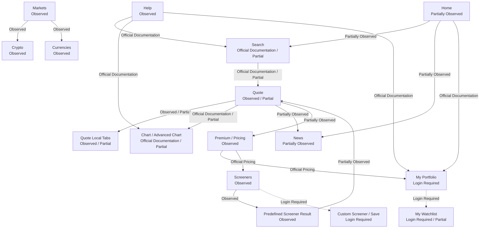

# Yahoo Finance Navigation Map

## 문서 목적

이 문서는 Phase 5.2 범위에서 Yahoo Finance의 Global Navigation, Search, Quote, Markets, Screeners, Portfolio, Watchlist, Premium 연결을 기록한다.

이 문서는 Navigation Observation만 다룬다. User Journey는 [04-core-journey-observations.md](04-core-journey-observations.md), Entity / State 후보는 [05-entity-and-state-observations.md](05-entity-and-state-observations.md)에 기록한다.

Candidate Principle, Registry 수정, Product Flow Architecture는 작성하지 않는다.

## 조사 기준

| 항목 | 내용 |
| --- | --- |
| 조사 날짜 | 2026-07-28 KST |
| Timezone | Asia/Seoul |
| Access | Public Access |
| Login | Not Logged In |
| Premium | No Yahoo Finance Premium subscription |
| Browser | Desktop web research via Codex web extraction / official URL review |
| Interactive viewport | Not Verified |
| Primary Evidence | Yahoo Finance Product, Yahoo Help, Yahoo Finance Premium pages |

## Navigation Status

| Status | 기준 |
| --- | --- |
| Observed | 공식 Product URL 또는 indexed Product content에서 Navigation 관계를 확인했다. |
| Partially Observed | Entry나 target은 확인했지만 dropdown, dynamic interaction, return state는 확인하지 못했다. |
| Official Documentation | Yahoo Help 또는 공식 Premium page에서만 확인했다. |
| Login Required | Sign in 이후에만 확인 가능한 User Navigation이다. |
| Premium Feature | Yahoo Finance Premium entitlement와 연결된다. |
| Inference | 기존 문서의 Observation에서 추정한 관계이며 사실로 확정하지 않는다. |
| Not Verified | 이번 조사에서 확인하지 못했다. |

## Navigation 관계 요약

이 Diagram은 Navigation 관계의 확인 수준만 표시한다. Product Flow Architecture가 아니다.

## Global Navigation Entry Inventory

| Navigation ID | Entry | Navigation Category | Primary Destination | Access Level | Observation Status | Navigation Responsibility | Evidence Type | Evidence | Confidence | Open Question |
| --- | --- | --- | --- | --- | --- | --- | --- | --- | --- | --- |
| YF-NAV-001 | Finance Home / Home | Market Navigation / Discovery Navigation | Home | Public Access | Partially Observed | Market Summary, Trending Tickers, News, Watchlist candidate, Premium entry의 시작점이다. | Official Product Observation | https://finance.yahoo.com/, https://finance.yahoo.com/about/ | Medium | current first viewport와 personalized area는 direct body 429로 Not Verified. |
| YF-NAV-002 | Search | Entity Navigation | Quote | Public Access | Official Documentation / Partially Observed | company name, ticker symbol, ETF, index, commodity, mutual fund, cryptocurrency lookup entry다. | Official Documentation | https://help.yahoo.com/kb/finance-for-web/learn-find-symbol-sln2340.html | High | Suggestion ordering과 category label은 Not Verified. |
| YF-NAV-003 | Quote | Entity Navigation | Quote Summary and local tabs | Public Access / Premium Feature 일부 | Observed / Partially Observed | selected symbol의 Summary, Chart, News, Statistics, Financials, Holders, Analysis, Options, Historical Data 등으로 이어진다. | Official Product Observation | https://finance.yahoo.com/quote/AAPL/ | High | direct US body는 일부 429였고 current tab order는 변동 가능하다. |
| YF-NAV-004 | Markets | Market Navigation | Markets Overview | Public Access | Observed | World Indices, Americas, Europe, Asia, Commodities, Currencies, Bonds, Stocks sections entry다. | Official Product Observation | https://finance.yahoo.com/markets/ | High | US subcategory current body는 일부 Not Verified. |
| YF-NAV-005 | News | Discovery Navigation / Market Navigation | News | Public Access / Premium Feature 일부 | Partially Observed | financial headlines, category, video, source-labeled article entry다. | Official Product Observation / Official Documentation | https://finance.yahoo.com/news/, https://help.yahoo.com/kb/SLN3642.html | Medium | related symbols per article은 Not Verified. |
| YF-NAV-006 | Screeners | Discovery Navigation | Screener Hub | Public Access / Login Required 일부 / Premium Feature 일부 | Observed | predefined screeners, custom screener entry, result table entry를 제공한다. | Official Product Observation / Official Documentation | https://finance.yahoo.com/screener/, https://help.yahoo.com/kb/create-premade-yahoo-finance-screeners-sln28083.html | High | custom screener create flow without sign in은 Not Verified. |
| YF-NAV-007 | My Portfolio | User Navigation | Portfolio landing | Login Required | Observed / Login Required | sign in 후 Portfolio, holdings, broker link, manual portfolio create로 연결된다. | Official Product Observation / Official Documentation | https://finance.yahoo.com/portfolios, https://help.yahoo.com/kb/finance/create-edit-delete-portfolio-sln4249.html | High | logged-in empty state와 holdings table은 Not Verified. |
| YF-NAV-008 | My Watchlist | User Navigation | Watchlist | Login Required / Public indexed content 일부 | Partially Observed | followed symbols와 custom list management candidate다. | Official Documentation | https://help.yahoo.com/kb/SLN7034.html | Medium | logged-in Watchlist UI와 add symbol interaction은 Not Verified. |
| YF-NAV-009 | Premium / Upgrade | Subscription Navigation | Premium / Pricing | Public Access | Observed | Fair Value, Research Reports, Premium Screeners, Premium Charts, Portfolio Analytics, Alerts, ad-free benefits로 연결된다. | Official Pricing | https://finance.yahoo.com/subscriptions/, https://finance.yahoo.com/about/plans/compare/ | High | Product 내부 gate message는 Not Verified. |
| YF-NAV-010 | Help | Support Navigation | Yahoo Help | Public Access | Observed | Product capability, access, chart, search, screener, portfolio instructions를 article로 제공한다. | Official Documentation | https://help.yahoo.com/kb/finance/ | High | Help와 current Product UI mismatch는 item별 확인 필요. |
| YF-NAV-011 | Crypto | Market Navigation | Crypto Top Stories / All Cryptocurrencies | Public Access | Observed | Crypto asset summary, crypto news, table / heatmap view entry다. | Official Product Observation | https://finance.yahoo.com/markets/crypto/, https://finance.yahoo.com/markets/crypto/all/ | High | crypto asset detail transition은 Not Verified. |
| YF-NAV-012 | Currencies | Market Navigation | Currencies | Public Access | Observed | Currency Pair table entry다. | Official Product Observation | https://finance.yahoo.com/markets/currencies/ | High | pair detail body는 Not Verified. |
| YF-NAV-013 | Advanced Chart | Entity Navigation / Chart Navigation | Quote Chart | Public Access / Premium Feature 일부 | Official Documentation / Partially Observed | chart type, indicator, compare, settings, range analysis를 제공한다. | Official Documentation | Yahoo Help chart indicator, compare, settings articles | High | Drawing Tool current availability는 Not Verified. |
| YF-NAV-014 | Predefined Screener Result | Discovery Navigation | Screener result table | Public Access / Login Required 일부 / Premium Feature 일부 | Observed | predefined criteria result를 table과 heatmap view로 보여주고 Quote 이동 후보를 제공한다. | Official Product Observation | https://finance.yahoo.com/screener/predefined/undervalued_growth_stocks/ | High | result row click과 Save / Download gate는 Not Verified. |
| YF-NAV-015 | Portfolio create / broker link / import | User Navigation | Portfolio state | Login Required | Official Documentation | manual portfolio, transaction, import/export, brokerage link를 account state와 연결한다. | Official Documentation | Yahoo Help Portfolio articles | High | actual logged-in interaction은 Not Verified. |
| YF-NAV-016 | Premium Plan Selection | Subscription Navigation | plan selection / compare | Public Access | Observed | Bronze, Silver, Gold plan, feature group, billing CTA를 제공한다. | Official Pricing | https://finance.yahoo.com/about/plans/select-plan/researchReports/, https://finance.yahoo.com/about/plans/compare/ | High | plan matrix는 access date 이후 변경 가능하다. |

## Search Navigation

Observation:
Yahoo Help는 Search가 company names, ticker symbols, ETFs, indices, commodities, mutual funds, cryptocurrency를 찾을 수 있다고 설명한다. Product snippets와 Home / Quote URL pattern은 Search가 Quote Surface로 이어지는 Entity Navigation임을 뒷받침한다.

Interpretation:
Search는 Home과 Quote 사이의 가장 짧은 Entity lookup 경로로 보인다. Suggestion dropdown은 Entity Type 분류를 제공할 가능성이 있으나 이번 조사에서는 직접 확인하지 못했다.

User Impact:
사용자는 symbol 또는 company name으로 Quote에 진입할 수 있다. Suggestion ordering이 Not Verified라 novice user의 disambiguation 비용은 판단하지 않는다.

Confidence:
High for supported lookup types, Medium for Product interaction.

Evidence:
Official Documentation, Yahoo Help Search article. Official Product Observation, Home / Quote URL pattern. 확인일 2026-07-28.

## Quote Navigation

| Local Entry | URL Pattern | Access Level | Observation Status | Responsibility | Context Preservation | Confidence | Open Question |
| --- | --- | --- | --- | --- | --- | --- | --- |
| Summary | `/quote/AAPL/` | Public Access / Premium Feature 일부 | Observed / Partially Observed | price, summary metrics, news, company overview, Premium insight candidate | ticker context 유지 | High | direct US body 일부 429. |
| Chart | `/quote/AAPL/chart/` | Public Access / Premium Feature 일부 | Official Documentation / Partially Observed | price visualization, range, indicator, compare, settings | selected symbol 유지 candidate | High | Drawing Tool current UI Not Verified. |
| News | `/quote/AAPL/news/` candidate | Public Access / Premium Feature 일부 | Partially Observed | symbol-related headlines | ticker context 유지 candidate | Medium | dedicated Quote News tab body Not Verified. |
| Statistics | `/quote/AAPL/key-statistics/` | Public Access / Premium Feature 일부 | Observed / Partially Observed | valuation and financial highlights | ticker context 유지 | High | current tab body direct rendering Not Verified. |
| Financials | `/quote/AAPL/financials/` | Public Access / Premium Feature 일부 | Partially Observed | statements and historical financial data candidate | ticker context 유지 candidate | Medium | public vs Premium depth Not Verified. |
| Holders | `/quote/AAPL/holders/` | Public Access | Observed / Partially Observed | holder tables | ticker context 유지 | High | current US body Not Verified. |
| Analysis | `/quote/AAPL/analysis/` | Public Access / Premium Feature 일부 | Partially Observed | analyst and earnings analysis candidate | ticker context 유지 candidate | Medium | public analysis body Not Verified. |
| Sustainability | `/quote/AAPL/sustainability/` | Public Access / Premium Feature 일부 | Not Verified | ESG / sustainability candidate | Not Verified | Low | current Surface body 확인 필요. |
| Options | `/quote/AAPL/options/` | Public Access / Premium Feature 일부 | Partially Observed | options chain candidate | ticker context 유지 candidate | Medium | option chain current body and gate Not Verified. |
| Historical Data | `/quote/AAPL/history/` | Public Access / Premium Feature 일부 | Partially Observed | historical price table and download candidate | ticker context 유지 candidate | Medium | public download boundary Not Verified. |
| Conversation | `/quote/AAPL/community/` | Public Access / Login Required candidate | Not Verified | community discussion candidate | Not Verified | Low | sign in, moderation, posting state Not Verified. |
| Profile | `/quote/AAPL/profile/` | Public Access | Observed / Partially Observed | company profile, sector, industry, website candidate | ticker and company context candidate | High | internal Company Surface Not Verified. |
| Related | `/quote/AAPL/related/` | Public Access | Partially Observed | related symbols / people also watch candidate | origin symbol relation candidate | Medium | dedicated related tab body Not Verified. |

## Markets Navigation

Observation:
Markets Overview exposes World Indices, Americas, Europe, Asia, Commodities, Currencies, Bonds, Stocks sections. Crypto and Currencies Product URLs were observed. All Cryptocurrencies provides table and heatmap view.

Interpretation:
Markets is a Market Navigation Surface that organizes asset class and region categories. It is not the same responsibility as Quote because the primary question is category comparison, not single symbol detail.

User Impact:
Users can move from broad Market categories to asset class tables. Detail transition from Crypto Asset or Currency Pair is Not Verified.

Confidence:
High for Markets, Crypto, Currencies entries. Medium for asset detail transition.

Evidence:
Official Product Observation, https://finance.yahoo.com/markets/, https://finance.yahoo.com/markets/crypto/, https://finance.yahoo.com/markets/crypto/all/, https://finance.yahoo.com/markets/currencies/. 확인일 2026-07-28.

## Screeners Navigation

Observation:
Screeners Hub exposes predefined screeners and Create entry. A predefined screener result exposes filter summary, result table, heatmap view, Save, Download, Customize candidate actions.

Interpretation:
Screeners is a Discovery Navigation Surface. Predefined results are public entry points, while custom create/save behavior appears account-dependent.

User Impact:
Users can start discovery from premade criteria without sign in. Persistence and premium analysis are restricted.

Confidence:
High for hub and predefined result. Medium for Quote transition and save gate.

Evidence:
Official Product Observation, https://finance.yahoo.com/screener/, https://finance.yahoo.com/screener/predefined/undervalued_growth_stocks/. Official Documentation, Yahoo Help Screeners article. 확인일 2026-07-28.

## Portfolio / Watchlist Navigation

Observation:
My Portfolio landing is reachable in Public Access but functional Portfolio creation and management require sign in. Yahoo Help describes Watchlists, multiple portfolios, holdings, notes, import/export, brokerage link, and transactions. My Watchlist current logged-in UI was not verified.

Interpretation:
Portfolio and Watchlist are User Navigation entries for personal continuity. In this phase they remain Login Required User-owned Entity candidates.

User Impact:
Public users can see the entry and sign-in prompt, but cannot verify persistence or holdings operations without login.

Confidence:
Medium

Evidence:
Official Product Observation, https://finance.yahoo.com/portfolios. Official Documentation, Yahoo Help Portfolio and Watchlist articles. 확인일 2026-07-28.

## Premium Navigation

Observation:
Premium / Subscriptions and plan pages are Public Access. They describe Fair Value, Research Reports, Premium Screeners, Premium Charts, Portfolio Analytics, Premium Alerts, ad-free, AlphaSpace, and plan comparison.

Interpretation:
Premium is Subscription Navigation, not a Product Entity. It changes access to capabilities, analysis depth, ads, alerts, and portfolio analytics.

User Impact:
Premium can appear as upgrade path from multiple Product Surfaces, but actual in-product gate UI was not verified.

Confidence:
High for official Premium claims. Medium for Product-surface-specific gates.

Evidence:
Official Pricing, https://finance.yahoo.com/subscriptions/, https://finance.yahoo.com/about/plans/compare/. 확인일 2026-07-28.

## Context Preservation Candidate

| Context ID | Context | Status | Preserved Across | Loss Point | Restriction | Confidence |
| --- | --- | --- | --- | --- | --- | --- |
| YF-CTX-001 | Search query to Quote | Official Documentation / Partial | Search to Quote candidate | suggestion state Not Verified | Public | Medium |
| YF-CTX-002 | Quote ticker context | Observed / Partial | Quote local tabs and Chart candidate | external article and Premium pages | Public / Premium 일부 | High |
| YF-CTX-003 | Chart settings | Official Documentation | chart display settings and indicator setup candidate | session / account persistence Not Verified | Public / Premium 일부 | Medium |
| YF-CTX-004 | Screener criteria | Observed / Partial | result table and view switch candidate | Quote transition and browser Back state Not Verified | Public / Login for save | Medium |
| YF-CTX-005 | Portfolio / Watchlist membership | Official Documentation / Login Required | signed-in account candidate | Not logged in | Login Required | Medium |
| YF-CTX-006 | Premium entitlement | Official Pricing | Premium features and ad-free candidate | actual gate UI Not Verified | Premium Feature | High |
| YF-CTX-007 | Recent / revisit context | Not Verified | Not Verified | Not Verified | Login candidate | Low |

## 남아 있는 Open Question

- Search Suggestion dropdown이 Entity Type을 어떤 순서와 label로 보여주는가.
- Search에서 Quote로 이동한 뒤 search query가 유지되는가.
- Quote local tab 간 이동 시 selected tab URL과 prior tab context가 어떻게 유지되는가.
- Related tab과 People Also Watch가 Quote origin context를 표시하는가.
- Sector / Industry link target이 존재하는가.
- Screener result row에서 Quote 이동 후 browser Back state가 criteria를 유지하는가.
- Save, Download, Customize action의 Login / Premium gate가 각각 어떻게 다른가.
- Portfolio와 Watchlist의 책임이 holdings, follow list, broker-linked Portfolio 중 어떻게 분리되는가.
- Premium gate가 Quote, Chart, Screener, Portfolio에서 어떤 UI로 나타나는가.
- mobile Navigation은 desktop Navigation과 같은 구조인지 확인 필요.
