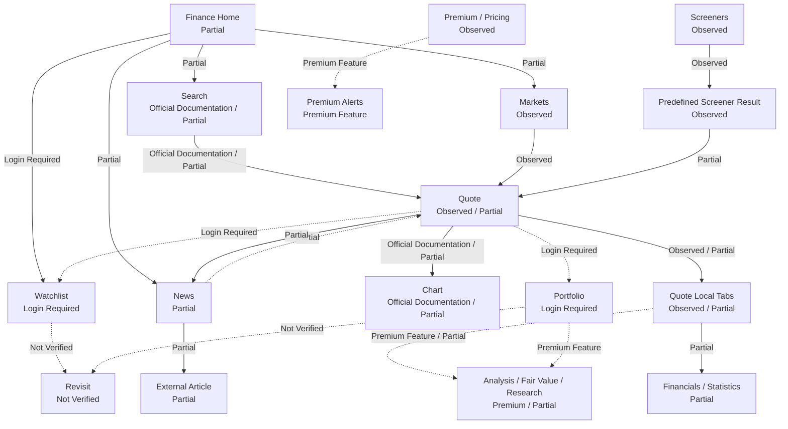
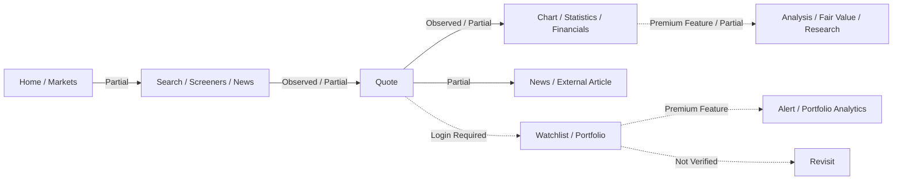
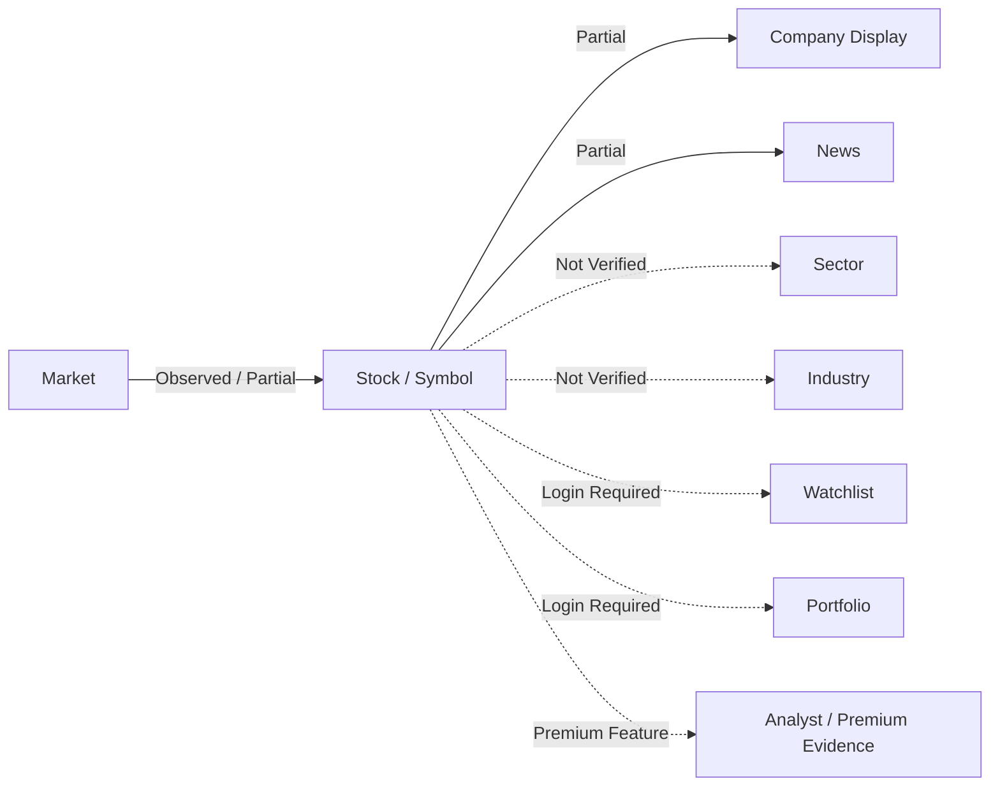
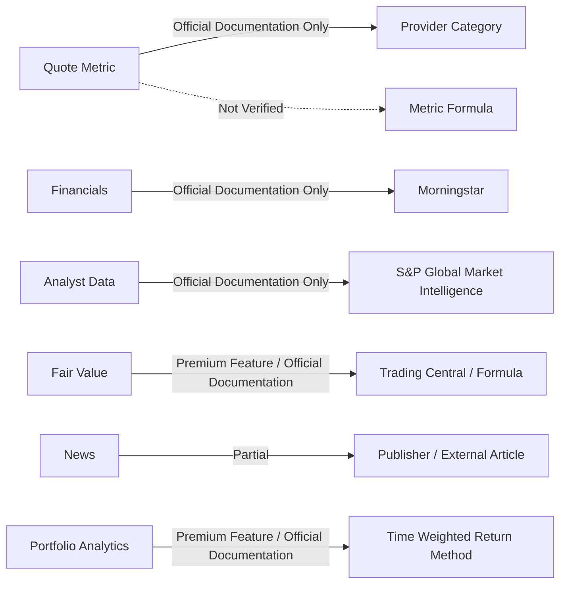
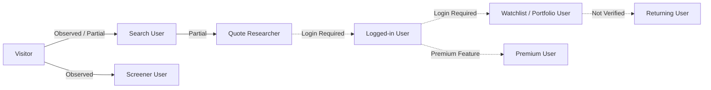
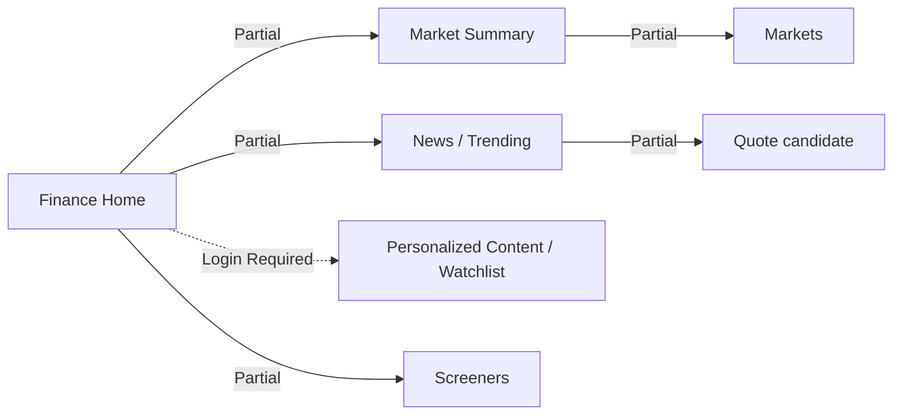
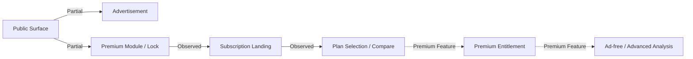

# Yahoo Finance Product Flow Architecture

## 문서 목적

이 문서는 Phase 5.1~5.3 Observation을 통합해 Yahoo Finance의 Product Flow를 기록한다.

이 문서는 Product Flow Architecture Observation이며 DATE Architecture를 확정하지 않는다. Candidate Principle, Registry 수정, Hypothesis Evidence Log는 작성하지 않는다.

## 조사 기준

| 항목 | 내용 |
| --- | --- |
| 조사 날짜 | 2026-07-28 KST |
| Timezone | Asia/Seoul |
| Access | Public Access |
| Login | Not Logged In |
| Premium | No Yahoo Finance Premium subscription |
| Browser | Desktop web research via Codex web extraction / official URL review |
| Flow Status | Observed, Partial, Official Documentation Only, Login Required, Premium Feature, Inferred, Not Verified |

## Flow 상태 분포

| Flow Status | Relation 수 |
| --- | ---: |
| Observed | 14 |
| Partial | 13 |
| Official Documentation Only | 9 |
| Login / Premium Restricted | 12 |
| Inferred | 7 |
| Not Verified | 8 |

## Overall Flow Diagram

이 Diagram은 확인 수준을 표시한다. 확인되지 않은 personal continuity를 Observed Flow로 사용하지 않는다.

## Flow Role Matrix

| Flow Type | Primary Surfaces | Primary User Question | Status | Main Restriction |
| --- | --- | --- | --- | --- |
| User Decision Flow | Home, Markets, Search, Quote, Chart, Financials, News, Portfolio | 어떤 symbol을 열고 무엇을 판단할 것인가 | Partial | Portfolio / Watchlist / Premium |
| Navigation Flow | Home, Markets, Search, Screeners, News, Quote, Premium | 어디에서 다음 Surface로 이동하는가 | Observed / Partial | Search Suggestion, logged-in state |
| Discovery Flow | Search, Markets, Screeners, News, Home | 어떤 방식으로 candidate를 찾는가 | Observed / Partial | custom/save/Premium |
| Entity Flow | Market, Stock, Company Display, News, Portfolio | Entity 간 관계가 어떻게 이어지는가 | Partial | Sector / Industry / Related Not Verified |
| Information Flow | Market Summary, Quote Summary, Chart, Financials, Analysis, News | 어떤 Information Form이 어떤 순서로 확장되는가 | Partial | Premium and tab body |
| Evidence Flow | Quote Metric, Financials, Analyst Data, News, Source | Evidence가 Source나 Methodology로 이어지는가 | Partial / Documentation Only | item-level traceability |
| Action Flow | Search, Open, Scan, Compare, Analyze, Save, Alert, Revisit | 사용자가 수행하는 action sequence | Partial | Login / Premium |
| State Transition | Visitor, Search User, Quote Researcher, Logged-in User, Premium User | User state가 어떻게 변하는가 | Inferred / Restricted | login and subscription |
| Personal Continuity Flow | Watchlist, Portfolio, Saved Screener, Alerts, Personalized Home | 다음 방문에 context를 복원할 수 있는가 | Login / Premium / Not Verified | account and subscription |
| Context Preservation Flow | Search Query, Quote Symbol, Tabs, Screener Filter, External Article | 어떤 context가 유지 또는 손실되는가 | Partial | external and back state |
| Portal Flow | Finance Home, Market Summary, News, Trending, Personalized Content | Finance portal이 research entry를 제공하는가 | Partial | Home direct body / login |
| Advertisement / Premium Flow | Public Surface, Advertisement, Premium Module, Subscription Landing | monetization and entitlement가 Flow에 어떤 영향을 주는가 | Observed / Partial | actual gate UI |

## User Decision Flow

Observation:
Yahoo Finance supports broad entry through Home / Markets, explicit entity entry through Search, criteria entry through Screeners, and headline entry through News. Quote then becomes the main Stock / symbol context.

Interpretation:
Yahoo Finance combines Finance Portal and Investment Research Product. The decision path can begin with portal content or direct symbol lookup.

Confidence:
Medium

Evidence:
Phase 5.1~5.3 Yahoo Finance documents, official Product and Help pages.

## Navigation Flow

| Relation ID | From | To | Status | Access | Note |
| --- | --- | --- | --- | --- | --- |
| YF-FLOW-001 | Home | Search | Partial | Public | Search input observed through Product snippets and Help. |
| YF-FLOW-002 | Home | Markets | Partial | Public | Help and Product snippets support relation. |
| YF-FLOW-003 | Home | News | Partial | Public | News block candidate and global News entry. |
| YF-FLOW-004 | Search | Quote | Official Documentation Only / Partial | Public | Help confirms entity lookup. |
| YF-FLOW-005 | Markets | Crypto / Currencies | Observed | Public | Product subpages observed. |
| YF-FLOW-006 | Screeners | Predefined Screener Result | Observed | Public | Product URL observed. |
| YF-FLOW-007 | Predefined Screener Result | Quote | Partial | Public | row-to-Quote click not directly verified. |
| YF-FLOW-008 | Quote | Quote Local Tabs | Observed / Partial | Public / Premium 일부 | local tab set recorded. |
| YF-FLOW-009 | Quote | Chart | Official Documentation Only / Partial | Public / Premium 일부 | Help confirms chart controls. |
| YF-FLOW-010 | Quote | Premium | Partial | Public / Premium Feature | Premium modules candidate. |
| YF-FLOW-011 | Quote | Watchlist / Portfolio | Login Required | Login Required | Follow/Add holdings candidate and Help. |
| YF-FLOW-012 | Premium | Plan Selection / Compare | Observed | Public | official plan pages observed. |

## Discovery Flow

| Discovery Type | Surface | Flow | Status | Responsibility | Confidence |
| --- | --- | --- | --- | --- | --- |
| Entity-directed Discovery | Search | Search → Quote | Official Documentation / Partial | known symbol or company lookup | High |
| Market-oriented Discovery | Markets | Markets → category table → asset / Quote candidate | Observed / Partial | broad Market category comparison | High |
| Filter / Predefined Discovery | Screeners | Screeners → predefined result → table / heatmap → Quote candidate | Observed / Partial | criteria-based candidate set | High |
| Event / Headline Discovery | News | News → headline → article / related Quote candidate | Partial | headline scan and external article routing | Medium |
| Portal / Personalized Discovery | Home | Finance Home → Market Summary / Trending / News / Watchlist candidate | Partial | broad portal entry and personal entry candidate | Medium |

## Entity Flow

Observation:
Stock / symbol is the clearest Product Entity in Quote, Screeners, Watchlist, and Portfolio. Company information appears inside Quote Profile. Sector and Industry are displayed candidates, but transition is Not Verified.

Interpretation:
Yahoo Finance’s Entity Flow is symbol-centered. Company Display supports context but is not confirmed as independent internal Entity.

Confidence:
Medium

## Information Flow

| Step | Information Form | Status | Responsibility | Limitation |
| --- | --- | --- | --- | --- |
| 1 | Market Summary / Portal Feed | Partial | broad entry and awareness | Home body 429 and personalization Not Verified |
| 2 | Search / Screener / News entry | Observed / Partial | choose discovery mode | Search Suggestion and News related symbols Not Verified |
| 3 | Quote Summary | Observed / Partial | ticker context and first scan | direct body partial |
| 4 | Chart / Statistics / Financials | Official Documentation / Partial | visual and table detail | some tab bodies Not Verified |
| 5 | Analysis / Premium Research | Premium Feature / Documentation | advanced Evidence and partner research | subscription required |
| 6 | External Article / Source | Partial | original article verification candidate | return path Not Verified |

## Evidence Flow

Observation:
Yahoo Help provides provider-level and methodology-level references for many areas. Product UI item-level Traceability is less confirmed.

Interpretation:
Yahoo Finance separates Evidence into Product content and Help/Premium methodology layers.

Confidence:
Medium

## Action Flow

| Action | Flow | Status | Access Restriction | Context Preservation |
| --- | --- | --- | --- | --- |
| Search | type symbol/company → Quote | Official Documentation / Partial | Public | selected symbol preserved in Quote |
| Open | open Markets / Screeners / News item | Observed / Partial | Public | category or article context candidate |
| Scan | Quote Summary / Markets table / News feed | Observed / Partial | Public | current Surface context preserved |
| Compare | Chart compare / Markets table / Screener table | Official Documentation / Observed | Public / Premium 일부 | comparison state persistence Not Verified |
| Analyze | Chart / Financials / Analysis | Official Documentation / Partial | Public / Premium | ticker context candidate |
| Save | Watchlist / Portfolio / Saved Screener | Official Documentation | Login Required | account state candidate |
| Alert | Premium Alerts | Official Documentation | Premium Feature | alert state Not Verified |
| Revisit | Home / Portfolio / Watchlist / Recent | Not Verified | Login Required / Premium / Not Verified | actual restore Not Verified |

## State Transition

Observation:
Visitor can use public Home, Markets, Screeners, Quote, News. Logged-in and Premium transitions are documented but not directly used.

Interpretation:
Yahoo Finance’s Personal Continuity is access-dependent.

Confidence:
Medium

## Personal Continuity Flow

| Flow ID | Flow | Status | Access | Note |
| --- | --- | --- | --- | --- |
| YF-PC-001 | Search / Quote → Watchlist | Login Required / Partial | Login Required | Follow / Watchlist membership candidate. |
| YF-PC-002 | Quote → Portfolio Holdings | Login Required / Official Documentation | Login Required | holdings and transactions require account. |
| YF-PC-003 | Screeners → Saved Screener | Official Documentation Only | Login Required | save custom screener after sign in. |
| YF-PC-004 | Premium → Alerts | Premium Feature | Premium Feature | Premium Alerts documented; trigger UI Not Verified. |
| YF-PC-005 | Watchlist / Portfolio → Personalized Home | Official Documentation / Partial | Login Required | Home sidebar / personal lists candidate. |
| YF-PC-006 | Saved State → Revisit | Not Verified | Login Required / Premium | actual next-day revisit not performed. |

## Context Preservation Assessment

| Context | Status | Preserved Across | Context Loss Point | Confidence |
| --- | --- | --- | --- | --- |
| Search Query | Partial | Search to selected Quote candidate | Suggestion and query history Not Verified | Medium |
| Quote Symbol | Observed / Partial | Quote local tabs, Chart candidate | external article, Premium landing | High |
| Quote Local Tab | Partial | URL-based tab candidate | current tab persistence Not Verified | Medium |
| Chart Preference | Official Documentation Only | chart settings candidate | account vs browser persistence Not Verified | Medium |
| Screener Result | Observed / Partial | result page table / heatmap view | Quote transition and Back state Not Verified | Medium |
| Screener Filter | Official Documentation / Partial | custom saved screener candidate | Login Required; persistence Not Verified | Medium |
| Related Symbol Origin | Not Verified | Not Verified | original ticker relation reason may be lost | Low |
| External Article | Partial | publisher article candidate | Yahoo Finance return path Not Verified | Medium |
| Watchlist | Login Required | account candidate | not logged in | Medium |
| Portfolio | Login Required | account candidate | not logged in | Medium |
| Premium Module | Premium Feature / Partial | entitlement candidate | Product gate placement Not Verified | Medium |
| Recent | Not Verified | Not Verified | Not Verified | Low |
| Logged-in Home | Login Required / Partial | personal sidebar candidate | not logged in | Low |
| Revisit State | Not Verified | Not Verified | not tested | Low |

## Portal Flow

Observation:
Finance Home acts as a portal entry with Market, News, Trending, personal candidate, and Premium exposure.

Interpretation:
Portal Flow lowers entry cost for broad finance users but can dilute the investment research task if primary intent is not explicit.

Confidence:
Medium

## Advertisement / Premium Flow

Observation:
Public Product includes advertisement label candidate and Premium entry. Premium pages describe ad-free, advanced data, research, charts, screeners, Portfolio Analytics, and Alerts.

Interpretation:
Advertisement / Premium Flow has two responsibilities: monetization and access boundary. Premium ad-free can act as Density Control, while Premium research expands Information Density.

Confidence:
Medium

## Verified / Not Verified Flow

| Category | Flows |
| --- | --- |
| Observed | Markets → Crypto, Markets → Currencies, Screeners → Predefined Result, Premium → Plan pages, Quote local tab set candidate |
| Partial | Home → Search / News / Markets, Search → Quote, Predefined Screener → Quote, Quote → News, Quote → Premium |
| Official Documentation Only | Chart controls, Search supported target types, Screener save, Portfolio create/import/export, Premium Portfolio methodology |
| Login Required | Portfolio, Watchlist, Saved Screener, holdings, broker link |
| Premium Feature | Fair Value, Research Reports, Premium Charts, Premium Screeners, Portfolio Analytics, Alerts, ad-free |
| Inferred | Yahoo as Finance Portal plus Research Product, Security as umbrella Entity, Company as embedded Quote context |
| Not Verified | Search Suggestion, Recent, mobile, Related transition, Sector / Industry target, external article return path, in-product Premium gates |

## Frictions

- Home direct body 429 caused Product Observation limitation.
- Search Suggestion and disambiguation UI are Not Verified.
- Quote tabs exist as structure, but several tab bodies are Partially Observed or Not Verified.
- News external article can cause context loss.
- Portfolio and Watchlist are Login Required.
- Premium analysis and Alerts create access-dependent Evidence and personal continuity.
- ad placement and ad-free layout impact are Not Verified.
- mobile Flow is Not Verified.

## Open Questions

- Does Search Suggestion display Entity Type, exchange, price, and ticker together?
- Does Screener result preserve criteria after Quote and browser Back?
- Does Quote Related preserve origin ticker relation?
- Are Sector and Industry clickable internal targets?
- How does Yahoo Finance show Premium locks inside Quote, Chart, Screeners, Portfolio?
- How does ad-free change layout and content hierarchy?
- How do Portfolio and Watchlist differ in logged-in UI?
- Does Recent / History exist as a revisit entry?
- Can external News articles return to Quote context?
- How are Chart preferences persisted?
