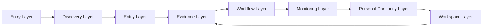
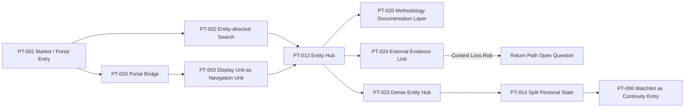
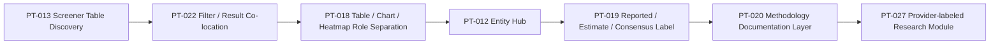
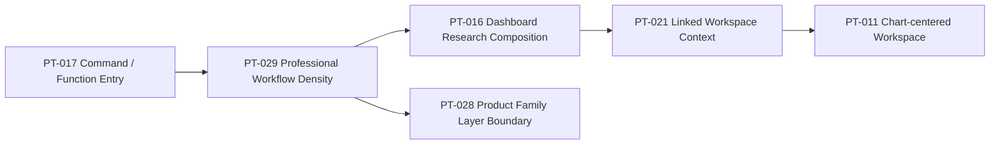
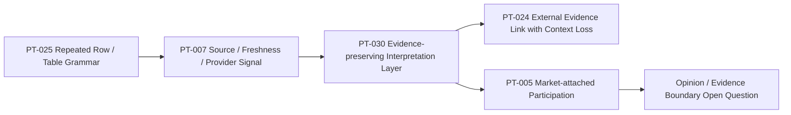

# Pattern Relationship Map

## 문서 목적

이 문서는 Phase 8.1 Pattern 간 dependency를 기록한다. Mermaid diagram은 Product Flow 후보이며 DATE Architecture가 아니다.

## Layer Flow

## Context Flow

## Research Workflow Flow

## Professional Workflow Flow

## News Evidence Flow

## Pattern Relationship Inventory

| Relationship ID | From Pattern | To Pattern | Relationship | Evidence Status | Open Question |
| --- | --- | --- | --- | --- | --- |
| REL-001 | PT-001 | PT-002 | Portal or Home often exposes Search entry. | Observed / Variant | Search role is entity router or broad discovery? |
| REL-002 | PT-001 | PT-026 | Portal can bridge passive discovery and active research. | Observed / Variant | Content hierarchy may compete with research task. |
| REL-003 | PT-002 | PT-012 | Search commonly routes to Symbol / Stock context. | Observed / Partial | Entity type disambiguation remains uneven. |
| REL-004 | PT-003 | PT-024 | News or row item can route to external Evidence. | Observed / Partial | Return Path is often Not Verified. |
| REL-005 | PT-005 | PT-007 | Discussion needs Source / Evidence boundary. | Partial | Community quality and moderation vary. |
| REL-006 | PT-006 | PT-014 | Watchlist is one state inside broader continuity model. | Observed / Partial | Persistence and owner scope remain open. |
| REL-007 | PT-007 | PT-020 | Source / Freshness cue may need methodology layer. | Observed / Variant | inline vs documentation responsibility. |
| REL-008 | PT-008 | PT-030 | AI identity separation overlaps interpretation boundary. | Variant / Insufficient | generated content labels need validation. |
| REL-009 | PT-009 | PT-024 | Specialized Surface increases external context loss risk. | Observed | return anchor and saved evidence needed. |
| REL-010 | PT-011 | PT-018 | Chart-centered workspace depends on chart role clarity. | Observed / Variant | chart as primary context or supporting view. |
| REL-011 | PT-012 | PT-023 | Entity Hub can be tabbed or dense simultaneous disclosure. | Observed / Variant | density control differs by user type. |
| REL-012 | PT-013 | PT-022 | Screener efficiency improves when filter and result are co-located. | Observed | saved filter persistence remains open. |
| REL-013 | PT-014 | PT-016 | Dashboard composition can be one saved state. | Observed / Variant | dashboard vs Workspace boundary. |
| REL-014 | PT-015 | PT-020 | Documents and methodology both support Evidence validation. | Observed / Variant | relation to News claim not always explicit. |
| REL-015 | PT-017 | PT-029 | Command entry can support professional workflow density. | Variant | actual command efficiency not verified. |
| REL-016 | PT-018 | PT-025 | repeated table grammar makes view-role separation learnable. | Observed | mobile readability and novice cost. |
| REL-017 | PT-019 | PT-027 | estimates require provider and methodology identity. | Partial | item-level Source and revision timing. |
| REL-018 | PT-021 | PT-029 | linked context can reduce task transition cost. | Insufficient | linking and persistence not verified. |
| REL-019 | PT-028 | PT-029 | product family layers affect professional workflow continuity. | Variant | context transfer across layers unknown. |
| REL-020 | PT-030 | PT-024 | interpretation layer needs path to Original Evidence. | Observed / Partial | Original Source Return Path unknown. |

## Dependency 판단

Pattern dependency는 Cross Validation 완료가 아니다. 특히 PT-017, PT-021, PT-028, PT-029는 professional 또는 enterprise Evidence에 접근 제한이 있어 Scope Limitation을 유지한다.
