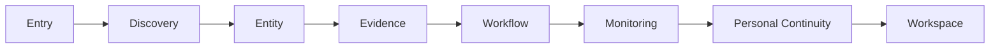

# Shared Pattern Synthesis

## 문서 목적

이 문서는 Phase 8.2.1 범위에서 Phase 8.1의 Shared Pattern만 다시 분석한다.

목표는 Benchmark 비교가 아니라 Pattern 자체의 Structural Rule을 정리하는 것이다. DATE Product Principle, DATE Information Architecture, DATE Navigation, DATE UX는 작성하지 않는다.

## Source Basis

- [01-pattern-inventory.md](01-pattern-inventory.md)
- [02-cross-benchmark-matrix.md](02-cross-benchmark-matrix.md)
- [03-layer-classification.md](03-layer-classification.md)
- [04-pattern-relationship-map.md](04-pattern-relationship-map.md)
- [05-evidence-quality-matrix.md](05-evidence-quality-matrix.md)
- [06-generalizability-matrix.md](06-generalizability-matrix.md)
- [07-open-question-matrix.md](07-open-question-matrix.md)

## Scope

Phase 8.1 Summary의 Shared Pattern count `13`을 기준으로 한다.

`PT-020 Methodology Documentation Layer`는 `01-pattern-inventory.md`에서 Shared Pattern row로 표시되어 있으나, Phase 8.2.1에서는 `PT-007 Source / Freshness / Provider Signal`의 Evidence-layer supporting pattern으로만 다룬다. 이 문서는 신규 Pattern ID, 신규 Candidate Principle ID, Registry 변경을 만들지 않는다.

## Shared Pattern Summary

| Metric | Count |
| --- | ---: |
| Shared Pattern | 13 |
| 분석 완료 Pattern | 13 |
| High Evidence Pattern | 8 |
| Medium Evidence Pattern | 5 |
| Low Evidence Pattern | 0 |
| General Pattern | 5 |
| Finance Pattern | 8 |
| Professional Pattern | 0 |
| Cross Validation Status | Pending |

## Layer Dependency

Shared Pattern은 대체로 Entry에서 Personal Continuity까지 이어지는 Product 판단 chain에 배치된다.

이 chain은 DATE Architecture 결정이 아니다. Benchmark 전반에서 반복되는 dependency 후보를 정리한 것이다.

| Dependency ID | From Layer | To Layer | Reason |
| --- | --- | --- | --- |
| LD-001 | Entry | Discovery | 첫 진입은 사용자가 비교 대상이나 판단 대상을 찾을 수 있어야 의미가 있다. |
| LD-002 | Discovery | Entity | Discovery 결과는 Stock, Symbol, Company, News, Event 같은 Entity로 수렴해야 한다. |
| LD-003 | Entity | Evidence | Entity 판단에는 Source, Freshness, Provider, Document 같은 Evidence가 붙어야 한다. |
| LD-004 | Evidence | Workflow | Evidence가 정리되면 Chart, Table, Report, News 같은 task 전환으로 이어질 수 있다. |
| LD-005 | Workflow | Monitoring | 반복되는 task는 Watchlist, Alert, Notification 같은 지속 Observation 구조로 확장된다. |
| LD-006 | Monitoring | Personal Continuity | Monitoring 결과는 다시 방문할 saved state를 만든다. |
| LD-007 | Personal Continuity | Workspace | 저장된 intent가 많아질수록 Layout, Watchlist, Portfolio, saved view 같은 Workspace 후보가 필요해진다. |

## Pattern Dependency Summary

| Pattern ID | Pattern Name | Layer | Required Previous Pattern | Required Next Pattern | Optional Pattern | Why This Dependency Matters |
| --- | --- | --- | --- | --- | --- | --- |
| PT-001 | Market / Portal Entry | Entry | None | PT-002, PT-003 | PT-007 | Entry는 사용자가 어디서 시작할지 정한다. 다음 단계는 Entity routing 또는 display unit click이다. |
| PT-002 | Entity-directed Search | Entry / Discovery | PT-001 | PT-012 | PT-007 | Search는 broad content보다 Entity Hub로 빨리 수렴할 때 판단 비용을 낮춘다. |
| PT-003 | Display Unit as Navigation Unit | Discovery | PT-001 | PT-012, PT-024 | PT-025 | Card, row, list item은 scan 결과를 detail validation으로 연결한다. |
| PT-005 | Market-attached Participation | Community | PT-012 | PT-007 | PT-014 | Discussion은 Entity 또는 Market context와 Evidence boundary가 있어야 과장되지 않는다. |
| PT-006 | Watchlist as Continuity Entry | Monitoring | PT-012 | PT-014 | PT-007 | Watchlist는 저장된 Entity를 반복 Observation과 revisit로 연결한다. |
| PT-007 | Source / Freshness / Provider Signal | Evidence | PT-003, PT-012 | PT-024 | PT-020 | Source와 Freshness Signal은 complete Traceability 전 단계의 trust calibration을 담당한다. |
| PT-009 | Surface Specialization vs Context Preservation | Workflow | PT-012 | PT-014 | PT-024 | Surface가 분리될수록 책임은 명확해지지만 context loss 위험이 생긴다. |
| PT-012 | Entity Hub with Local Analysis Modes | Entity | PT-002, PT-003 | PT-007, PT-018 | PT-024 | Entity Hub는 Chart, News, Metric, Document 같은 mode를 같은 Entity context에 묶는다. |
| PT-013 | Screener Table Discovery | Discovery | PT-001 | PT-012 | PT-025 | Screener는 많은 후보를 줄인 뒤 특정 Entity로 연결해야 한다. |
| PT-014 | Split Personal State | Personal Continuity | PT-006, PT-009 | Workspace 후보 | PT-007 | saved state가 Watchlist, Alert, Layout, Portfolio로 나뉘면 각 state owner가 필요하다. |
| PT-018 | Table / Chart / Heatmap Role Separation | Workflow | PT-012, PT-013 | PT-007 | PT-025 | 같은 data도 질문 유형에 따라 Table, Chart, Heatmap이 다른 역할을 맡는다. |
| PT-024 | External Evidence Link with Context Loss | Evidence | PT-007 | PT-009 | PT-014 | Original Source 접근은 Evidence Traceability를 높이지만 Product context를 잃게 할 수 있다. |
| PT-025 | Repeated Row / Table Grammar | Discovery / Workflow | PT-003, PT-013 | PT-018 | PT-007 | 반복 row grammar는 dense comparison을 가능하게 하지만 row action과 Evidence boundary가 필요하다. |

## PT-001 Market / Portal Entry

| Field | 내용 |
| --- | --- |
| Definition | Home 또는 Portal이 Market, News, Summary, route entry를 결합해 첫 진입 기준을 제공하는 Pattern이다. |
| Purpose | 사용자가 Product 첫 화면에서 Market orientation과 다음 task direction을 얻도록 한다. |
| User Problem | 사용자는 무엇을 먼저 봐야 하는지, 어떤 Entity 또는 Surface로 갈지 결정해야 한다. |
| Current Industry Consensus | TradingView, Yahoo Finance, Finviz, Bloomberg는 서로 다른 UI를 쓰지만 첫 진입에서 Market state와 주요 route를 같이 제시한다. |
| Supporting Benchmark | EidosLayer, TradingView, Finviz, Yahoo Finance, Bloomberg |
| Evidence Summary | Public Home, portal, Market page, index summary, News block, route card가 반복된다. |
| Structural Commonality | 첫 화면은 passive reading과 active research entry 사이의 gateway로 작동한다. |
| Why Every Product Uses It | Finance Product는 단일 task app이 아니라 Market 상황에 따라 다음 task가 달라진다. Entry가 방향을 정하지 못하면 Search, screener, quote, news로 분기하기 어렵다. |
| User Benefit | Market Orientation, Discoverability, Entry Cost Reduction |
| Trade-off | Portal이 너무 많은 route를 동시에 보여주면 판단 시작 전 cognitive load가 커질 수 있다. |
| Generalizability | Finance |
| Evidence Quality | High. 여러 public benchmark에서 Home 또는 Market entry가 직접 확인되었다. |
| Confidence | High |
| Related Principle | P-001, P-026 |
| Cross Validation Status | Pending |
| Open Question | logged-in Home과 professional entry가 같은 responsibility를 갖는지 추가 확인이 필요하다. |
| Required Previous Pattern | None |
| Required Next Pattern | PT-002 Entity-directed Search, PT-003 Display Unit as Navigation Unit |
| Optional Pattern | PT-007 Source / Freshness / Provider Signal |

## PT-002 Entity-directed Search

| Field | 내용 |
| --- | --- |
| Definition | Search가 broad content보다 Stock, Symbol, Security, Company 같은 Entity routing을 우선하는 Pattern이다. |
| Purpose | known Entity로 빠르게 진입하게 한다. |
| User Problem | 사용자는 ticker나 Company name은 알지만 어떤 Surface에서 봐야 하는지 모를 수 있다. |
| Current Industry Consensus | Yahoo Finance, Koyfin, EidosLayer는 Search를 Entity entry로 쓰고, TradingView와 Bloomberg는 Symbol 또는 Command variant로 같은 문제를 푼다. |
| Supporting Benchmark | EidosLayer, Koyfin, Yahoo Finance |
| Evidence Summary | Search entry가 quote, symbol, company detail 같은 Entity 중심 Surface로 연결된다. |
| Structural Commonality | Search 결과는 content list보다 Entity selection과 disambiguation을 먼저 해결한다. |
| Why Every Product Uses It | Finance에서는 사용자가 이미 ticker, company, security를 알고 들어오는 경우가 많다. Search는 navigation tree보다 빠른 entity resolver가 된다. |
| User Benefit | Decision Speed, Learnability, Discoverability |
| Trade-off | result grouping, symbol ambiguity, exchange ambiguity가 약하면 빠른 entry가 오히려 오류를 만들 수 있다. |
| Generalizability | Finance |
| Evidence Quality | High. Multiple benchmark rows record this as observed Search-to-Entity Pattern. |
| Confidence | High |
| Related Principle | P-002, P-017 |
| Cross Validation Status | Pending |
| Open Question | Search result grouping과 disambiguation UI가 어떤 depth를 가져야 하는지 확인이 필요하다. |
| Required Previous Pattern | PT-001 Market / Portal Entry |
| Required Next Pattern | PT-012 Entity Hub with Local Analysis Modes |
| Optional Pattern | PT-007 Source / Freshness / Provider Signal |

## PT-003 Display Unit as Navigation Unit

| Field | 내용 |
| --- | --- |
| Definition | Card, list item, row가 summary display와 Navigation trigger를 겸하는 Pattern이다. |
| Purpose | scan에서 detail validation으로 빠르게 넘어가게 한다. |
| User Problem | display unit과 click target이 분리되면 반복 Discovery 비용이 커진다. |
| Current Industry Consensus | Finviz row, Yahoo list item, TradingView card, SaveTicker headline은 UI가 다르지만 summary unit을 next action unit으로 쓴다. |
| Supporting Benchmark | EidosLayer, TradingView, Finviz |
| Evidence Summary | Table row, News item, card, quote row가 summary와 target entry를 겸한다. |
| Structural Commonality | 작은 display unit이 context preview와 transition affordance를 동시에 제공한다. |
| Why Every Product Uses It | dense Product에서 사용자는 먼저 scan하고, 관심 단위만 깊게 확인한다. unit 자체가 action이면 scan과 validation 사이 friction이 줄어든다. |
| User Benefit | Decision Speed, Discoverability, Comparison Efficiency |
| Trade-off | row default action, external target, detail target이 명확하지 않으면 사용자가 예상하지 못한 Surface로 갈 수 있다. |
| Generalizability | General |
| Evidence Quality | Medium. 여러 Product에서 반복되지만 row action 세부 규칙은 일부 benchmark에서 제한적으로만 확인되었다. |
| Confidence | Medium |
| Related Principle | P-003, P-025 |
| Cross Validation Status | Pending |
| Open Question | row default action과 external target을 어떻게 구분해야 하는지 확인이 필요하다. |
| Required Previous Pattern | PT-001 Market / Portal Entry |
| Required Next Pattern | PT-012 Entity Hub with Local Analysis Modes, PT-024 External Evidence Link with Context Loss |
| Optional Pattern | PT-025 Repeated Row / Table Grammar |

## PT-005 Market-attached Participation

| Field | 내용 |
| --- | --- |
| Definition | Discussion, Idea, Reaction, Prediction이 Market Object 주변에 붙는 Pattern이다. |
| Purpose | social signal 또는 opinion을 standalone feed가 아니라 Market context 안에서 보게 한다. |
| User Problem | 사용자는 의견과 대상 Entity를 따로 찾아야 하면 판단 context를 잃는다. |
| Current Industry Consensus | TradingView는 Idea와 social layer를 Symbol context에 붙이고, SaveTicker는 Reaction과 Community candidate를 News context에 둔다. |
| Supporting Benchmark | EidosLayer, TradingView |
| Evidence Summary | Discussion 또는 participation element가 Market, Symbol, News 주변에 배치되는 구조가 반복된다. |
| Structural Commonality | participation unit은 Evidence가 아니라 context-attached social layer로 분리된다. |
| Why Every Product Uses It | Finance 판단은 data만이 아니라 다른 사용자의 opinion과 reaction도 참고하지만, 그 반응은 Entity나 News context와 분리되면 value가 낮아진다. |
| User Benefit | Discussion Awareness, Market Orientation |
| Trade-off | Reaction이나 comment가 Financial Evidence처럼 보이면 trust calibration이 왜곡될 수 있다. |
| Generalizability | Finance |
| Evidence Quality | Medium. TradingView Evidence는 비교적 강하지만 SaveTicker와 EidosLayer는 participation boundary 검증이 제한적이다. |
| Confidence | Medium |
| Related Principle | P-005 |
| Cross Validation Status | Pending |
| Open Question | Community Opinion과 Financial Evidence boundary를 UI에서 어떻게 분리해야 하는지 확인이 필요하다. |
| Required Previous Pattern | PT-012 Entity Hub with Local Analysis Modes |
| Required Next Pattern | PT-007 Source / Freshness / Provider Signal |
| Optional Pattern | PT-014 Split Personal State |

## PT-006 Watchlist as Continuity Entry

| Field | 내용 |
| --- | --- |
| Definition | Watchlist가 저장 기능을 넘어 monitoring과 revisit entry 후보로 작동하는 Pattern이다. |
| Purpose | 반복적으로 확인하는 Entity를 빠르게 다시 열게 한다. |
| User Problem | 관심 Entity를 매번 Search하거나 screener에서 다시 찾아야 하면 continuity가 끊긴다. |
| Current Industry Consensus | TradingView, Koyfin, Yahoo Finance, Finviz는 Watchlist 또는 saved entity variant를 제공하며, SaveTicker는 Follow / Bookmark persistence 후보를 가진다. |
| Supporting Benchmark | EidosLayer, TradingView, Koyfin |
| Evidence Summary | Watchlist, account-gated watch, saved symbol, follow candidate가 반복된다. |
| Structural Commonality | user-selected Entity set이 next session entry로 작동한다. |
| Why Every Product Uses It | 투자 판단은 일회성 reading보다 반복 Observation이다. 저장된 Entity set은 반복 task 시작점을 줄인다. |
| User Benefit | Personal Continuity, Monitoring, Decision Speed |
| Trade-off | Watchlist가 research state, alert state, portfolio state를 모두 대신하면 state owner가 불명확해질 수 있다. |
| Generalizability | Finance |
| Evidence Quality | Medium. core idea는 반복되지만 persistence scope와 login boundary는 benchmark별로 다르게 확인되었다. |
| Confidence | Medium |
| Related Principle | P-006, P-014 |
| Cross Validation Status | Pending |
| Open Question | Watchlist가 research state도 보존하는지, 단순 Entity set인지 구분이 필요하다. |
| Required Previous Pattern | PT-012 Entity Hub with Local Analysis Modes |
| Required Next Pattern | PT-014 Split Personal State |
| Optional Pattern | PT-007 Source / Freshness / Provider Signal |

## PT-007 Source / Freshness / Provider Signal

| Field | 내용 |
| --- | --- |
| Definition | Source, timestamp, delay, provider, entitlement cue가 deep Evidence 전 표시되는 Pattern이다. |
| Purpose | 사용자가 정보의 origin, timing, access condition을 빠르게 판단하게 한다. |
| User Problem | 사용자는 data와 News가 언제, 누구에게서, 어떤 조건으로 왔는지 모르면 판단 강도를 조절하기 어렵다. |
| Current Industry Consensus | Yahoo Finance, Bloomberg, Koyfin, Finviz, SaveTicker 모두 Source, Freshness, provider 또는 methodology cue를 서로 다른 UI로 노출한다. |
| Supporting Benchmark | EidosLayer, TradingView, Koyfin, Finviz, Yahoo Finance, Bloomberg, SaveTicker |
| Evidence Summary | timestamp, delayed data notice, provider label, official methodology document, publisher label이 반복된다. |
| Structural Commonality | complete Traceability 이전에 최소 trust calibration Signal을 먼저 제공한다. |
| Why Every Product Uses It | Finance data는 값 자체보다 timing과 origin이 판단에 영향을 준다. Source와 Freshness가 없으면 같은 Metric도 다른 의미가 된다. |
| User Benefit | Trust Calibration, Decision Speed, Evidence Traceability |
| Trade-off | Source Visibility가 complete data lineage로 오해될 수 있고, provider label만으로 methodology gap이 가려질 수 있다. |
| Generalizability | General |
| Evidence Quality | High. 7개 Benchmark 전반에서 반복 확인되었다. PT-020은 이 Pattern의 methodology support로 다룬다. |
| Confidence | High |
| Related Principle | P-007, P-020, P-027 |
| Cross Validation Status | Pending |
| Open Question | Source Visibility와 complete Traceability를 UI와 data model에서 어떻게 분리해야 하는지 확인이 필요하다. |
| Required Previous Pattern | PT-003 Display Unit as Navigation Unit, PT-012 Entity Hub with Local Analysis Modes |
| Required Next Pattern | PT-024 External Evidence Link with Context Loss |
| Optional Pattern | PT-020 Methodology Documentation Layer |

## PT-009 Surface Specialization vs Context Preservation

| Field | 내용 |
| --- | --- |
| Definition | Page 또는 Product Layer specialization이 clarity와 context loss를 동시에 만드는 Pattern이다. |
| Purpose | Surface responsibility를 나누면서 이전 Entity, Query, Filter, Evidence context를 유지할 필요를 드러낸다. |
| User Problem | 분석 중 다른 Surface로 전환하면 사용자는 이전 context를 다시 구성해야 한다. |
| Current Industry Consensus | Finviz, Koyfin, Bloomberg, Yahoo Finance는 specialized Surface를 제공하고, TradingView는 panel variant로 context loss를 줄이는 방식을 쓴다. |
| Supporting Benchmark | EidosLayer, Koyfin, Finviz, Bloomberg |
| Evidence Summary | quote, chart, screener, news, portfolio, workspace, external document가 분리되어 나타난다. |
| Structural Commonality | Surface specialization은 Product clarity를 높이지만 transition boundary마다 context preservation rule이 필요하다. |
| Why Every Product Uses It | Finance workflow는 task가 다층적이다. 하나의 Surface에 모든 것을 넣으면 overload가 생기고, 나누면 context loss가 생긴다. |
| User Benefit | Context Preservation, Clarity, Workflow Efficiency |
| Trade-off | specialization이 과하면 사용자에게 backtracking, duplicate search, state reconstruction 비용이 생긴다. |
| Generalizability | General |
| Evidence Quality | Medium. specialization은 반복되지만 context preservation mechanism은 일부 Product에서만 제한적으로 확인되었다. |
| Confidence | Medium |
| Related Principle | P-009, P-024, P-028 |
| Cross Validation Status | Pending |
| Open Question | external transition 후 return anchor와 saved evidence state가 필요한지 검증해야 한다. |
| Required Previous Pattern | PT-012 Entity Hub with Local Analysis Modes |
| Required Next Pattern | PT-014 Split Personal State |
| Optional Pattern | PT-024 External Evidence Link with Context Loss |

## PT-012 Entity Hub with Local Analysis Modes

| Field | 내용 |
| --- | --- |
| Definition | Symbol, Stock, Quote context 안에서 tabs 또는 sections가 analysis mode를 나누는 Pattern이다. |
| Purpose | 같은 Entity 안에서 chart, Metric, News, document, discussion을 전환하게 한다. |
| User Problem | 사용자는 같은 Stock 판단에 필요한 Surface를 여러 곳에서 따로 열어야 한다. |
| Current Industry Consensus | TradingView, Finviz, Yahoo Finance는 Symbol 또는 Quote hub를 사용하고 Bloomberg는 Security workflow candidate로 같은 책임을 가진다. |
| Supporting Benchmark | TradingView, Finviz, Yahoo Finance |
| Evidence Summary | Symbol page, quote page, stock detail, tabs, sections, related News, analysis mode가 반복된다. |
| Structural Commonality | Entity가 local navigation context owner가 된다. |
| Why Every Product Uses It | Finance 판단의 중심은 대부분 Entity다. Entity context 없이 chart, news, metric을 보면 cross-reference 비용이 커진다. |
| User Benefit | Context Preservation, Information Density Control, Decision Speed |
| Trade-off | Entity Hub가 너무 많은 mode를 포함하면 nested navigation과 overload가 생길 수 있다. |
| Generalizability | Finance |
| Evidence Quality | High. 여러 benchmark에서 직접 확인되었다. Bloomberg와 SaveTicker는 scope-limited variant다. |
| Confidence | High |
| Related Principle | P-012, P-023 |
| Cross Validation Status | Pending |
| Open Question | Stock, Company, Security boundary를 DATE에서 어떤 기준으로 나눌지 검토가 필요하다. |
| Required Previous Pattern | PT-002 Entity-directed Search, PT-003 Display Unit as Navigation Unit |
| Required Next Pattern | PT-007 Source / Freshness / Provider Signal, PT-018 Table / Chart / Heatmap Role Separation |
| Optional Pattern | PT-024 External Evidence Link with Context Loss |

## PT-013 Screener Table Discovery

| Field | 내용 |
| --- | --- |
| Definition | Filter와 Table로 후보군을 찾고 comparison을 수행하는 Pattern이다. |
| Purpose | 많은 candidate Entity를 같은 criteria로 줄인다. |
| User Problem | 사용자는 너무 많은 Stock이나 Fund 중에서 비교 가능한 후보를 찾아야 한다. |
| Current Industry Consensus | Finviz, Koyfin, TradingView, Yahoo Finance는 서로 다른 UI depth를 가지지만 filter + result table grammar를 반복한다. |
| Supporting Benchmark | TradingView, Koyfin, Finviz, Yahoo Finance |
| Evidence Summary | Screener, filter controls, result table, sortable column, row-to-detail pattern이 반복된다. |
| Structural Commonality | Discovery criteria와 comparison result가 같은 task 안에 묶인다. |
| Why Every Product Uses It | Finance discovery는 free browsing보다 criteria narrowing이 중요하다. Table은 비교 가능한 동일 grammar를 제공한다. |
| User Benefit | Comparison Efficiency, Discoverability, Information Density Control |
| Trade-off | complex filter와 dense table은 novice에게 진입 비용을 만들 수 있다. |
| Generalizability | Finance |
| Evidence Quality | High. 여러 benchmark에서 screener 또는 equivalent table discovery가 확인되었다. |
| Confidence | High |
| Related Principle | P-013, P-022 |
| Cross Validation Status | Pending |
| Open Question | result row에서 Entity context와 filter context가 유지되는지 확인이 필요하다. |
| Required Previous Pattern | PT-001 Market / Portal Entry |
| Required Next Pattern | PT-012 Entity Hub with Local Analysis Modes |
| Optional Pattern | PT-025 Repeated Row / Table Grammar |

## PT-014 Split Personal State

| Field | 내용 |
| --- | --- |
| Definition | Watchlist, Alert, Layout, Saved Screen, Portfolio, Profile이 별도 user state로 나뉘는 Pattern이다. |
| Purpose | saved intent의 owner와 persistence scope를 구분한다. |
| User Problem | 모든 saved state를 하나로 묶으면 어떤 state가 어떤 workflow를 재개하는지 불명확해진다. |
| Current Industry Consensus | TradingView와 Koyfin은 multiple saved state를 제공하고, Finviz, Yahoo Finance, Bloomberg, SaveTicker는 access-limited variant로 같은 문제를 가진다. |
| Supporting Benchmark | TradingView, Koyfin |
| Evidence Summary | Watchlist, Alert, Portfolio, Layout, Profile, saved screen, bookmark, follow candidate가 분리된다. |
| Structural Commonality | personal state는 하나의 저장 box가 아니라 intent별 state model로 나뉜다. |
| Why Every Product Uses It | 사용자는 관심 Entity, 보유 Position, Alert condition, layout preference를 서로 다른 이유로 저장한다. |
| User Benefit | Personal Continuity, Expert Scalability, Monitoring |
| Trade-off | state 종류가 많아질수록 관리 UI와 permission boundary가 복잡해진다. |
| Generalizability | General |
| Evidence Quality | Medium. logged-in state와 persistence detail은 benchmark별 접근 제한이 있다. |
| Confidence | Medium |
| Related Principle | P-014, P-006 |
| Cross Validation Status | Pending |
| Open Question | state owner와 persistence scope를 Product model에서 어떻게 분리할지 검토가 필요하다. |
| Required Previous Pattern | PT-006 Watchlist as Continuity Entry, PT-009 Surface Specialization vs Context Preservation |
| Required Next Pattern | Workspace 후보 |
| Optional Pattern | PT-007 Source / Freshness / Provider Signal |

## PT-018 Table / Chart / Heatmap Role Separation

| Field | 내용 |
| --- | --- |
| Definition | Table, Chart, Heatmap이 서로 다른 comparison question을 담당하는 Pattern이다. |
| Purpose | 같은 data라도 질문 유형에 맞는 information form을 제공한다. |
| User Problem | 사용자는 비교, trend, distribution, relative movement를 같은 view로 판단하기 어렵다. |
| Current Industry Consensus | Finviz heatmap, Yahoo chart/table, Koyfin chart/table, Bloomberg monitor/dashboard candidate가 role-separated information form을 사용한다. |
| Supporting Benchmark | Koyfin, Finviz, Yahoo Finance, Bloomberg |
| Evidence Summary | Table은 sortable comparison, Chart는 time-series validation, Heatmap은 relative distribution scan에 쓰인다. |
| Structural Commonality | information form은 decorative choice가 아니라 question type별 tool이다. |
| Why Every Product Uses It | Finance decision은 ranking, trend, distribution, detailed validation이 모두 필요하지만 각 task가 요구하는 visual grammar가 다르다. |
| User Benefit | Comparison Efficiency, Information Density Control, Decision Speed |
| Trade-off | form이 많아질수록 사용자가 어떤 view를 언제 써야 하는지 배워야 한다. |
| Generalizability | Finance |
| Evidence Quality | High. 여러 benchmark에서 반복 확인되었다. |
| Confidence | High |
| Related Principle | P-018, P-025 |
| Cross Validation Status | Pending |
| Open Question | heatmap methodology와 chart Source가 충분히 visible한지 추가 검증이 필요하다. |
| Required Previous Pattern | PT-012 Entity Hub with Local Analysis Modes, PT-013 Screener Table Discovery |
| Required Next Pattern | PT-007 Source / Freshness / Provider Signal |
| Optional Pattern | PT-025 Repeated Row / Table Grammar |

## PT-024 External Evidence Link with Context Loss

| Field | 내용 |
| --- | --- |
| Definition | original article, SEC filing, external Source로 전환하며 Product context loss가 생기는 Pattern이다. |
| Purpose | original validation을 제공하면서 context preservation 문제를 드러낸다. |
| User Problem | 사용자는 원문 validation과 Product 내부 context를 동시에 원하지만 external transition은 previous state를 끊을 수 있다. |
| Current Industry Consensus | Finviz, Yahoo Finance, SaveTicker는 external Source access를 제공하거나 후보로 가지며, Bloomberg와 Koyfin은 return path 확인이 제한적이다. |
| Supporting Benchmark | Finviz, Yahoo Finance, SaveTicker |
| Evidence Summary | filing, article, original Source, external link, provider document로 나가는 구조가 반복된다. |
| Structural Commonality | Evidence Traceability가 강해질수록 cross-product context boundary가 생긴다. |
| Why Every Product Uses It | 완전한 Evidence는 Product 내부 summary만으로 충분하지 않다. 그러나 original Source로 나가면 Product가 보유한 Entity, filter, feed position을 잃을 수 있다. |
| User Benefit | Evidence Traceability, Trust Calibration |
| Trade-off | external validation은 context loss, return path 부재, saved evidence gap을 만들 수 있다. |
| Generalizability | General |
| Evidence Quality | High. 여러 benchmark에서 external evidence transition 또는 limitation이 확인되었다. |
| Confidence | High |
| Related Principle | P-024, P-009 |
| Cross Validation Status | Pending |
| Open Question | return path와 evidence saving이 Product responsibility에 포함되어야 하는지 검토가 필요하다. |
| Required Previous Pattern | PT-007 Source / Freshness / Provider Signal |
| Required Next Pattern | PT-009 Surface Specialization vs Context Preservation |
| Optional Pattern | PT-014 Split Personal State |

## PT-025 Repeated Row / Table Grammar

| Field | 내용 |
| --- | --- |
| Definition | 반복 row, table, list grammar가 high-density scan을 학습 가능하게 만드는 Pattern이다. |
| Purpose | 많은 item을 같은 grammar로 빠르게 비교하게 한다. |
| User Problem | Product마다 row rule이 다르면 사용자는 comparison 기준과 action 위치를 다시 배워야 한다. |
| Current Industry Consensus | Finviz, Yahoo Finance, Bloomberg, SaveTicker는 dense list/table grammar를 쓰고, TradingView와 Koyfin은 chart 또는 dashboard variant를 결합한다. |
| Supporting Benchmark | Finviz, Yahoo Finance, Bloomberg, SaveTicker |
| Evidence Summary | row, table, headline list, quote list, market list, news list가 반복 grammar를 사용한다. |
| Structural Commonality | repeated unit은 information display, comparison, and action entry를 동시에 담당한다. |
| Why Every Product Uses It | Finance와 News scan은 많은 item을 빠르게 비교하는 task다. 반복 grammar는 사용자의 pattern recognition을 돕는다. |
| User Benefit | Learnability, Comparison Efficiency, Information Density Control |
| Trade-off | dense row grammar는 novice readability와 mobile layout에서 비용을 만들 수 있다. |
| Generalizability | Finance |
| Evidence Quality | High. 여러 benchmark에서 반복 table/list grammar가 직접 확인되었다. |
| Confidence | High |
| Related Principle | P-025, P-003 |
| Cross Validation Status | Pending |
| Open Question | novice onboarding과 mobile readability를 어떻게 보완할지 검토가 필요하다. |
| Required Previous Pattern | PT-003 Display Unit as Navigation Unit, PT-013 Screener Table Discovery |
| Required Next Pattern | PT-018 Table / Chart / Heatmap Role Separation |
| Optional Pattern | PT-007 Source / Freshness / Provider Signal |

## Synthesis Notes

## Current Industry Consensus 요약

Shared Pattern은 동일한 UI를 의미하지 않는다.

TradingView는 chart와 Symbol context 중심으로, Yahoo Finance는 quote와 portal 중심으로, Bloomberg는 professional Product responsibility 중심으로, Finviz는 dense table 중심으로, SaveTicker는 News-first context 중심으로 같은 structural problem을 다르게 해결한다.

반복되는 Structural Rule은 다음과 같다.

- Entry는 다음 task를 정해야 한다.
- Discovery는 Entity로 수렴해야 한다.
- Entity는 Evidence context를 가져야 한다.
- Evidence는 Source와 Freshness boundary를 먼저 보여야 한다.
- Workflow는 Surface specialization과 context preservation을 함께 다뤄야 한다.
- Monitoring은 saved Entity와 user state를 필요로 한다.
- Personal Continuity는 state owner를 분리해야 한다.

## Evidence Quality Reasoning

| Evidence Quality | Pattern Count | Reason |
| --- | ---: | --- |
| High | 8 | 여러 Benchmark에서 직접 확인된 public 또는 official Product 구조가 반복된다. |
| Medium | 5 | Pattern 자체는 반복되지만 logged-in state, persistence, context preservation mechanism, community boundary가 일부 제한된다. |
| Low | 0 | Phase 8.2.1 대상은 Shared Pattern으로 제한했기 때문에 Low Evidence Pattern은 제외했다. |

## Generalizability Reasoning

| Generalizability | Pattern Count | Reason |
| --- | ---: | --- |
| General | 5 | display unit, Source Signal, context preservation, split state, external Evidence context loss는 Finance 밖에서도 적용 가능하다. |
| Finance | 8 | Market entry, Entity Search, Watchlist, Screener, Entity Hub, table/chart role은 Finance domain task와 강하게 연결된다. |
| Professional | 0 | professional-only Pattern은 Phase 8.2.1 대상에서 제외했다. |

## Open Question Summary

| Pattern ID | Open Question |
| --- | --- |
| PT-001 | logged-in Home과 professional entry가 같은 responsibility를 갖는가 |
| PT-002 | Search result grouping과 disambiguation UI는 어느 정도까지 필요한가 |
| PT-003 | row default action과 external target은 어떻게 구분되는가 |
| PT-005 | Community Opinion과 Financial Evidence boundary는 어떻게 표시되는가 |
| PT-006 | Watchlist가 research state도 보존하는가 |
| PT-007 | Source Visibility와 complete Traceability는 어떻게 분리되는가 |
| PT-009 | external transition 후 return anchor가 필요한가 |
| PT-012 | Stock, Company, Security boundary는 어떻게 나눌 것인가 |
| PT-013 | result row에서 Entity context와 filter context가 유지되는가 |
| PT-014 | state owner와 persistence scope는 무엇인가 |
| PT-018 | heatmap methodology와 chart Source가 보이는가 |
| PT-024 | return path와 evidence saving은 존재하는가 |
| PT-025 | novice onboarding과 mobile readability는 어떻게 보완되는가 |

## Phase Boundary

이 문서는 Shared Pattern만 다룬다.

Variant Pattern, Benchmark-specific Pattern, Insufficient Pattern, Potential Contradiction은 분석하지 않는다. 신규 Candidate Principle은 만들지 않는다. Registry는 수정하지 않는다. Cross Validation Status는 모두 `Pending`이다.
