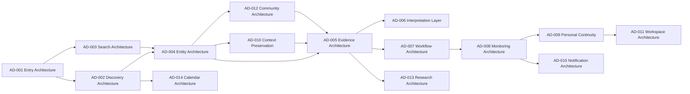

# Domain Dependency Map

## 문서 목적

이 문서는 Architecture Domain 간 dependency를 정리한다.

Dependency는 DATE Architecture 확정안이 아니다. Pattern consolidation에서 확인된 review chain이다.

## Domain Dependency Graph

## Required Dependency Matrix

| Dependency ID | From Domain | To Domain | Required Pattern | Reason |
| --- | --- | --- | --- | --- |
| DD-001 | Entry Architecture | Discovery Architecture | PT-001 -> PT-013 | Entry는 candidate discovery로 연결되어야 한다. |
| DD-002 | Entry Architecture | Search Architecture | PT-001 -> PT-002 | Entry는 known Entity route를 제공해야 한다. |
| DD-003 | Discovery Architecture | Entity Architecture | PT-013 -> PT-012 | Discovery result는 Entity context로 수렴해야 한다. |
| DD-004 | Search Architecture | Entity Architecture | PT-002 -> PT-012 | Search는 Entity resolver 역할을 가져야 한다. |
| DD-005 | Entity Architecture | Evidence Architecture | PT-012 -> PT-007 | Entity 판단에는 Evidence signal이 필요하다. |
| DD-006 | Evidence Architecture | Interpretation Layer | PT-007 -> PT-030 | interpretation layer는 Original Evidence boundary를 가져야 한다. |
| DD-007 | Evidence Architecture | Workflow Architecture | PT-024 -> PT-029 | Evidence validation 이후 task chain으로 확장될 수 있다. |
| DD-008 | Workflow Architecture | Monitoring Architecture | PT-029 -> PT-006 | 반복 workflow는 Monitoring state로 이어질 수 있다. |
| DD-009 | Monitoring Architecture | Personal Continuity | PT-006 -> PT-014 | Watchlist와 Alert candidate는 saved state owner를 필요로 한다. |
| DD-010 | Personal Continuity | Workspace Architecture | PT-014 -> PT-016 | saved state가 많아지면 reusable composition이 필요할 수 있다. |
| DD-011 | Entity Architecture | Context Preservation | PT-012 -> PT-009 | Entity context가 여러 Surface로 분산되면 context rule이 필요하다. |
| DD-012 | Context Preservation | Evidence Architecture | PT-009 -> PT-024 | external Evidence path는 context loss를 만들 수 있다. |
| DD-013 | Evidence Architecture | Research Architecture | PT-020 -> PT-027 | Research content는 methodology와 provider boundary를 필요로 한다. |
| DD-014 | Discovery Architecture | Calendar Architecture | PT-018 -> PT-026 | Calendar 후보는 discovery route와 연결되어야 한다. |
| DD-015 | Monitoring Architecture | Notification Architecture | PT-006 -> PT-010 | Monitoring은 delivery and state vocabulary를 필요로 한다. |
| DD-016 | Entity Architecture | Community Architecture | PT-012 -> PT-005 | Community participation은 Entity 또는 Market context가 필요하다. |

## Optional Dependency Matrix

| Dependency ID | Domain | Optional Dependency | Related Pattern | Reason |
| --- | --- | --- | --- | --- |
| OD-001 | Entry Architecture | Evidence Architecture | PT-007 | Entry Surface에 Source / Freshness cue가 붙을 수 있다. |
| OD-002 | Discovery Architecture | Search Architecture | PT-002 | Search와 screener가 같은 Discovery system으로 묶일 수 있다. |
| OD-003 | Search Architecture | Workflow Architecture | PT-017 | expert user에게 command entry가 붙을 수 있다. |
| OD-004 | Entity Architecture | Research Architecture | PT-015 | Symbol context에 document Evidence가 붙을 수 있다. |
| OD-005 | Evidence Architecture | Policy Layer | PT-020 | methodology explanation이 external docs로 제공될 수 있다. |
| OD-006 | Interpretation Layer | Research Architecture | PT-030 | Summary / Translation은 research reading context에서만 필요할 수 있다. |
| OD-007 | Workflow Architecture | Workspace Architecture | PT-021 | professional context에서는 linked Workspace가 필요할 수 있다. |
| OD-008 | Monitoring Architecture | Notification Architecture | PT-010 | live / delayed state는 notification rule과 함께 정의될 수 있다. |
| OD-009 | Personal Continuity | Settings Layer | PT-014 | state owner가 user preference로 노출될 수 있다. |
| OD-010 | Context Preservation | Workspace Architecture | PT-021 | linked context가 확인되면 Workspace context rule로 확장된다. |
| OD-011 | Workspace Architecture | Infrastructure | PT-028 | enterprise Product family가 필요할 때만 연결된다. |
| OD-012 | Community Architecture | Interpretation Layer | PT-030 | Reaction과 interpretation boundary를 함께 표시할 수 있다. |
| OD-013 | Research Architecture | Evidence Architecture | PT-019 | estimates require provider and methodology identity. |
| OD-014 | Calendar Architecture | Monitoring Architecture | PT-006 | Event-based reminder가 확인되면 연결된다. |
| OD-015 | Notification Architecture | Personal Continuity | PT-014 | notification state가 saved state로 남을 수 있다. |

## Layer Mapping

| Architecture Domain | Primary Layer | Secondary Layer |
| --- | --- | --- |
| Entry Architecture | Entry | Discovery, Evidence |
| Discovery Architecture | Discovery | Entity, Workflow |
| Search Architecture | Discovery | Entry, Entity, Workflow |
| Entity Architecture | Entity | Evidence, Workflow |
| Evidence Architecture | Evidence | Policy, Research |
| Interpretation Layer | Evidence | Information Density, Research, Policy |
| Workflow Architecture | Workflow | Workspace, Infrastructure |
| Monitoring Architecture | Monitoring | Evidence, Personal Continuity |
| Personal Continuity | Personal Continuity | Settings, Monitoring, Workspace |
| Context Preservation | Workflow | Entity, Evidence, Workspace |
| Workspace Architecture | Workspace | Workflow, Personal Continuity |
| Community Architecture | Community | Entity, Evidence |
| Research Architecture | Research | Evidence, Policy |
| Calendar Architecture | Calendar | Discovery, Evidence |
| Notification Architecture | Notification | Monitoring, Settings |

## Dependency Readiness

| Item | Count |
| --- | ---: |
| Architecture Domain | 15 |
| Required Dependency | 16 |
| Optional Dependency | 15 |
| Independent Domain | 1 |

Entry Architecture is the only independent starting Domain in this review. All other Domain candidates depend on Entry, Discovery, Entity, Evidence, or Monitoring context.
