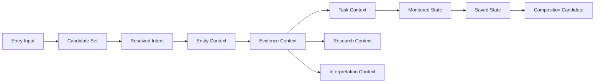

# Domain Data Flow

## 문서 목적

이 문서는 각 Architecture Domain의 Data Flow를 `Input -> Transformation -> Output`으로 정리한다.

이 문서는 data model을 작성하지 않는다. Domain-level data contract만 정의한다.

## Data Flow Summary

| Metric | Count |
| --- | ---: |
| Data Flow | 15 |
| Input 정의 | 15 |
| Transformation 정의 | 15 |
| Output 정의 | 15 |

## Data Flow Matrix

| Domain | Input | Transformation | Output | Consumes | Produces | Data Boundary | Failure Case |
| --- | --- | --- | --- | --- | --- | --- | --- |
| Entry Architecture | Market summary, route metadata, public entry content | route grouping and shallow context framing | initial route context | public entry data | entry context | does not enrich Evidence | route has no next task |
| Discovery Architecture | broad candidate set, filter input, sort input | filtering, sorting, comparison grammar | candidate set, comparison context | Market data, Entity summaries | filtered result context | does not own Entity detail | result row loses filter context |
| Search Architecture | query, ticker, company name, command text | resolution and disambiguation | resolved Entity or task candidate | query input, Entity taxonomy candidate | target candidate | does not persist command history | ambiguous target is hidden |
| Entity Architecture | resolved Entity, candidate row, selected local mode | context binding and mode grouping | Entity context, local analysis context | Entity identifiers | selected Entity context | does not own Source method | Entity type boundary blurs |
| Evidence Architecture | Entity context, News, Report, Metric, Source | Source, Freshness, method, original path labeling | Evidence context, Traceability cue | Evidence inputs | Evidence boundary | does not own interpretation content | Source cue lacks method gap |
| Interpretation Layer | Original Evidence, article body, translation candidate | compression or language transformation boundary | summary / translation context | article and Source cue | interpretation layer context | does not create Original Evidence | interpretation becomes standalone Evidence |
| Workflow Architecture | Entity context, Evidence context, task intent | task chain handoff and transition framing | task context, workflow candidate | Entity and Evidence context | workflow handoff | does not own Workspace persistence | task loses prior context |
| Monitoring Architecture | Entity, Watchlist action, live state cue | monitored set update and observation framing | monitored state candidate | Entity reference, state cue | monitoring entry | does not own delivery payload | monitored state lacks trigger |
| Personal Continuity | save action, monitored set, profile candidate | state owner classification | saved state and restore candidate | user intent | persisted state candidate | does not own Entity definition | saved state cannot be restored |
| Context Preservation | Entity context, query, Source path | origin capture and return anchor candidate | preserved context, return token candidate | transition context | origin reference | does not control external product | return path is lost |
| Workspace Architecture | saved state, Entity context, widget intent | composition and layout grouping | workspace composition candidate | state references | composition state | does not own Source method | layout has no state owner |
| Community Architecture | Entity context, post, reaction, user cue | opinion boundary labeling | discussion context, reaction context | participation inputs | opinion context | does not produce Financial Evidence | reaction treated as trust signal |
| Research Architecture | Report, Document, provider label, estimate label | provider and method boundary framing | research context, provider context | provider content | research context | does not own raw Market feed | provider label hides item detail |
| Calendar Architecture | date, event candidate, Market context | time grouping and event candidate framing | time context, event route candidate | date and event inputs | calendar context | does not own Event Source relation | Event is treated as verified Evidence |
| Notification Architecture | monitored state, alert candidate, delivery preference | trigger reference packaging | notification item candidate | monitoring state | delivery context | does not own alert rule engine | notification lacks Entity or Source |

## Cross-domain Data Flow

This diagram is a data contract view. It is not Navigation or UI.
