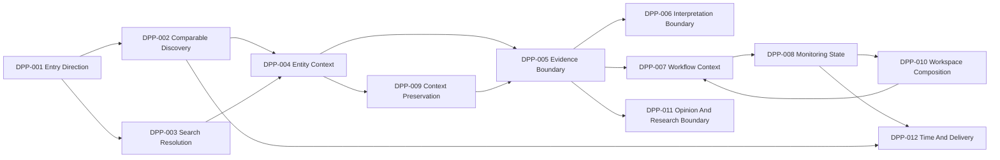

# Principle Relationship Map

## 문서 목적

이 문서는 Phase 9 DATE Product Principle 간 dependency를 정리한다.

이 문서는 Navigation, Entity Model, Information Architecture를 작성하지 않는다.

## Relationship Summary

| Metric | Count |
| --- | ---: |
| Product Principle | 12 |
| Principle Relationship | 18 |
| Dependency | 18 |
| Critical Dependency | 8 |
| Supporting Dependency | 10 |

## Principle Dependency Graph

## Relationship Matrix

| Relationship ID | From Principle | To Principle | Dependency Type | Reason | Failure Risk |
| --- | --- | --- | --- | --- | --- |
| PR-001 | DPP-001 | DPP-002 | Critical Dependency | actionable Entry should lead to comparable Discovery. | Entry remains passive. |
| PR-002 | DPP-001 | DPP-003 | Critical Dependency | Entry should allow known intent Search. | user cannot reach known target. |
| PR-003 | DPP-002 | DPP-004 | Critical Dependency | Discovery output should become Entity context. | candidate set becomes dead end. |
| PR-004 | DPP-003 | DPP-004 | Critical Dependency | Search output should resolve into Entity context. | ambiguous routing. |
| PR-005 | DPP-004 | DPP-005 | Critical Dependency | Entity context requires Evidence boundary. | Entity content lacks trust calibration. |
| PR-006 | DPP-005 | DPP-006 | Critical Dependency | Interpretation must depend on Evidence. | interpretation replaces Evidence. |
| PR-007 | DPP-005 | DPP-007 | Supporting Dependency | workflow handoff should carry Evidence context. | task starts without Source context. |
| PR-008 | DPP-004 | DPP-009 | Supporting Dependency | Entity transition requires Context Preservation. | local mode transition loses context. |
| PR-009 | DPP-009 | DPP-005 | Critical Dependency | external context preservation supports Evidence path. | Original Evidence path loses origin. |
| PR-010 | DPP-007 | DPP-008 | Supporting Dependency | repeated workflow can become Monitoring intent. | Monitoring lacks task context. |
| PR-011 | DPP-008 | DPP-010 | Supporting Dependency | saved Monitoring state can feed Workspace composition. | Workspace has no state owner. |
| PR-012 | DPP-008 | DPP-012 | Supporting Dependency | Notification depends on Monitoring trigger. | delivery lacks trigger context. |
| PR-013 | DPP-005 | DPP-011 | Critical Dependency | Community and Research must keep Evidence boundary. | opinion or provider label becomes Evidence. |
| PR-014 | DPP-002 | DPP-012 | Supporting Dependency | Calendar candidate can extend Discovery. | time route is detached from candidate context. |
| PR-015 | DPP-010 | DPP-007 | Supporting Dependency | Workspace composition should support task handoff. | composition is isolated from workflow. |
| PR-016 | DPP-011 | DPP-005 | Supporting Dependency | Research and opinion boundaries should refer back to Evidence. | report or reaction lacks Source cue. |
| PR-017 | DPP-006 | DPP-005 | Critical Dependency | interpretation must preserve Original Evidence relation. | summary or translation stands alone. |
| PR-018 | DPP-012 | DPP-008 | Supporting Dependency | time and delivery signals require Monitoring state. | notification becomes contextless. |

## Dependency Layers

| Layer Chain | Related Principles |
| --- | --- |
| Entry -> Discovery -> Entity | DPP-001, DPP-002, DPP-003, DPP-004 |
| Entity -> Evidence -> Interpretation | DPP-004, DPP-005, DPP-006 |
| Evidence -> Workflow -> Monitoring | DPP-005, DPP-007, DPP-008 |
| Monitoring -> Personal Continuity -> Workspace | DPP-008, DPP-010 |
| Entity / Evidence -> Context Preservation | DPP-004, DPP-005, DPP-009 |
| Evidence -> Community / Research | DPP-005, DPP-011 |
| Discovery / Monitoring -> Calendar / Notification | DPP-002, DPP-008, DPP-012 |

## Relationship Guardrail

Dependency is not implementation order.

These relationships define architecture dependency. They do not define UI order, Navigation, component hierarchy, or data schema.
