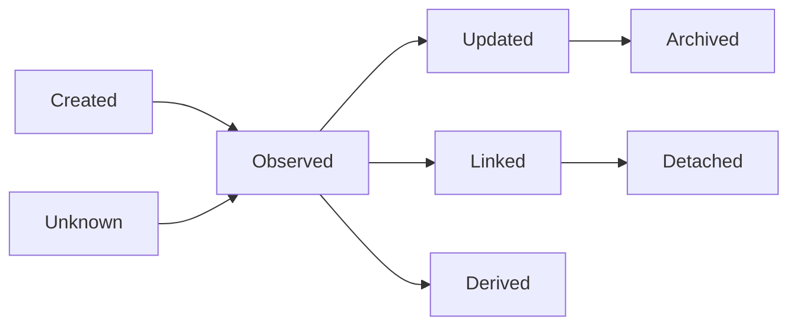

# Entity State Model

## 문서 목적

이 문서는 Canonical Entity의 product state를 정의한다.

이 문서는 persistence lifecycle 설계가 아니다. Entity가 product context에서 어떤 상태로 다뤄지는지만 정의한다.

## Entity State Summary

| Entity State | Definition |
| --- | --- |
| Created | user or system action으로 product context에 처음 생긴 상태 |
| Observed | external or product content로 확인된 상태 |
| Updated | previous state가 새 context로 갱신된 상태 |
| Archived | active context에서 제외되었지만 reference 가능성이 남은 상태 |
| Derived | 다른 Entity나 Evidence에서 계산 또는 판단되어 나온 상태 |
| Linked | 다른 Entity와 relation이 생긴 상태 |
| Detached | 이전 relation 또는 context에서 분리된 상태 |
| Unknown | access or Evidence limitation으로 state를 확정하지 않는 상태 |

## State Assignment Matrix

| Entity | Primary State | Secondary State | State Owner | State Consumer | State Producer | State Observer | Boundary | Open Question |
| --- | --- | --- | --- | --- | --- | --- | --- | --- |
| Security | Linked | Observed, Updated | Entity Architecture | Evidence, Workflow | Search, Discovery | User | Security is not Company | multi-listing handling |
| Company | Linked | Observed, Updated | Entity Architecture | Discovery, Research | Entity Architecture | User | Company is not Security | company identifier |
| Evidence | Observed | Created, Updated, Archived | Evidence Architecture | Entity, Workflow, Research | Source, User action candidate | User | Evidence is not Interpretation | item-level Traceability |
| Source | Linked | Observed, Updated | Evidence Architecture | Research, Interpretation | Source context | User | Source is not complete Traceability | Source type taxonomy |
| Publisher | Linked | Observed, Updated | Research Architecture | Evidence | Source / content context | User | Publisher is not data Source | authoring responsibility |
| News | Observed | Created, Updated, Archived | Interpretation Layer | Evidence, Community | Publisher | User | News is not Report | Original Evidence path |
| Report | Observed | Created, Updated, Archived | Research Architecture | Evidence | Publisher / provider | User | Report needs Source | provider method |
| Event | Linked | Created, Updated, Archived | Calendar Architecture | Evidence, Monitoring | Source / Evidence | User | Event is not Evidence by default | Event Source |
| Calendar Event | Observed | Created, Updated, Archived | Calendar Architecture | Notification | Calendar context | User | Calendar Event is not Alert | schedule update |
| Economic Event | Linked | Created, Updated, Archived | Calendar Architecture | Research | Macro context | User | Economic Event is not Macro Indicator | revision handling |
| Macro Indicator | Updated | Observed, Archived | Research Architecture | Evidence | Source | User | indicator is not Event | methodology |
| Market | Observed | Updated | Entry Architecture | Discovery | Market context | User | Market is not Exchange | Market scope |
| Exchange | Linked | Observed, Updated | Search Architecture | Entity | listing context | User | Exchange is not Source | exchange ambiguity |
| Sector | Linked | Observed, Updated | Discovery Architecture | Entity | taxonomy candidate | User | Sector is not Theme | taxonomy Source |
| Theme | Derived | Created, Updated, Archived | Discovery Architecture | Collection, Search | user or product context candidate | User | Theme is not Sector | theme criteria |
| Signal | Derived | Observed, Updated, Archived | Monitoring Architecture | Alert, Timeline | Evidence or Event | User | Signal needs Source relation | threshold |
| Timeline | Linked | Created, Updated, Archived | Evidence Architecture | Context Preservation | Evidence / Event relation | User | Timeline is not calendar UI | ordering basis |
| Watchlist | Created | Updated, Archived | Monitoring Architecture | Personal Continuity | User | User | Watchlist is not Portfolio | research state |
| Alert | Created | Updated, Archived | Notification Architecture | User | Monitoring | User | Alert is not Notification | payload Source |
| Workspace | Created | Updated, Archived | Workspace Architecture | Workflow | Personal Continuity | User | Workspace does not own truth | linked context |
| Portfolio | Created | Updated, Archived | Personal Continuity | Workflow, Evidence | User | User | Portfolio is not Watchlist | holdings Source |
| Position | Created | Updated, Archived | Personal Continuity | Portfolio, Evidence | User | User | Position is not Security | exposure definition |
| Strategy | Created | Updated, Archived | Workflow Architecture | Personal Continuity | User | User | Strategy is not recommendation | scope |
| User | Created | Updated, Archived | Personal Continuity | Monitoring, Workspace | identity context candidate | Organization candidate | User is not Organization | profile boundary |
| Organization | Created | Updated, Archived | Personal Continuity | Workspace, Portfolio | group context candidate | User | Organization is not User | permission model |
| Context | Linked | Created, Detached | Context Preservation | Workflow, Evidence | transition handoff | User | Context is not Workspace | restoration scope |
| Relationship | Linked | Created, Updated, Archived | Evidence Architecture | Entity Architecture | Evidence | User | Relationship needs Source if trust-bearing | relation confidence |
| Collection | Created | Updated, Archived | Personal Continuity | Discovery | User | User | Collection is not Watchlist | grouping purpose |
| Tag | Linked | Created, Updated, Archived | Discovery Architecture | Search, Collection | User or system candidate | User | Tag is not Source | tag ownership |

## State Transition Candidate

This transition is a product state vocabulary. It is not a persistence lifecycle.
