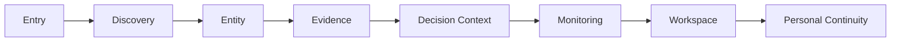

# Navigation Flow Definition

## 문서 목적

이 문서는 Information 기준 Navigation Flow를 정의한다.

Flow는 사용자 판단 이동을 설명한다. presentation sequence나 behavior specification을 정의하지 않는다.

## Flow Summary

| Metric | Count |
| --- | ---: |
| Navigation Flow | 8 |
| Navigation Dependency | 10 |
| Architecture Alignment | 15 |
| Principle Alignment | 12 |

## Primary Navigation Flow

이 diagram은 Information-based Navigation dependency를 설명한다. presentation sequence를 의미하지 않는다.

## Navigation Flow Matrix

| Flow ID | Navigation Flow | Start Information | End Information | Required Context | Preserved Context | Lost Context Risk | Navigation Result | Related Domain | Related Principle | Confidence | Open Question |
| --- | --- | --- | --- | --- | --- | --- | --- | --- | --- | --- | --- |
| NF-001 | Global Entry Flow | Market Information | Discovery or Search Information | Market | Market scope, selected direction | broad content origin | actionable direction | AD-001 | DPP-001 | Medium | authenticated entry context |
| NF-002 | Discovery To Entity Flow | Market / Discovery Information | Security Information | candidate set | filter criteria, candidate identity | criteria loss | focused Entity context | AD-002, AD-004 | DPP-002, DPP-004 | High | filter retention |
| NF-003 | Search To Entity Flow | Search Information | Security or Company Information | query | target type, ambiguity cue | wrong Entity type | resolved Entity context | AD-003, AD-004 | DPP-003, DPP-004 | Medium | disambiguation depth |
| NF-004 | Entity To Evidence Flow | Security Information | Evidence Information | selected Entity | Entity identity, Source cue | Source boundary loss | Evidence context | AD-004, AD-005 | DPP-004, DPP-005 | High | Evidence item granularity |
| NF-005 | Evidence To Research Flow | Evidence Information | Research Information | Evidence, Source | Source, provider cue | provider label overreach | provider-labeled context | AD-005, AD-013 | DPP-005, DPP-011 | Medium | method visibility |
| NF-006 | Evidence To Monitoring Flow | Evidence / Signal Information | Monitoring Information | Entity, Evidence | trigger Source, Entity | trigger ambiguity | observed state | AD-005, AD-008 | DPP-005, DPP-008 | Medium | Signal threshold |
| NF-007 | Monitoring To Personal Flow | Watchlist / Alert Information | Personal Information | User | owner, monitored Entity | saved state owner loss | continuity context | AD-008, AD-009 | DPP-008 | Medium | persistence scope |
| NF-008 | Workspace Return Flow | Workspace / Context Information | Entity or Evidence Information | Context | origin reference, selected Entity | return anchor loss | restored context candidate | AD-010, AD-011 | DPP-009, DPP-010 | Low | linked Workspace validation |

## Navigation Dependency Matrix

| Dependency ID | From Navigation | To Navigation | Required / Optional | Purpose | Boundary |
| --- | --- | --- | --- | --- | --- |
| NDP-001 | Entry Navigation | Discovery Navigation | Required | first direction to candidate set | Entry does not own comparison |
| NDP-002 | Entry Navigation | Search Navigation | Optional | known target shortcut | Search must resolve intent |
| NDP-003 | Discovery Navigation | Entity Navigation | Required | candidate to selected Entity | Discovery does not own Entity lifecycle |
| NDP-004 | Search Navigation | Entity Navigation | Required | resolved intent to Entity | ambiguity must remain visible |
| NDP-005 | Entity Navigation | Evidence Navigation | Required | selected Entity to trust boundary | Evidence owns Source boundary |
| NDP-006 | Evidence Navigation | Research Navigation | Optional | provider-labeled support | Research does not replace Evidence |
| NDP-007 | Evidence Navigation | Monitoring Navigation | Optional | Evidence or Signal to observed state | Signal needs Source context |
| NDP-008 | Monitoring Navigation | Personal Navigation | Required | user-owned continuity | Notification does not own trigger |
| NDP-009 | Entity Navigation | Workspace Navigation | Optional | reusable context composition | Workspace does not own truth |
| NDP-010 | Calendar Navigation | Evidence Navigation | Required | Event timing to Source context | Calendar Event is not verified Evidence |

## Flow Guardrail

Navigation Flow는 Information handoff다.

Flow does not define presentation sequence, product surface shape, or behavior specification.
