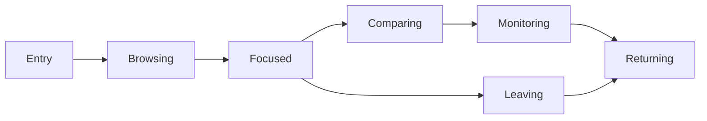

# Navigation State Model

## 문서 목적

이 문서는 DATE Navigation State와 ownership을 정의한다.

Navigation State는 사용자 판단 이동의 상태 vocabulary다. presentation state나 persistence lifecycle을 정의하지 않는다.

## Navigation State Summary

| Navigation State | Definition |
| --- | --- |
| Entry | user가 first direction을 정하는 상태 |
| Browsing | candidate Information을 훑고 좁히는 상태 |
| Focused | selected Entity or Evidence에 집중한 상태 |
| Comparing | candidate, Evidence, Relationship을 비교하는 상태 |
| Monitoring | observed Entity나 trigger를 계속 보는 상태 |
| Returning | saved or preserved context로 돌아가는 상태 |
| Leaving | external Evidence or boundary 밖으로 나가는 상태 |

## State Assignment Matrix

| Navigation Domain | Primary State | Secondary State | Owner | Consumer | Producer | Observer | Required Context | Output | Confidence | Open Question |
| --- | --- | --- | --- | --- | --- | --- | --- | --- | --- | --- |
| Entry Navigation | Entry | Browsing | Entry Architecture | Discovery, Search | Market Information | User | Market | direction context | Medium | public / authenticated state |
| Discovery Navigation | Browsing | Comparing | Discovery Architecture | Entity | candidate set | User | Market, criteria | comparable set | High | criteria persistence |
| Search Navigation | Entry | Focused | Search Architecture | Entity, Workflow | query | User | query | resolved context | Medium | ambiguity state |
| Entity Navigation | Focused | Comparing | Entity Architecture | Evidence, Research | Security Information | User | selected Entity | Entity context | High | Entity type boundary |
| Evidence Navigation | Focused | Leaving | Evidence Architecture | Research, Workflow | Evidence Information | User | Evidence, Source | trust context | Medium | external boundary |
| Research Navigation | Focused | Comparing | Research Architecture | Evidence | Report Information | User | Report, Source | provider context | Medium | method state |
| Monitoring Navigation | Monitoring | Returning | Monitoring Architecture | Personal | Watchlist / Signal | User | User, Security | observed state | Medium | trigger state |
| Portfolio Navigation | Focused | Comparing | Personal Continuity | Workflow | Position context | User | User, Position | exposure context | Medium | holdings Source |
| Workspace Navigation | Returning | Focused | Workspace Architecture | Workflow | Context | User | User, Context | restored context candidate | Low | restore fidelity |
| Community Navigation | Browsing | Comparing | Community Architecture | Evidence | opinion context | User | User, News | opinion boundary | Medium | moderation state |
| Calendar Navigation | Browsing | Focused | Calendar Architecture | Evidence | Event Information | User | Event, date | time context | Low | Event Source |
| Personal Navigation | Returning | Monitoring | Personal Continuity | Workspace, Monitoring | saved intent | User | User | continuity context | Medium | state owner |
| System Navigation | Leaving | Returning | Notification Architecture | Personal | Alert / Organization | User | User, Alert | system boundary | Low | permission state |

## Navigation Ownership Model

| Ownership Role | Definition |
| --- | --- |
| Owner | Navigation state boundary를 책임지는 Architecture Domain |
| Consumer | Navigation output을 다음 판단에 사용하는 Domain |
| Producer | Navigation State를 발생시키는 Information |
| Observer | Navigation State를 읽고 판단하는 actor |

## State Transition Candidate

이 transition은 Navigation State vocabulary다. visual behavior를 의미하지 않는다.
