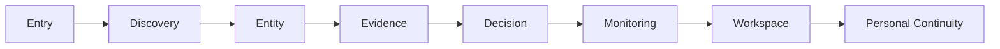

# Interaction Contract

## 문서 목적

이 문서는 DATE Interaction Contract를 정의한다.

Contract는 `User Action -> System Processing -> State Change -> Feedback Signal -> Available Next Action` 순서로 작성한다.

## Contract Summary

| Metric | Count |
| --- | ---: |
| Interaction Contract | 13 |
| Interaction Dependency | 8 |
| Architecture Alignment | 15 |
| Principle Alignment | 12 |

## Interaction Contract Matrix

| Contract ID | User Action | System Processing | State Change | Feedback Signal | Available Next Action | Required Context | Error Handling | Recovery | Related Interaction | Related Principle | Confidence |
| --- | --- | --- | --- | --- | --- | --- | --- | --- | --- | --- | --- |
| IC-001 | choose entry direction | map Market context to next Information options | Idle -> Focused | Immediate, Passive | refine Discovery, Search, inspect Evidence cue | Market | no direction available | return to broad Market context | Entry Direction Interaction | DPP-001 | Medium |
| IC-002 | change candidate criteria | recompute comparable candidate set and preserve criteria | Focused -> Comparing | Immediate, Persistent | focus Entity, compare criteria | Market, criteria | criteria conflict | restore previous criteria | Discovery Refinement Interaction | DPP-002 | High |
| IC-003 | enter query or command | resolve target type before handoff | Idle -> Focused | Immediate, Warning when ambiguous | select resolved Entity, refine query | query | ambiguous target | expose ambiguity and require selection | Search Resolution Interaction | DPP-003 | Medium |
| IC-004 | select candidate Entity | set selected Entity as context owner | Browsing -> Focused | Immediate, Persistent | inspect Evidence, Research, Monitoring | Security | Entity type conflict | preserve target type cue | Entity Focus Interaction | DPP-004 | High |
| IC-005 | inspect Evidence cue | attach Source, Freshness, boundary status | Focused -> Comparing | Immediate, Persistent | inspect Source, compare Evidence, follow Original Evidence candidate | Evidence, Source | Source unavailable | mark limitation and preserve Entity context | Evidence Inspection Interaction | DPP-005 | Medium |
| IC-006 | inspect interpretation | bind interpretation to Original Evidence relation | Focused -> Expanded | Immediate, Warning when weak | compare Original Evidence, inspect methodology gap | Evidence, Source | methodology unavailable | mark gap and keep Source cue | Interpretation Boundary Interaction | DPP-006 | Low |
| IC-007 | inspect Report or provider cue | separate provider label, method cue, Evidence boundary | Focused -> Comparing | Deferred, Persistent | compare provider context, return to Evidence | Report, Source | provider method unavailable | mark method gap | Research Context Interaction | DPP-011 | Medium |
| IC-008 | monitor Entity or Signal | create or update user-scoped observed state | Focused -> Monitoring | Immediate, Persistent | inspect trigger, return to Watchlist | User, Security | missing user context | request ownership context | Monitoring Setup Interaction | DPP-008 | Medium |
| IC-009 | inspect exposure | preserve Position and Security boundary | Focused -> Comparing | Deferred, Persistent | relate Evidence, inspect Position | User, Position | holdings Source unavailable | mark Source limitation | Portfolio Context Interaction | DPP-008 | Medium |
| IC-010 | restore saved context | restore origin reference before next action | Returning -> Focused | Deferred, Persistent | resume Entity, inspect Evidence | User, Context | restore incomplete | recover partial context | Workspace Restore Interaction | DPP-010 | Low |
| IC-011 | inspect opinion cue | label participation as opinion context | Browsing -> Comparing | Immediate, Passive | compare Evidence boundary | User, News | moderation unknown | mark moderation gap | Community Boundary Interaction | DPP-011 | Medium |
| IC-012 | inspect Event timing | preserve date and Event Source requirement | Browsing -> Focused | Immediate, Warning when Source weak | inspect Evidence, monitor Event | Event, date | Event Source missing | mark Source limitation | Calendar Event Interaction | DPP-012 | Low |
| IC-013 | inspect system boundary | identify owner, trigger, limitation | Warning -> Completed | Critical or Blocking when needed | adjust ownership, inspect trigger | User, Alert | permission or payload unknown | block or mark unknown | System Boundary Interaction | DPP-012 | Low |

## Interaction Dependency

## Dependency Matrix

| Dependency ID | From Interaction | To Interaction | Purpose | Boundary |
| --- | --- | --- | --- | --- |
| ICD-001 | Entry Direction | Discovery Refinement | first direction to comparable candidates | Entry does not own comparison |
| ICD-002 | Discovery Refinement | Entity Focus | candidate to selected Entity | criteria must be preserved |
| ICD-003 | Search Resolution | Entity Focus | resolved intent to Entity | ambiguity must remain visible |
| ICD-004 | Entity Focus | Evidence Inspection | selected Entity to Evidence boundary | Entity does not own Source |
| ICD-005 | Evidence Inspection | Research Context | Evidence to provider-labeled content | provider label is not complete Traceability |
| ICD-006 | Evidence Inspection | Monitoring Setup | Evidence or Signal to observed state | Signal needs Source |
| ICD-007 | Monitoring Setup | Workspace Restore | observed state to reusable context | Workspace does not own truth |
| ICD-008 | Workspace Restore | Portfolio Context | restored context to exposure context | Portfolio does not redefine Security |

## Contract Guardrail

Feedback Signal is not presentation design.

Available Next Action is not a product route.
