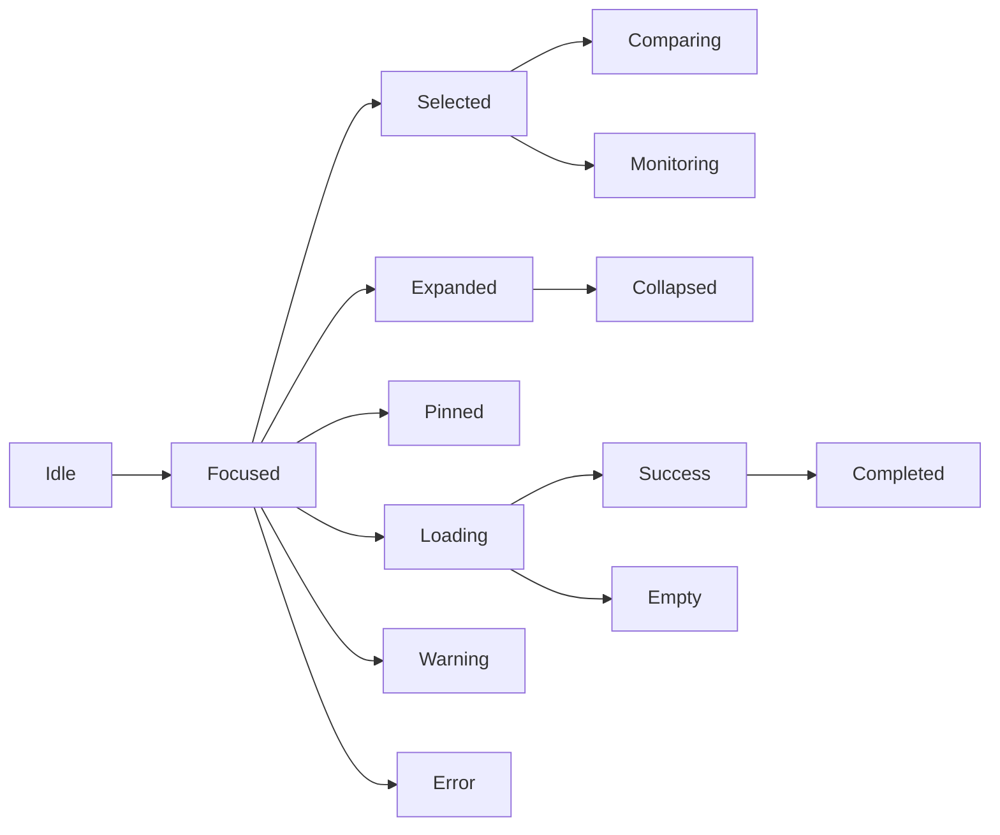

# Interaction State Machine

## 문서 목적

이 문서는 DATE Interaction State와 State Transition을 정의한다.

Interaction State는 response vocabulary다. presentation state, persistence lifecycle을 정의하지 않는다.

## Interaction State Summary

| Interaction State | Definition |
| --- | --- |
| Idle | user action 전 대기 상태 |
| Hover | target affordance candidate를 살펴보는 상태 |
| Focused | target Information에 user attention이 고정된 상태 |
| Selected | target Information이 action 대상으로 선택된 상태 |
| Expanded | compressed Information이 더 자세한 context로 열린 상태 |
| Collapsed | expanded context가 다시 축약된 상태 |
| Pinned | context가 handoff 중 유지되도록 고정된 상태 |
| Comparing | 둘 이상의 Information을 같은 기준으로 보는 상태 |
| Monitoring | observed Entity or trigger를 계속 보는 상태 |
| Loading | system response를 준비하는 상태 |
| Empty | expected Information이 없는 상태 |
| Success | user action이 완료된 상태 |
| Warning | limitation or ambiguity가 있는 상태 |
| Error | action을 완료하지 못한 상태 |
| Completed | interaction cycle이 끝난 상태 |

## State Transition Matrix

| Transition ID | From State | Trigger | To State | System Response | Error Handling | Recovery | Related Interaction | Confidence |
| --- | --- | --- | --- | --- | --- | --- | --- | --- |
| IST-001 | Idle | entry direction action | Focused | next Information options become available | no direction | return to Market context | Entry Direction | Medium |
| IST-002 | Focused | criteria change | Comparing | candidate set updates | criteria conflict | restore previous criteria | Discovery Refinement | High |
| IST-003 | Idle | query input | Focused | target type is resolved | ambiguous query | require disambiguation | Search Resolution | Medium |
| IST-004 | Focused | target selection | Selected | Entity context is fixed | Entity conflict | preserve target cue | Entity Focus | High |
| IST-005 | Selected | Evidence inspection | Comparing | Evidence boundary becomes available | missing Source | mark limitation | Evidence Inspection | Medium |
| IST-006 | Focused | interpretation request | Expanded | interpretation is linked to Evidence | method unavailable | keep Source cue | Interpretation Boundary | Low |
| IST-007 | Expanded | collapse action | Collapsed | compressed context remains linked | none | keep origin | Interpretation Boundary | Medium |
| IST-008 | Focused | pin context action | Pinned | origin context is preserved | unsupported context | mark unsupported | Workspace Restore | Low |
| IST-009 | Selected | monitor action | Monitoring | observed state is user-scoped | missing user context | request ownership context | Monitoring Setup | Medium |
| IST-010 | Monitoring | trigger inspection | Focused | trigger context opens | missing trigger Source | mark Source gap | Monitoring Setup | Medium |
| IST-011 | Loading | response success | Success | output is available | none | continue to next action | All | Medium |
| IST-012 | Loading | no result | Empty | empty state is explicit | none | refine input | Search / Discovery | Medium |
| IST-013 | Focused | limitation detected | Warning | limitation is explicit | missing method or Source | preserve current context | Evidence / Research | Medium |
| IST-014 | Focused | action failure | Error | failure is explicit | action cannot complete | retry or return to previous state | System Boundary | Low |
| IST-015 | Success | cycle end | Completed | next action set is available | none | start next cycle | All | Medium |

## State Machine

## State Guardrail

Interaction State does not define presentation behavior.

State Transition only defines product response meaning.
