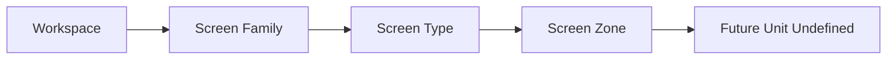

# Workspace Definition

## 문서 목적

이 문서는 Phase 15 범위에서 DATE Workspace를 Screen보다 상위의 작업 목적 단위로 정의한다.

Workspace는 user work purpose를 기준으로 한다. Screen arrangement, visual composition, build artifact는 작성하지 않는다. Registry는 수정하지 않는다.

## Workspace Summary

| Metric | Count |
| --- | ---: |
| Workspace | 5 |
| Screen Family | 18 |
| Architecture Alignment | 15 |
| Product Principle Alignment | 12 |
| Visual Alignment | 8 |
| Open Question | 5 |

## Workspace Matrix

| Workspace | Definition | Primary User Goal | Owns | Does Not Own | Primary Screen Family | Supporting Screen Family | Required Information | Required Entity | Required Navigation | Required Interaction | Required Visual Rule | Architecture Alignment | Product Principle Alignment | Confidence | Open Question |
| --- | --- | --- | --- | --- | --- | --- | --- | --- | --- | --- | --- | --- | --- | --- | --- |
| Dashboard Workspace | first return and overview workspace | 오늘 무엇을 봐야 하는지 판단 | overview context, return context | deep Evidence validation | Dashboard | Discovery, Watchlist, Monitoring | Market Information, Monitoring Information | Market, Watchlist | Entry Navigation | Entry Direction Interaction | Information First, Navigation -> Glass | AD-001, AD-008, AD-009 | DPP-001, DPP-008 | Medium | authenticated overview scope |
| Research Workspace | Entity and Evidence research workspace | selected Entity의 Evidence를 검토 | Entity-Evidence working context | Portfolio ownership | Security, Company, Evidence, Research, Timeline | Search, Calendar, AI Assistant | Security Information, Evidence Information, Research Information | Security, Company, Evidence, Report | Entity Navigation, Evidence Navigation, Research Navigation | Entity Focus, Evidence Inspection, Research Context | Evidence -> Layered, Chart -> Minimal | AD-004, AD-005, AD-013 | DPP-004, DPP-005, DPP-011 | High | Evidence depth and Source boundary |
| Monitor Workspace | observed state and trigger workspace | 관심 Entity와 Signal을 추적 | observed state context | final decision | Watchlist, Monitoring | Calendar, System, AI Assistant | Monitoring Information, System Information | Watchlist, Signal, Alert | Monitoring Navigation, System Navigation | Monitoring Setup, System Boundary | Monitoring -> High Contrast | AD-008, AD-015 | DPP-008, DPP-012 | Medium | trigger Source and alert payload |
| Portfolio Workspace | exposure and position workspace | holdings context와 Evidence를 연결 | exposure context | Security identity | Portfolio | Security, Evidence, Workspace | Portfolio Information, Position Information | Portfolio, Position, Security | Portfolio Navigation | Portfolio Context Interaction | Data -> Flat, Evidence -> Layered | AD-009, AD-004, AD-005 | DPP-008, DPP-004, DPP-005 | Medium | holdings Source |
| Journal Workspace | user reasoning and revisit workspace | 판단 과정과 return context를 보존 | user reasoning context, revisit context | Source truth | Journal, Workspace | Evidence, AI Assistant, Profile | Strategy Information, Workspace Information, Evidence Information | Strategy, Context, User | Workspace Navigation, Personal Navigation | Workspace Restore, Interpretation Boundary | Workspace uses Glass Layer, AI -> Floating Layer | AD-007, AD-010, AD-011 | DPP-007, DPP-009, DPP-010 | Low | Journal boundary and saved reasoning scope |

## Workspace Dependency

This dependency is a product architecture hierarchy.

It does not define screen arrangement or future unit design.

## Workspace Guardrail

Workspace is above Screen.

Workspace owns work purpose and context grouping, not Evidence truth, Entity identity, or production arrangement.
