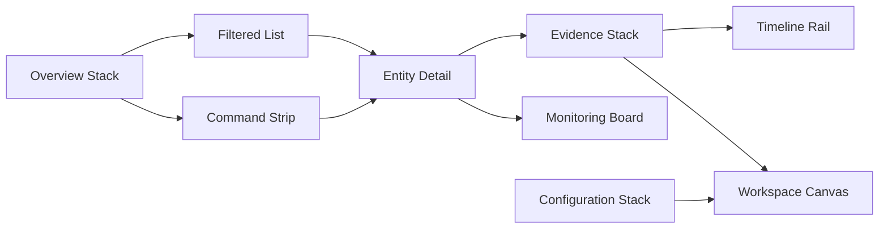

# Layout Patterns

## Purpose

이 문서는 Phase 16 Screen에 사용할 Gray Box Layout Pattern을 정의한다. Pattern은 Screen responsibility와 Information priority를 표현하기 위한 reusable structure다.

## Layout Pattern Summary

| Item | Count |
| --- | ---: |
| Layout Pattern | 9 |
| Referenced Screen | 18 |
| Referenced Zone | 11 |

## Layout Pattern Matrix

| Layout Pattern | Purpose | Used By | Required Section | Required Zone | Primary Information | Navigation Dependency | Interaction Dependency | Do Not Define | Confidence | Open Question |
| --- | --- | --- | --- | --- | --- | --- | --- | --- | --- | --- |
| Overview Stack | first orientation and next direction | Dashboard | Overview / Monitoring Preview / Return Context | Header / Summary / Navigation / Action | Market Information | Entry to Discovery | Entry Direction | fixed production values | Medium | authenticated scope |
| Filtered List | candidate narrowing and comparison | Discovery | Criteria / Candidate Set / Comparison Context | Toolbar / Summary / Relationship / Action | Security Information | Discovery to Entity | Discovery Refinement | row production treatment | High | criteria persistence |
| Command Strip | known intent resolution | Search | Query / Result / Ambiguity | Toolbar / Summary / Action | Security Information | Search to Entity | Search Resolution | command syntax finalization | Medium | result grouping |
| Entity Detail | selected Entity context | Security / Company | Entity Context / Local Information / Evidence Preview | Header / Summary / Evidence / Relationship / Action | Security Information, Company Information | Entity to Evidence | Entity Focus | final module placement | High | Entity boundary |
| Evidence Stack | Evidence boundary and related context | Evidence / Research | Source Boundary / Evidence Body / Related Context | Header / Evidence / Relationship / Action | Evidence Information | Evidence to Research | Evidence Inspection | Source ranking logic | Medium | Traceability depth |
| Timeline Rail | time context and Event relation | Timeline / Calendar | Time Rail / Event Detail / Evidence Link | Header / Timeline / Evidence / Action | Calendar Information | Calendar to Evidence | Calendar Event | final time scale | Low | Event Source |
| Workspace Canvas | reusable work context | Workspace | Context Restore / Saved Set / Next Action | Header / Workspace / Action | Workspace Information | Workspace to Entity | Workspace Restore | persistence mechanism | Low | restore fidelity |
| Monitoring Board | observed state and revisit trigger | Watchlist / Monitoring | Monitored Set / Trigger / Signal Context | Header / Summary / Monitoring / Timeline / Action | Monitoring Information | Monitoring to Entity | Monitoring Setup | alert payload rule | Medium | trigger Source |
| Configuration Stack | ownership and system boundary | Settings / Profile / System | Ownership Boundary / Preference Context / System State | Header / Toolbar / Summary / Action / Footer | System Information, Personal Information | Personal to System | System Boundary | account system design | Low | permission model |

## Layout Pattern Dependency

## Pattern Guardrail

- Layout Pattern represents responsibility, not final placement.
- Layout Pattern may be reused by multiple Screen Families.
- Layout Pattern cannot add new Entity, Information, or Architecture Domain.
