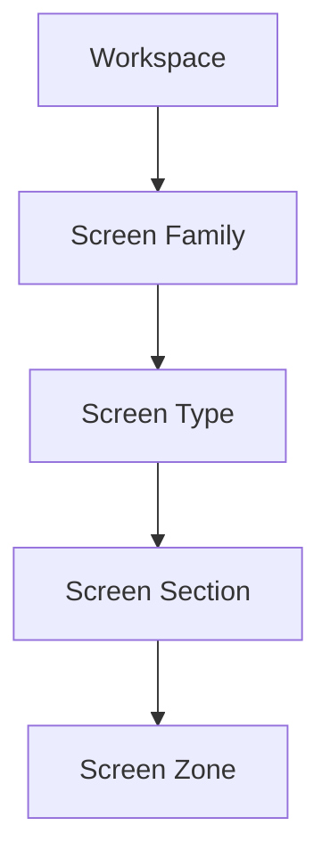

# Wireframe Hierarchy

## Purpose

이 문서는 Low Fidelity Wireframe의 hierarchy를 정의한다. Hierarchy는 Workspace에서 Zone까지의 responsibility chain을 표현한다.

## Hierarchy Summary

| Item | Count |
| --- | ---: |
| Hierarchy Level | 5 |
| Workspace | 5 |
| Screen Family | 18 |
| Screen Type | 9 |
| Screen Zone | 11 |

## Hierarchy Levels

| Level | Name | Responsibility | Owner | Output | Boundary |
| --- | --- | --- | --- | --- | --- |
| 1 | Workspace | user task purpose | Product Architecture | task context | does not define Screen details |
| 2 | Screen Family | major Screen responsibility | Screen System | Screen direction | does not define final layout |
| 3 | Screen Type | reusable Screen structure | Screen System | structure pattern | does not define production artifact |
| 4 | Screen Section | grouped Information responsibility | Wireframe Architecture | section intent | does not define final rendering |
| 5 | Screen Zone | local Information and action role | Wireframe Architecture | zone contract | does not define final unit |

## Workspace to Screen Hierarchy

| Workspace | Screen Family | Primary Screen Type | Primary Section | Primary Zone |
| --- | --- | --- | --- | --- |
| Dashboard Workspace | Dashboard | Overview | Overview | Header / Summary |
| Dashboard Workspace | Discovery | Compare | Criteria / Candidate Set | Toolbar / Summary |
| Dashboard Workspace | Settings | Configuration | Ownership Boundary | Header / Toolbar |
| Dashboard Workspace | Profile | Configuration | User Identity | Header / Summary |
| Dashboard Workspace | System | Configuration | Access Boundary | Header / Footer |
| Research Workspace | Search | Overview | Query / Result | Toolbar / Summary |
| Research Workspace | Security | Detail | Entity Context | Header / Summary |
| Research Workspace | Company | Detail | Company Context | Header / Relationship |
| Research Workspace | Evidence | Detail | Source Boundary | Header / Evidence |
| Research Workspace | Research | Detail | Provider Context | Header / Evidence |
| Research Workspace | Timeline | Timeline | Time Rail | Timeline / Evidence |
| Research Workspace | AI Assistant | Assistant | Prompt Context | AI / Evidence |
| Monitor Workspace | Watchlist | Monitoring | Monitored Set | Header / Monitoring |
| Monitor Workspace | Monitoring | Monitoring | Trigger | Monitoring / Timeline |
| Monitor Workspace | Calendar | Timeline | Date Context | Timeline / Evidence |
| Portfolio Workspace | Portfolio | Detail | Exposure | Summary / Evidence |
| Journal Workspace | Workspace | Workspace | Context Restore | Workspace / Action |
| Journal Workspace | Journal | Workspace | Reasoning Context | Workspace / Evidence |

## Hierarchy Dependency

## Hierarchy Guardrail

- Hierarchy is not a page map.
- Hierarchy is not a production route map.
- Hierarchy cannot introduce new Product Domain.
