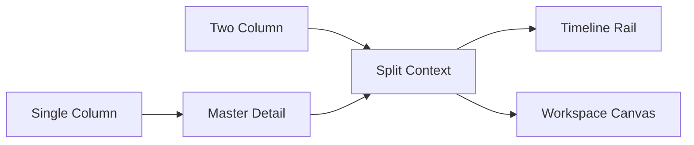

# Layout Grid Definition

## Purpose

이 문서는 Low Fidelity Wireframe에서 사용할 abstract grid responsibility를 정의한다. Grid는 Information priority와 Context Preservation을 위한 structure이며 production values를 정하지 않는다.

## Grid Summary

| Item | Count |
| --- | ---: |
| Layout Grid | 6 |
| Layout Pattern | 9 |
| Screen Zone | 11 |

## Grid Matrix

| Grid | Purpose | Used By | Primary Axis | Secondary Axis | Zone Behavior | Context Preservation | Not Allowed | Confidence | Open Question |
| --- | --- | --- | --- | --- | --- | --- | --- | --- | --- |
| Single Column | linear reading and simple configuration | Settings / Profile / System | top to bottom | none | Header leads Summary and Action | owner context remains visible | dense comparison | Low | configuration scope |
| Two Column | primary context with supporting detail | Dashboard / Portfolio | primary context | supporting context | Summary and Evidence stay separated | selected context remains visible | hidden Source boundary | Medium | authenticated scope |
| Master Detail | candidate selection to focused detail | Discovery / Search / Security / Company | candidate to focus | related context | Relationship explains transition | selected Entity remains visible | ambiguous target switch | High | disambiguation |
| Split Context | exposure or Entity plus Evidence | Portfolio / Evidence / Research | object context | Evidence context | Evidence Zone has independent boundary | Source and owner remain visible | Evidence mixed with opinion | Medium | Traceability depth |
| Timeline Rail | time ordered inspection | Timeline / Calendar / Monitoring | time order | selected item detail | Timeline and Evidence remain paired | date or trigger remains visible | Event without Source cue | Low | Event Source |
| Workspace Canvas | reusable working context | Workspace / Journal / AI Assistant | saved context | next action context | Workspace or AI Zone must show boundary | restored context remains visible | silent state restore | Low | restore fidelity |

## Grid to Pattern Mapping

| Grid | Layout Pattern |
| --- | --- |
| Single Column | Configuration Stack |
| Two Column | Overview Stack / Split Context |
| Master Detail | Filtered List / Command Strip / Entity Detail |
| Split Context | Evidence Stack |
| Timeline Rail | Timeline Rail / Monitoring Board |
| Workspace Canvas | Workspace Canvas |

## Grid Dependency

## Grid Guardrail

- Grid defines structural responsibility only.
- Grid cannot define production measurements.
- Grid cannot introduce new Screen Family, Entity, or Information Object.
